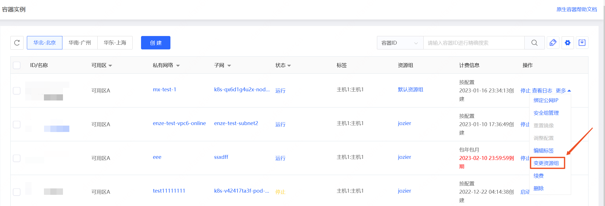

# 变更资源组

资源加入资源组后，您可参考下方操作变更资源所在资源组。

## 操作步骤

- 访问[容器实例控制台]( https://cns-console.jdcloud.com/host/container/list)或是[Pod控制台]( https://cns-console.jdcloud.com/host/pod/list)。或访问[京东云控制台](https://console.jdcloud.com)点击顶部导航栏 **弹性计算-原生容器-容器实例/Pod** 进入资源列表页。

- 点击资源列表页【操作-更多-变更资源组】或进入资源详情页点击右上角的【操作-变更资源组】,即可变更单一资源所在的资源组。

 
 

- 在资源列表页勾选想要变更资源组的资源，点击下方横栏的【变更资源组】按钮，在弹窗中选择欲转入的目标资源组，即可批量变更多个资源所在的资源组。
 
 

