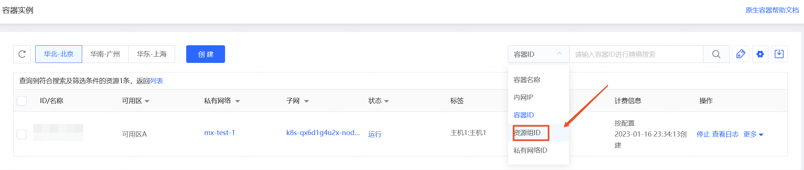

# 资源组筛选

可在资源控制台基于资源组ID对资源进行筛选。

## 操作步骤

- 访问[容器实例控制台]( https://cns-console.jdcloud.com/host/container/list)或是[Pod控制台]( https://cns-console.jdcloud.com/host/pod/list)。或访问[京东云控制台](https://console.jdcloud.com)点击顶部导航栏 **弹性计算-原生容器-容器实例/Pod** 进入资源列表页。
- 在列表页右上角的搜索框中，下拉选择搜索条件-资源组ID，输入资源组ID后进行筛选。

