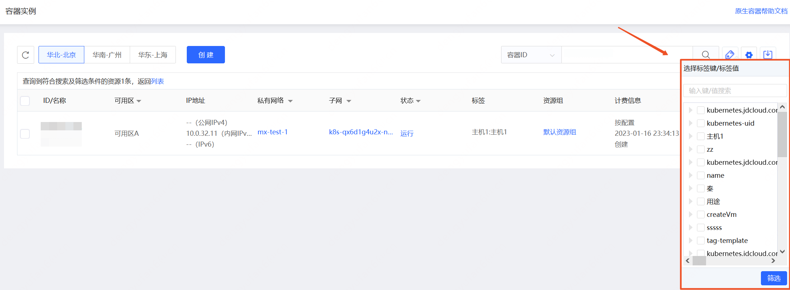

# 根据标签筛选
为资源绑定标签后，您可以通过本文描述的方法根据标签快速筛选资源。

## 操作步骤

1. 访问[容器实例控制台]( https://cns-console.jdcloud.com/host/container/list)或是[Pod控制台]( https://cns-console.jdcloud.com/host/pod/list)。或访问[京东云控制台](https://console.jdcloud.com)点击顶部导航栏 **弹性计算-原生容器-容器实例/Pod** 进入资源列表页。
2. 选择地域后点击列表页右上角的 **标签筛选**。支持输入键/值进行模糊搜索，或直接在当前有效标签中勾选。

3. 点击 **筛选** 则根据勾选情况筛选资源。
 >提示：
 >* 勾选某个标签键（Key）表示需要筛选出绑定了这个标签键（可能有多个标签值）的资源。
 >* 勾选标签键/值（Key-Value），表示需要筛选出绑定了这个键值对（Key-Value）的资源。
 >* 不同键之间为逻辑与关系，相同键不同值之间为逻辑或关系。例：若勾选了“所有人（Key）”、“用途：测试（Key-Value）”及“用途：开发（Key-Value）”，则表示需要筛选出绑定了标签“所有人”且“用途”为测试或开发的资源。

此外，标签支持与其他搜索条件同时生效，可先搜索再匹配标签筛选，或先根据标签筛选再指定搜索项搜索。
