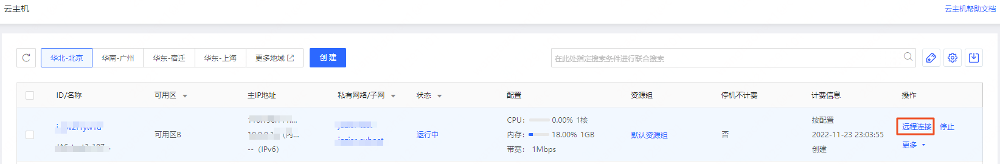

# 登录Linux实例
在购买并启动了 Linux 类型的实例后，您可以选择登录实例进行相关管理。根据您本地的操作系统和实例是否可被 Internet 访问，不同情况下可以使用不同的登录方式，关于各登录方式对比可详见 [登录实例](https://docs.jdcloud.com/virtual-machines/connect-to-instance)。

根据本地操作系统情况和实例公网IP绑定情况，可选择不同的登录方式：
<table>
   <tr>
      <td> 本地操作系统类型 </td>
      <td> Linux实例已绑定弹性公网IP  </td>
      <td> Linux实例未绑定弹性公网IP </td>
   </tr>
   <tr>
      <td> Wndows </td>
      <td> VNC 登录<br>WebTerminal 登录<br>Xshell/MobaXterm等客户端工具登录  </td>
      <td rowspan="2"> VNC登录<br>WebTerminal 登录 </td>
   </tr>
   <tr>     
      <td> Linux / Mac OS</td>
      <td>VNC 登录<br>WebTerminal 登录<br>SSH命令连接登录</td>
   </tr>
</table>

> 提示：WebTerminal目前处于功能公测期间，即将全面开放，公测期间如需申请使用请提交工单。

## 登录准备
创建实例并获取账号和对应密码：

* 管理员账号：root
* 密码：创建实例时，可选择由系统**自动生成**密码以短信及邮件方式发送，或**自定义**密码。也可以在实例创建后通过 [重置密码](../Operation-Guide/Instance/Reset-Password.md) 功能重新设置密码。
* 密钥：创建实例时，如实例为Linux系统可为实例绑定SSH密钥，实例创建后可调整绑定的密钥对。须注意通过京东云控制台创建的SSH密钥对仅有一次下载私钥的机会，请妥善保管。


## 使用 WebTerminal 登录Linux实例
WebTerminal是京东云提供的基于SSH/RDP协议的Web远程终端工具，安全组开放SSH/RDP对应端口后，可直接在Web上远程登录云主机实例。支持命令复制粘贴、多用户登录、多会话、可视化查看系统文件资源等功能。

由于WebTerminal服务会使用内部地址对客户端发起的SSH请求进行转发，因此需要预先确认实例绑定的安全组和网络ACL（如有）在入方向允许的规则中包含服务使用的地址网段。不同连接方式和不同地域下所需添加的网段如下：（如入方向源IP未限定具体IP地址或网段，则无需再额外配置）
* 内网连接：不区分地域，地址为 **100.64.0.0/10**
* 公网连接：
  * 华北-北京：**114.67.239.0/24**
  * 华南-广州：**114.67.202.0/24**
  * 华东-上海：**114.67.126.0/24**
  * 华东-宿迁：**116.198.205./24**


1. 在实例列表的操作列，点击 **远程连接** ，在登录方式选择中选择 **WebTerminal登录**。

</div>

2. 在登录弹窗中，根据实际情况完成选择或填写
* 实例：可切换当前地域下的实例，仅显示请求时状态为 **运行中** 的实例。
* 连接方式：绑定弹性公网IP情况下可选通过公网或内外连接，如未绑定弹性公网IP将默认使用内外连接。
* 端口：填写SSH端口。默认22，如自行修改了SSH端口请酌情填写。
* 用户名：默认为root，如在实例内创建了其他用户可按登录需求填写。
* 认证方式：可选密码或密钥，选择密钥登录时需要导入本地私钥，系统仅使用私有进行登录不会保存私钥。
* 会话名称：默认为root@<实例ID>，可自行修改为方便识别的会话名称。

<div align="center">

</div>

3. 登录成功后，可按需使用以下功能：
* 快速查看系统内文件目录。
* 同时管理多个实例的会话。
* 查看实例详细信息。
* 进行复制、关闭等会话管理。

<div align="center">

</div>

>请注意：
>* WebTerminal暂不支持windows操作系统的实例和裸金属实例。
>* 要正常使用VNC登录，建议使用高版本浏览器，如：Chrome及Firefox等浏览器。
>* VNC暂不支持文件上传下载。

## 使用 VNC 登录Linux实例
VNC是京东云提供的基于RFB协议的Web远程终端工具。在WebTerminal或其他客户端工具无法远程登录的情况下，可以通过 VNC 登陆连接到实例，观察实例状态，并且可通过实例用户进行基本的实例管理操作。
VNC登陆的常见场景包括以下几种：

* 查看实例的启动进度
* 排查网络配置错误等异常，例如误开启了防火墙与安全组规则冲突。
* 无法通过远程登录软件或密钥登录时，通过 VNC 登陆实例，排查SSH服务异常等异常。

1. 在实例列表的操作列，点击 **远程连接** ，在登录方式选择中选择 **VNC登录**。

</div>

2. 点击VNC之后进入到登录页面
* 默认用户名：root        
* 密码：为您创建实例时设置的实例密码 

<div align="center">

</div>

>请注意：
>* VNC不支持多用户同时登录。
>* 要正常使用VNC登录，建议使用高版本浏览器，如：Chrome及Firefox等浏览器。
>* VNC暂不支持文件上传下载。

## 本地为Windows，通过客户端工具登录Linux实例
您可选择多种远程登录软件登陆京东云Linux实例，如选择使用SSH密钥登录实例，需要在创建实例时选择开启密钥登录功能，并为其绑定一个密钥，请确保已下载所绑定密钥的私钥。有关密钥的创建操作，请参阅 [创建SSH密钥](../Operation-Guide/Key-Pair/Create-Keypair.md)。

同时请您查看实例关联 [安全组](http://docs.jdcloud.com/cn/virtual-private-cloud/security-group-features) 及所在子网的 [网络ACL](http://docs.jdcloud.com/cn/virtual-private-cloud/network-acl-features) 配置，确保实例22端口已开放。

本例以 CentOS 7.1 64位系统，Xshell远程登录软件为示范，可按照如下步骤完成登录。

1. 下载并安装远程登录软件
    可使用此地址下载：http://iaas-cns-download.s3.cn-north-1.jcloudcs.com/xshell5_5.0.1332.exe 或自行下载Xshell软件。
    下载后双击xshell5_5.0.1332.exe进行安装。

2. 安装完成，打开Xshell，并点击新建，根据要求输入相应参数

	* 名称：自定义设置
	* 协议：SSH
	* 主机：实例所绑定的公网IP，可在实例列表查询
	* 端口号：22
	[](https://img1.jcloudcs.com/cn/image/vm/Getting-Start-Linux-Connect-linux-xshell.png)

3. 选择用户身份认证
	* 密码登录
		* 方法：选择Password
		* 用户名：默认用户名为root<br>
		<div align="center">
		
		</div>
		* 点击确定，连接实例，如下图：<br>
		<div align="center">
		
		</div>
	* 密钥登录
		*  方法：选择Public Key
		*  用户名：默认用户名为root
		*  用户密钥：点击**浏览**-**导入**，打开弹窗后找到本地保存的私钥，点击**打开**，返回用户密钥配置窗口。
		<div align="center">
		
		</div>
		
		* 选中导入的密钥后，点击**确定**，可以看到该密钥显示在**用户密钥**处。再次点击**确定**。
		* 在会话连接确认窗口中，选择**连接**，选择以何种方式接受实例密钥。
		<div align="center">
		
		</div>
		* 若连接成功，显示如下图，若连接失败，请确认公网IP地址是否输入正确，并查看安全组和网络ACL配置。
		<div align="center">
		
		</div>

## 本地为Linux/Mac OS，通过SSH指令登录Linux实例
### 密码登录
Linux用户请直接运行以下命令，Mac OS用户请打开系统自带的终端（Terminal）后运行以下命令，随后输入该实例root用户的密码，输入正确即可连接实例。

```Shell
ssh root@<实例的公网IP地址>
```

### 密钥登录
Linux用户请直接运行以下命令，Mac OS用户请打开系统自带的终端（Terminal）后运行以下命令，以对私钥文件赋予本人可读的权限：

```Shell
chmod 400 <下载到本地的与实例绑定的私钥绝对路径>
```

随后运行以下远程登录命令：

```Shell
ssh -i "<下载到本地的与实例绑定的私钥绝对路径>" root@<实例公网IP地址>
```

## 相关参考

[重置密码](../Operation-Guide/Instance/Reset-Password.md)

[创建SSH密钥](../Operation-Guide/Key-Pair/Create-Keypair.md)

[安全组](http://docs.jdcloud.com/cn/virtual-private-cloud/security-group-features)

[网络ACL](http://docs.jdcloud.com/cn/virtual-private-cloud/network-acl-features)


  [1]: ./images/Getting-Start-Linux-Connect-console.png "Getting-Start-Linux-Connect-console.png"
  [2]: ./images/Getting-Start-Linux-Connect-vnc.png "Getting-Start-Linux-Connect-vnc.png"
  [3]: ./images/Getting-Start-Linux-Connect-linux-xshell.png "Getting-Start-Linux-Connect-linux-xshell.png"
  [4]: ./images/Getting-Start-Linux-Connect-linux-xshell1.png "Getting-Start-Linux-Connect-linux-xshell1.png"
  [5]: ./images/Getting-Start-Linux-Connect-linux-xshell2.png "Getting-Start-Linux-Connect-linux-xshell2.png"
  [6]: ./images/Getting-Start-Linux-Connect-linux-xshell3.png "Getting-Start-Linux-Connect-linux-xshell3.png"
  [7]: ./images/Getting-Start-Linux-Connect-linux-xshell4.png "Getting-Start-Linux-Connect-linux-xshell4.png"
  [8]: ./images/Getting-Start-Linux-Connect-linux-xshell5.png "Getting-Start-Linux-Connect-linux-xshell5.png"
