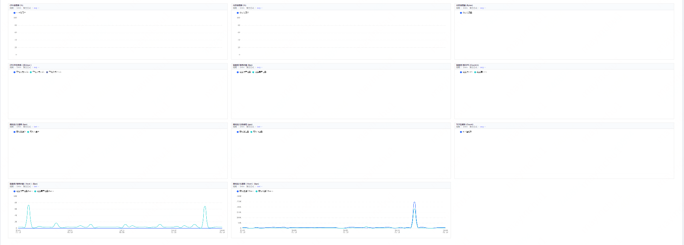
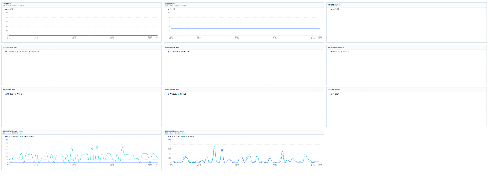
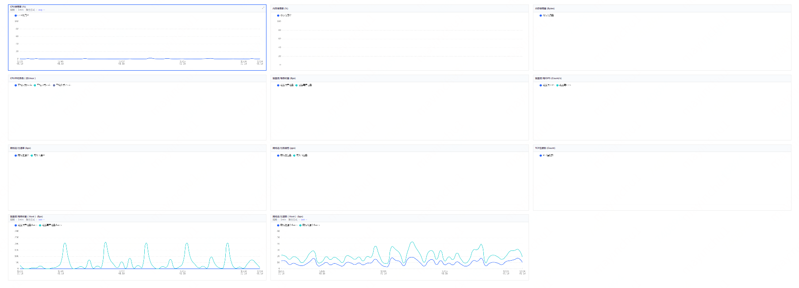
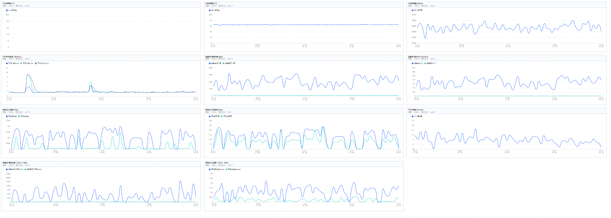

# 云主机控制台监控信息不显示问题汇总

目前云主机控制台的监控信息获取有两个方式：

- 通过系统内`JCS-Agent`插件的`MonitorPlugin`进程上报。
- 宿主机采集上报。如遇到监控信息个别监控项显示不全的问题，可以参考如下情况检查处理

## 除Host监控项外都不显示



此问题通常是云主机内`JCS-Agent`插件的`MonitorPlugin`进程不存在或者`JCS-Agent`插件异常导致的：

**windows系统：**

1. 登陆云主机在任务管理器中看下是否有`JCSAgentCore`和`MonitorPlugin`进程运行。
2. 如果没有这两个进程，您在系统服务中看下是否有`JCS Agent Core`这个服务，如果服务缺失，参考 [官方镜像系统组件](https://docs.jdcloud.com/cn/virtual-machines/default-agent-in-public-image#user-content-1) 安装下`JCS-Agent`插件。
3. 如果服务存在，启动下该服务，插件服务运行后会自动拉起`MonitorPlugin`进程，之后看下监控是否恢复。
4. 如果插件服务启动异常或者启动后一段时间`MonitorPlugin`进程没有运行，请检查下云主机内是否有安装360安全卫士或者其他安全类软件，此类软件会查杀`jcs-agent`目录下的文件，导致插件运行异常。可以参考 [官方镜像系统组件](https://docs.jdcloud.com/cn/virtual-machines/default-agent-in-public-image#user-content-1) 重新安装下插件，同时在安全类的软件设置中将`C:\Program Files\JD.com\jCloud`目录加白，以免再次被查杀；

**linux系统:**

1. 登陆云主机检查下`jcs-agent-core`服务是否运行，没有启动的话手动启动下，命令为`systemctl start jcs-agent-core`。
2. 如果服务启动异常，参考 [官方镜像系统组件](https://docs.jdcloud.com/cn/virtual-machines/default-agent-in-public-image#user-content-1) 重新安装下插件；

## 只能看到cpu，内存和Hsot的监控信息，其他监控项信息缺失



此问题通常是云主机官方镜像的系统组件`JCS-Agent`中的`MonitorPlugin`插件版本过低导致，您可以使用如下命令查看插件版本：

**Linux系统：** 

```bash
ps -ef|grep MonitorPlugin
```

**Windows系统：** 

```bash
wmic process where caption="MonitorPlugin.exe" get caption,commandline /value
```

`MonitorPlugin`插件版本不低于`3.0.989`版本才能正常显示全部的监控信息，如果插件版本过低，可以参考 [官方镜像系统组件](https://docs.jdcloud.com/cn/virtual-machines/default-agent-in-public-image#user-content-1) 安装下ifrit插件，安装后等待几分钟，`ifrit`会自动升级`MonitorPlugin`插件，待插件升级后您在通过控制台查看下监控信息；

## 只显示cpu和Host项监控信息



此问题通常是实例绑定的安全组或者所在子网绑定的acl出网策略没有放行监控上报的服务器IP地址导致，需要在安全组或者acl中的添加如下的IP地址针对80端口的放行：

不同地域放行的IP地址如下：

| 地域 | 放行IP         |
| ---- | -------------- |
| 北京 | 100.64.254.91  |
| 广州 | 100.65.1.10    |
| 宿迁 | 100.66.1.94    |
| 上海 | 100.67.239.135 |

调整安全组规则可以参考 [配置安全组出站规则](https://docs.jdcloud.com/cn/virtual-machines/configurate-outbound-rules)
acl配置可以参考 [网络ACL配置](https://docs.jdcloud.com/cn/virtual-private-cloud/network-acl-configuration#user-content-2)

## cpu项或者Host项监控信息缺失



目前云主机的cpu监控和Host监控都是通过宿主机上的插件和云主机通信采集上报的，此监控项信息缺失需要反馈京东云工程师检查处理，可以通过工单的方式反馈，工单中说明下问题现象，并提供下对应的云主机id；