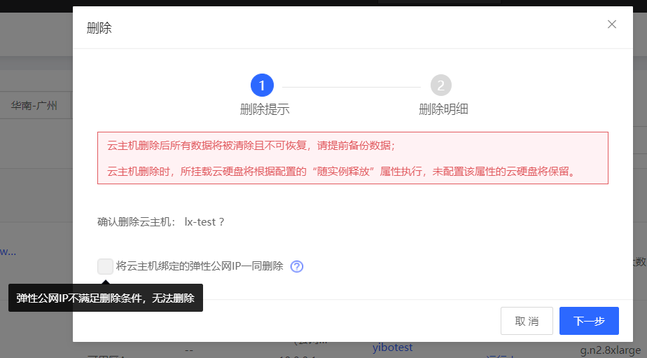
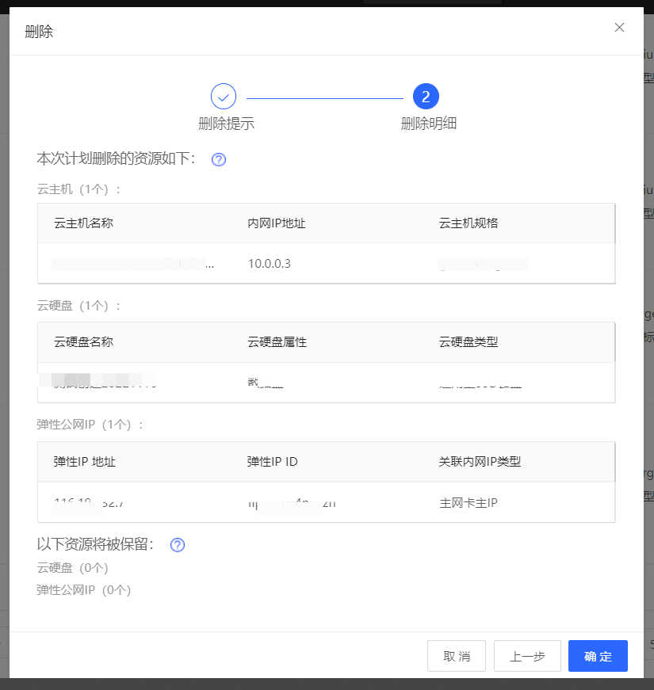
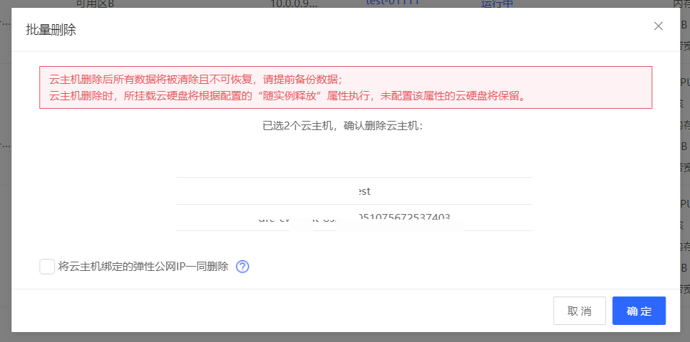

# 删除实例

如果您不需要实例，可以操作删除实例以节约费用。

## 前提条件与限制

* 实例须处于**已停止**状态。若实例处于**运行中**状态，请先操作[停止实例](Stop-Instance.md)；若实例处于其他非稳定状态，还请等待前序操作执行完成后再操作删除实例。
* 仅按配置计费的实例或包年包月已到期的实例可以删除，对于包年包月未到期的实例无法删除。
	

## 操作影响
* 实例删除后所有数据将被清除且不可恢复，请提前备份数据，详细请查阅实例[制作私有镜像](../Image/Create-Private-Image.md)、[创建云硬盘快照](../Storage/Create-Snapshot.md)。
* 实例删除后，本地盘将随之删除，挂载的云硬盘将根据配置的“随实例释放”的属性进行删除，“随实例释放”属性为“否”的云硬盘和包年包月计费的云硬盘将被保留。
* 若在删除过程中勾选了“将云主机绑定的弹性公网IP一同删除”选项，则在云主机删除后，系统将尝试删除云主机主网卡上绑定的全部弹性公网IP，如弹性公网IP本身不满足删除条件，将导致删除失败，包括但不限于以下情况：
  - 弹性公网IP为包年包月计费且未到期
  - 弹性公网IP为包年包月计费且到期时间超过7天
## 操作步骤
   1. 访问[云主机控制台](https://cns-console.jdcloud.com/host/compute/list)，即进入实例列表页面。或访问[京东云控制台](https://console.jdcloud.com)点击顶部导航栏**弹性计算-云主机**进入实例列表页。
   2. 选择地域。
   3. 在实例列表中选择需要删除的实例，确认其状态为**已停止**。如果需要同时操作多台实例，可通过多选实现。
  4.1 在单台操作：点击**操作-更多-删除**按钮，或点击实例名称进入详情页后点击**操作-删除**按钮。单台删除操作分为两步，“**删除提示**”和“**删除明细**”。
- 在“**删除提示**”步骤中，如云主机未绑定弹性公网IP则无勾选框；如已绑定弹性IP，则有勾选框，其中绑定的弹性IP不符合删除条件则勾选框会置灰。

- 点击**下一步**进入“**删除明细**”步骤，**删除明细**分类展示了计划删除的资源和保留的资源信息。磁盘的删除规则可见**操作影响**，其中本地盘删除信息不展示在删除列表中。 如果在“**删除提示**”步骤中勾选了随云主机删除弹性IP，系统将删除云主机主网卡上绑定的按配置计费及包年包月已到期的弹性公网IP，保留其余弹性公网IP。
- 在“**删除明细**”步骤中，确认信息后点击**确定**提交删除。之后实例将进入**删除中**状态，请您耐心等待删除完成。

 **注意1**：请不要在挂载卸载云硬盘过程中进行删除云主机操作，否则会导致资源删除信息和保留信息统计不准确。
 **注意2**：弹性公网IP的保留信息仅统计主网卡上绑定的弹性公网IP在云主机删除后的剩余数量，辅助网卡剩余弹性IP数量不做统计。

  4.2 批量操作：点击列表下方**更多-删除**按钮。
- 批量操作不再显示**删除明细**信息，选择是否勾选“将云主机绑定的弹性公网IP一同删除”选项后，点击**确定**即可提交删除。

## 相关参考

[停止实例](Stop-Instance.md)

[制作私有镜像](http://docs.jdcloud.com/virtual-machines/create-private-image)

[创建云硬盘快照](../Storage/Create-Snapshot.md)
