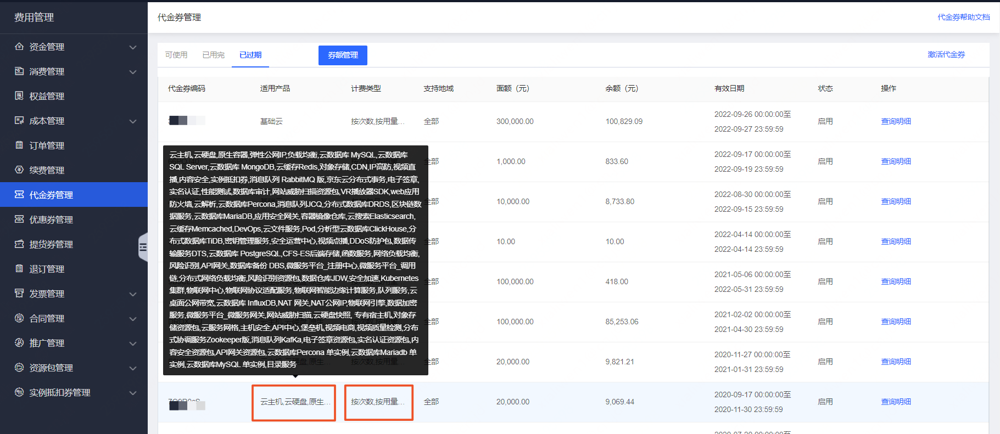
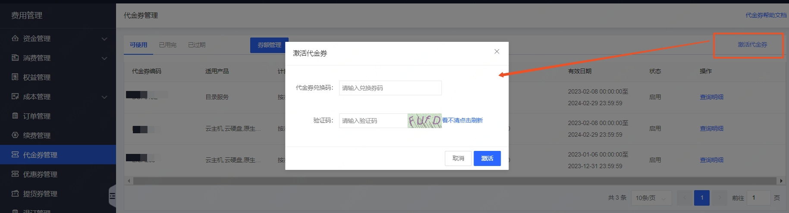
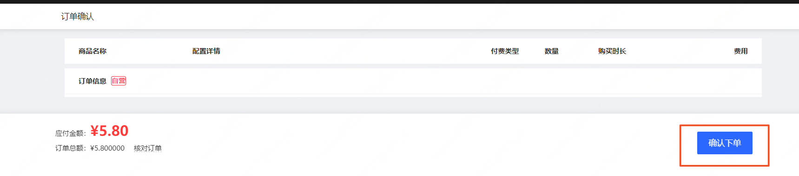
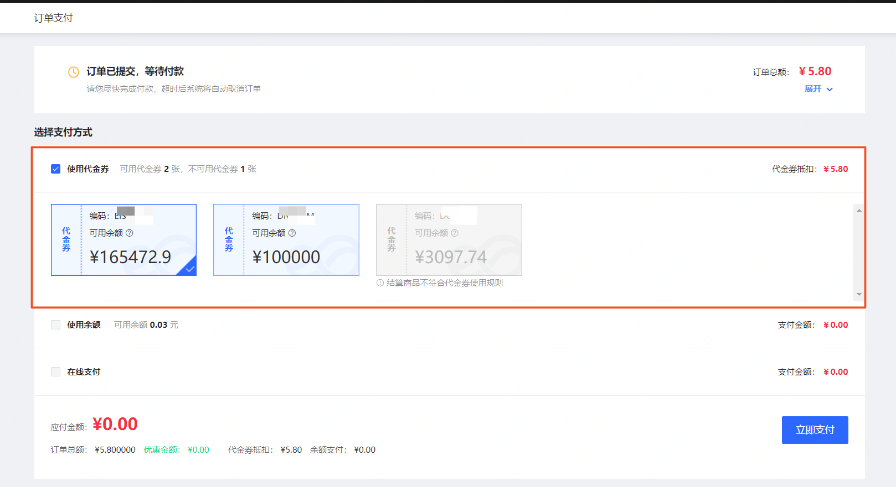

# 代金券

代金券是京东云账户下一种虚拟券形式的资金类权益，可用于抵扣客户购买云产品的费用。

## 功能说明

### 适用场景

适用的产品：每张代金券的适用产品范围，请在[代金券管理控制台](https://coupon-console.jdcloud.com/cost/coupon)查看。一般来说代金券可以适用于京东云官网售卖的全部云产品，如云主机、对象存储、云数据库、域名等。

适用的计费类型：每张代金券的适用计费类型，请在[代金券管理控制台](https://coupon-console.jdcloud.com/cost/coupon)查看。一般来说代金券可以支持包年包月、按配置、按用量、按次数购买的费用抵扣。

### 使用规则

**预付费订单**

1. 预付费类型的订单，如包年包月订单，支付时可以使用且只能使用一张代金券。

2. 代金券使用需要满足两个条件，第一购买的产品在代金券支持的产品范围内，第二购买产品的计费类型代金券支持，否则代金券为不可用状态。

3. 在支付确认页面使用代金券，选择相应代金券后金额会自动扣减。

**后付费订单**

1. 后付费类型的订单，如按配置计费订单，会每天生成日账单同时系统自动扣款，账户优先扣减代金券，代金券余额不足或无代金券时会扣减账户余额。

2. 扣费规则

（1）必须同时满足支持的产品线和计费类型的代金券才能正常扣款，否则无法扣减代金券。

（2）相同条件下，系统会优先扣减金额最少的代金券，如果金额相同，会优先扣减有效期最近的代金券。

## 操作说明

**查看代金券**

进入[代金券管理控制台](https://coupon-console.jdcloud.com/cost/coupon)，可以查看代金券是否可用、适用产品范围、支持的计费类型，以及代金券的消费记录。

**激活代金券**

进入[代金券管理控制台](https://coupon-console.jdcloud.com/cost/coupon)，点击【激活代金券】按钮，可以输入代金券编码，激活使用。

**在预付费订单中使用代金券**

在包年包月产品的下单过程中，确认下单、进入订单支付页面后，如果账户内有可以使用的代金券，系统将会自动勾选代金券作为支付方式。如需更换代金券，可取消选定（点击已选中的代金券）并重新选择；也可以取消代金券支付勾选，选用其他方式支付。

