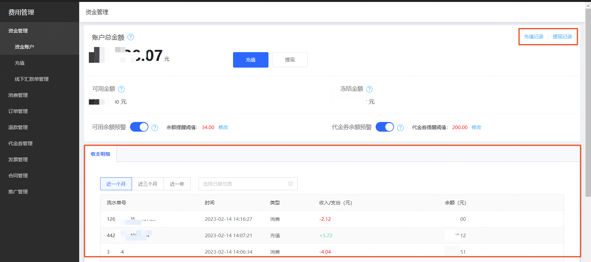

# 收支明细

收支明细用于记录您账户的每一笔现金收入和支出流水，您可通过收支明细功能掌握账户的充值、消费、提现、退款等现金入账和出账记录。

## 功能说明

查询时间：默认查询最近一个月的收支明细，可选择其他时间段，最长查询时长为一年。

明细类型：充值、消费、提现，其中[充值记录](https://uc.jdcloud.com/cost/capital/recharge-history)和[提现记录](https://uc.jdcloud.com/cost/capital/withdrawal-history)可单独查询。

## 操作说明

进入[费用管理控制台-资金账户](https://uc.jdcloud.com/cost/capital/capital-overview)，可以查看收支明细，并点击 “充值记录” 和 “提现记录” 查看相关详情。

