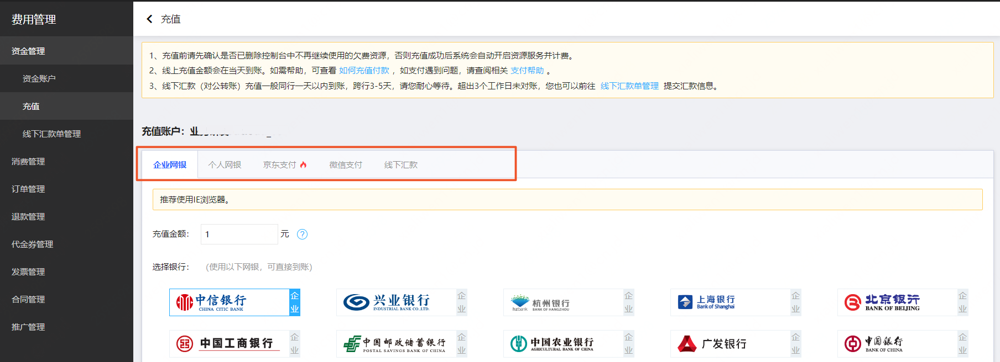

# 充值

您可以通过京东支付、网银、微信支付在线充值，充值后的金额可用于抵扣包年包月产品的订单，或自动抵扣按量计费产生的账单。后续您不再订购京东云产品时，可以通过提现将余额原路退回至原付款账户。

## 充值方式说明

**京东云不支持任何方式的信用卡充值**

### 线上充值

- 京东支付充值（**推荐**）：选择京东支付充值，系统自动跳转到京东支付收银台界面，支持京东钱包余额和快捷卡支付。
- 网银充值：选择网上银行在线充值，支持个人网银或企业网银支付。
- 微信支付：选择微信支付，系统自动跳转至微信支付页面，通过微信扫描二维码完成支付。二维码有效期为两小时，过期后需刷新重新生成新二维码。

### 线下汇款

选择线下汇款到京东云对公账户，请在充值控制台获取**汇款识别码**。汇款时需将**汇款识别码**填写至电汇凭证的【回款用途】，【附言】，【摘要】等栏内；企业网银转账请务必将**汇款识别码**填写到【附言】，【摘要】，【备注】等栏内（提醒：因不同银行备注字段不同，最好是将所有的可填写备注的地方都填写上汇款识别码）。

确保汇款识别码填写正确的情况下，无需提交汇款底单信息，汇款成功后自动充值到您的京东云账号。如果未通过汇款识别码汇款，或汇款后系统未在有效期内自动核销充值到账，您可以在完成银行汇款后，通过[线下汇款单管理](https://capital.jdcloud.com/cost/capital/remittance)提交汇款底单实现款项核销充值。

**线下汇款的京东云对公账户信息如下**

收款户名：**京东云计算有限公司**

收款开户行：**招商银行股份有限公司北京亚运村支行**

收款账号：**110938841310106**

**注意事项：**

1. 线下公司转账汇款时备注汇款识别码，可确保充值单及时核销，请务必填写正确，勿增加其他文字说明；

2. 一个汇款识别码对应一个充值单和相应的金额，请勿多转账或者少转账；

3. 线下汇款到账时间一般为：招行1-2天，跨行3-5天（具体到账时间以银行的实际到账时间为准）。

## 操作说明

进入[费用管理控制台-资金账户](https://uc.jdcloud.com/cost/capital/capital-overview)，点击【充值】按钮，选择充值方式，根据页面提示进行充值。

