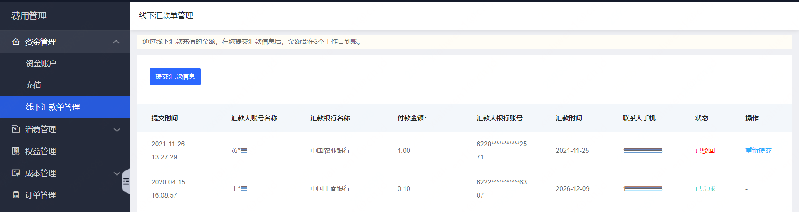
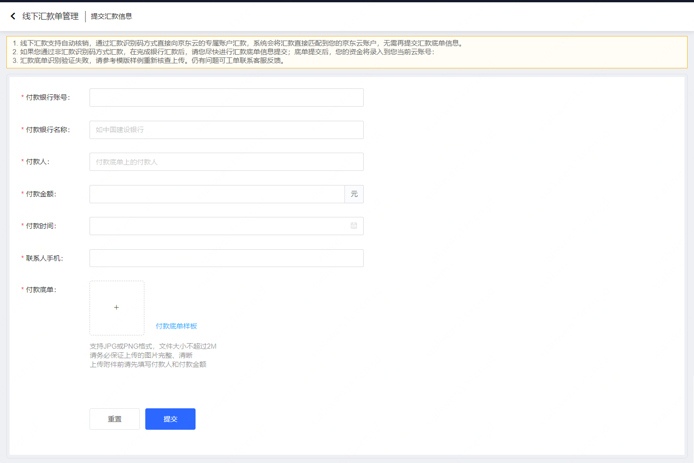

# 线下汇款单管理

通过银行完成向京东云对公账户的汇款后，如果您未通过汇款识别码汇款，或汇款后系统未在有效期内自动核销充值到账，您可以通过[线下汇款单管理](https://capital.jdcloud.com/cost/capital/remittance)提交汇款底单，完成充值资金认领。

## 操作说明

进入[线下汇款单管理](https://capital.jdcloud.com/cost/capital/remittance)页面，可查看历史线下汇款单记录。

点击【提交汇款信息】按钮，填写付款银行、银行账号、付款人、付款金额等信息，并按照页面提示上传付款底单图片。

提交后，后台人员会对您的申请进行审批，一般3个工作日左右。审批通过后充值即会到账。
