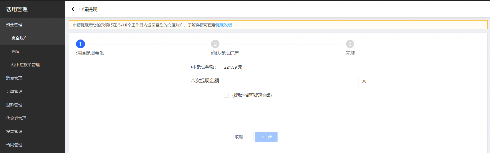
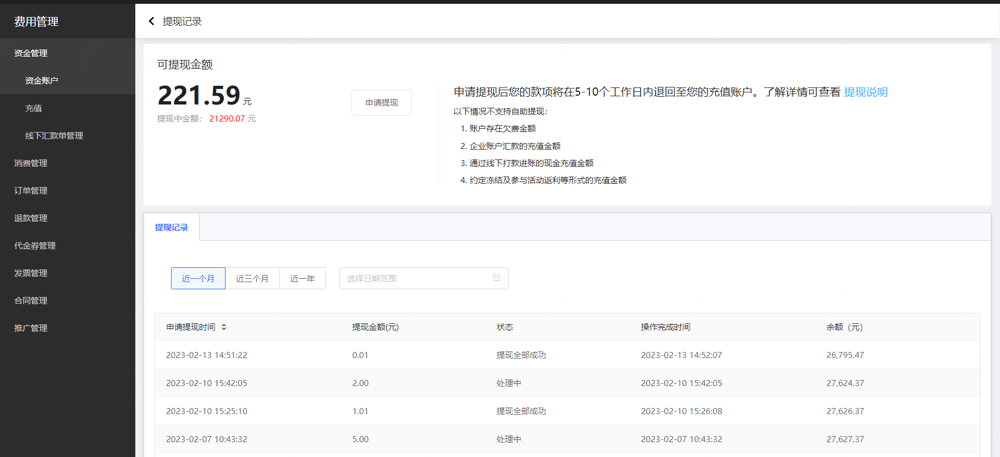

# 提现

**提现前，京东云账号必须完成实名认证。未完成实名认证将不能进行提现。**

温馨提醒：
- 请务必使用与您相符的实名认证账号进行业务操作,如果您借用非同名的实名认证账号进行业务操作，后续可能存在因资金归属纠纷带来经济损失。
- 如您账户下有后付费产品，提现后易产生欠费，影响资源使用，请慎重提现！

## 功能说明

**规则和限制**

1. 提现款会根据历史充值方式按照**原路返还**的原则退还至您当时的付款账户，预计到账时间为 5-10 个工作日。

2. 京东云账号存在欠费时，不允许提现。请先完成欠款缴费再进行提现。

3. **暂不支持公对公转账自助提现**，如需提现请[提交工单](https://ticket.jdcloud.com/applyorder/submit)或者发送邮件至京东云客服邮箱jdcloud@jd.com，提供贵司需要提现的京东云账号信息、公司全称、汇款时使用银行账号、银行类型、付款金额、开户银行、开户城市、支行名称、退款原因，由客服协助您进行处理。

## 操作说明

进入[费用管理控制台-资金账户](https://uc.jdcloud.com/cost/capital/capital-overview)，点击【提现】按钮，填写并确认提现金额后，提交提现申请。

提现后，可以查看[提现记录](https://capital.jdcloud.com/cost/capital/withdrawal-history)。

