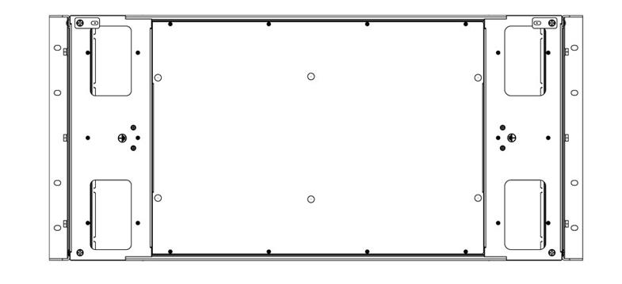

# J360G2 用户手册

## 前言 

**摘要**

本手册介绍本服务器的规格信息、硬件操作、服务条款、故障诊断等与维护工作密切相关的内容。

**目标受众**

本手册主要适用于以下人员：
- 技术支持工程师
- 产品维护工程师
建议由具备服务器知识的专业工程师参考本手册进行服务器运维操作。

**符号约定**

在本文中可能出现下列标志，它们所代表的含义如下。

**变更记录**

## 正文

### 1. 整机柜介绍
#### 1.1 简介
- 京东云整机柜是京东云首款全自主研发、低成本、高可靠 42U 机架式整机柜服务器，采用了标准的 19 英寸设计，完全融合标准服务器的尺寸，对数据中心环境适配要求更低，极大降低了用户使用门槛。京东云结合用户的需求及痛点，采用自主创新弹性模块化架构设计，用户可以以搭积木的方式，实现按需定制，快速安装，轻松维护。   
- 以高密度、高效能、低功耗、低成本、易管理、灵活部署等特性，为数据中心提供了新一代开放技术管理方案。

#### 1.2 机柜前视图及后视图	

#### 1.3 机柜左视图及右视图	

#### 1.4 机柜俯视图	

#### 1.5 机柜下视图	

### 2. 服务器介绍
#### 2.1 简介
- 第二代京东云服务器的设计理念源于京东自有大规模云数据中心的建设和运营经验，基于全新一代英特尔®至强®可扩展处理器设计的一款高端双路机架式服务器。J360 G2是继第一代服务器“微定制”之后，基于内部多样化海量业务需求，以及京东云各行业客户需求，自主研发与深度创新的新一代云服务器基础架构。
- 通过系统架构设计创新、核心部件创新，实现了高效、灵活、高性价比的目标。
    
#### 2.2 服务器前视图及后视图	
    

#### 2.3 服务器左视图及右视图	
  

#### 2.4 服务器俯视图	
 

### 3. 组件识别	
#### 3.1 前面板	
- **9LFF 硬盘机型（前 I/O）**	

   

| 编号	|	模块名称	|
| ：----	| ：----	|
|	1	|	RJ45网口	|
|	2	|	VGA接口	|
|	3	|	硬盘模组（9盘位）	|
|	4	|	风扇模组	|
|	5	|	电源开关按键	|
|	6	|	系统故障指示灯	|
|	7	|	UID按键	|
|	8	|	USB3.0接口x2	|
|	9	|	PAB模组	|
   
- **16SFF 硬盘机型（前 I/O）**	
  

- **12LFF 硬盘机型（后 I/O）**
  

- **16SFF 硬盘机型（后 I/O）**	
  

#### 前控板按键与指示灯	

#### 3.2 后面板	
- **标准电源服务器（前 I/O）**
    

- **标准电源服务器（后 I/O）**	
  

- **整机柜节点服务器（前 I/O）**	
   

#### 3.3 主板布局	
- **前 I/O 机型主板**  
   
- **后 I/O 机型主板**    
  
#### 3.4 硬盘编号	
- **9LFF 硬盘机型**
    硬盘盘位顺序见下图（编号 0—8）。 
   
- **12LFF 硬盘机型**
    硬盘盘位顺序见下图（编号0—11）。
  

- **16SFF 硬盘机型**	
    硬盘盘位顺序见下图（编号0—15）。
   
#### 3.5 硬盘指示灯	

  
###  4、服务器操作	
#### 启动服务器	
   在连接到输入电源时，服务器进行短暂自检（电源状态 LED 快速闪烁）后，进入待机状态（电源状态 LED 每秒闪烁一次）。
您可以通过以下任何一种方式开启服务器（电源 LED 点亮）：
   - 按下并释放服务器前控制板上的电源按钮，启动服务器。
   - 启动BMC网路界面：登录BMC网路界面，从电源控制操作列表框选择启动。
   - 登录BMC CLI，发出IPMI命令，以启动系统。

 如果引导屏幕上持续显示“系统安全 - 系统受损”消息，则意味着未正确安装服务器外盖。请将其卸下并重新装回，然后重新启动服务器。

#### 关闭服务器	
 
为减少人身伤害、电击或设备损坏的危险，请拔出电源线插头以断开服务器电源。前面板的 “电源开关按键”按钮不能彻底切断系统电源。在切断交流电源前，部分电源和一些内部电路仍带电。

 要将服务器置于待机状态（打开电源 LED 每秒闪烁一次）：
  - 使用操作系统开始正常关闭（如果操作系统支持）。
  - 按下“打开电源”按钮开始正常关闭（如果操作系统支持）。
  - 登录BMC CLI，发出IPMI命令，以关闭系统。
  - 紧急关闭：按住电源按钮超过 4 秒，进行关机。

 正常关闭：关闭之前，需要储存所有打开的文件和网络服务，关闭所有应用程序，停止或终止所有必要的系统流程，然后才可以进行关机操作。
 紧急关闭：所有应用程序和文件将关闭，不储存更改，文件系统可能损坏。

#### 将服务器从机架中拉出	

 为减少人身伤害或设备损坏的危险，将组件从机架中拉出之前应保证机架足够稳固。

  - 拧松服务器左右挂耳内的松不脱螺钉。
  - 将服务器从机架中拉出。
  
   
    
  - 在执行安装或维护步骤后，将服务器向后推入机架，并固定到位。
  
  
#### 取下主机上盖	

 为避免设备表面温度过高而造成人身伤害的危险，请在驱动器和内部系统组件散热后再触碰设备。

 

 请小心取放顶盖。在外盖滑锁打开的情况下跌落顶盖可能会损坏外盖滑锁。
 为充分散热，请不要在未安装主机上盖、导风罩、风扇的情况下运行服务器。如果服务器支持热插拔组件，请最大限度地减少打开主机上盖的时间。

 卸下组件：
  - 如果执行非热插拔安装或维护步骤，则关闭服务器电源。
  - 将服务器从机架中拉出。
  - 使用螺丝刀拧松机盖锁定器上的安全保护螺钉。
  - 提起机盖锁定器手柄，如下图箭头所示方向，卸下主机上盖。
  
 

#### 安装主机上盖	
  - 打开机盖锁定器，将主机上盖对准服务器安装槽位并垂直放下。
  - 将主机上盖滑到闭合位置，向下扣合机盖锁定器。
  - 使用螺丝刀拧紧机盖锁定器上的安全保护螺钉。

#### 卸下 PCIe Riser 卡笼	
 
  为了避免损坏服务器或扩展卡，在拆卸或安装PCIe Riser卡笼之前，应关闭服务器电源并拔出所有交流电源插头。

  按以下信息卸下 PCIe Riser 卡笼。本过程以前置 PCIe Riser 卡笼为例，其他 PCIe Riser 卡笼拆卸方法与此相似。
  
  **步骤**
  - 步骤 1. 解锁前 IO 模块与机箱相连的螺丝，向机箱外抽出前IO 模块。

   
    
  - 步骤 2. 向上提前取出 PCIe 模块。捏住PCIe 适配器的两端然后取出 PCIe 适配器。

  - 步骤 3. 解锁固定转接卡的两颗螺丝，向右滑动转接卡然后取出转接卡，分离转接卡和 PCIe 卡支架。

  

#### 安装 PCIE Riser 卡笼	

- **安装前置 PCIe 模组**
  
  **步骤**
    - 步骤 1. 组装PCIe模组。
      a.将转接卡螺钉孔和葫芦孔与 PCIe 支架上的螺钉孔和立柱对齐，向左滑动。
      b.拧紧两颗螺钉，将转接卡固定在 PCIe 支架上。

    
      c.将 PCIe 适配器对齐转接卡上的插槽，然后轻轻地按压 PCIe 适配器的两端，直到适配器在插槽上牢固就位。
      d.将装有 PCIe 适配器的支架向下插入到 OCP 支架上，组成 PCIe 模组。
     
    
   - 步骤 2. 将线缆连接到转接卡上。
   - 步骤 3. 安装 PCIe 模组。
       a. 将线材穿过硬盘仓，伸到机箱内部，把 PCIe 模组插入硬盘仓，并向机箱背面推动。
       b. 锁紧两颗自带螺钉固定 PCIe 模组。

- **安装内置 PCIe 模组**
 
  **步骤**
    - 步骤 1. 安装转接卡。
       a.将转接卡螺钉孔和葫芦孔与 PCIe 支架上的螺钉孔和立柱对齐，向左滑动。
       b.拧紧两颗螺钉，将转接卡固定在 PCIe 支架上。
       
     
      
    - 步骤 2. 将线缆连接到转接卡上。
    - 步骤 3. 安装 PCIe 适配器：解锁 PCIe 支架上的螺丝，旋转打开 latch ,将 PCIe 适配器对齐转接卡上的插槽，然后轻轻地按压 PCIe 适配器的两端，直到适配器在插槽上牢固就位,最后旋回 latch，紧锁螺丝固定。
   
     
   
    - 步骤 4. 安装 PCIe 模组。
       a.将装有 PCIe 适配器的支架上的销钉和孔与机箱上的孔和销钉对齐，并向下放置。
       b.锁紧一颗螺钉固定 PCIe 模组。
       
     

- **安装后置 PCIe 模组**

  **步骤**
   - 步骤 1. 组装 PCIe 模组。
       a.将转接卡螺钉孔和葫芦孔与 PCIe 支架上的螺钉孔和立柱对齐，向左滑动。
       b.拧紧两颗螺钉，将转接卡固定在 PCIe 支架上后，将线缆连接到转接卡上。
      
      
      
      c.将 PCIe 适配器对齐转接卡上的插槽，然后轻轻地按压 PCIe 适配器的两端，直到适配器在插槽上牢固就位。
      
    
      
      步骤 2. 安装系统风扇。
        a.将系统风扇插到 OCP 支架的风扇仓内。
        b.按压铆钉固定风扇。
	
     
        
      步骤 3. 将装有 PCIe 适配器的支架向下插入到 OCP 支架上，组成 PCIe 模组。
      
    

      步骤 4. 安装后置 PCIe 模组。
        a.把后置 PCIe 模组插入硬盘仓，并向机箱正面推动。
        b.锁紧一颗螺钉固定后置 PCIe 模组。
        
    

#### 卸下导风罩
 

  为充分散热，请不要在未安装主机上盖、导风罩、风扇的情况下运行服务器。如果服务器支持热插拔组件，请最大限度地减少打开主机上盖的时间。
  
  - 关闭服务器电源。
  - 将服务器从机架中取出。
  - 卸下主机上盖。
  - 卸下导风罩。
 
 
   
 （可选）如果服务器配置后置 IO,则服务器安装了后置导风罩。向上提起后置导风罩取出即可。
 
 
#### 安装导风罩	

  
  
  为避免损坏服务器组件，请勿用力安装导风罩。确保所有DIMM闩锁都已锁定，以免损坏组件。
  
  - 关闭服务器电源。
  - 将服务器从机架中取出。
  - 卸下主机上盖。
  - 安装导风罩。
  - 安装主机上盖。
  - 将服务器安装到机架中。
  - 接通服务器电源。
 
 

  （可选）后置IO配置时，需要安装后置导风罩。将导风罩两侧的卡槽与机箱对齐，向下放入服务器并按压导风罩，直至其牢固就位。
  
  

#### 移除风扇模组

  
  
  操作时务必佩戴劳保手套，避免双手被设备上的尖锐部分划伤。
  
  - 确定需要拆卸的风扇模块。
  - 按压风扇模块一侧把手，将风扇模块水平拉出。
    
 

#### 安装风扇模组	

 
  操作时务必佩戴劳保手套，避免双手被设备上的尖锐部分划伤。
  - 确定风扇模块的安装槽位。
  - 确定风扇的安装方向。
  - 沿水平方向将风扇模块插入机箱中，直到机箱扣紧风扇模块为止。
  - 重复2～3步骤安装其余的风扇模块。
  
 
## 声明

  感谢您选择京东云服务器产品。
  
  - 京东云可能不会在所有国家或地区都提供本文档中讨论的产品、服务或者功能特性。有关您当前所在区域的产品和服务的信息，请向您当地的京东代表咨询。
  - 京东云提供本手册，不附有任何种类的（无论是明示的还是默示的）保证，包括但不限于默示的有关非侵权、适销和适用于某特定用途的保证。某些管辖区域在特定交易中不允许免除明示或暗含的保证，因此本声明可能不适用您。
  - 本手册的用途在于帮助您正确地使用京东服务器产品（以下称“本产品”），在安装和第一次使用本产品前，请您务必先仔细阅读随机配送的所有数据，特别是本手册中所提及的注意事项。这会有助于您更好和安全地使用本产品。请妥善保管本手册，以便日后参阅。
  - 对本产品及相关服务的保证和保修承诺，应按可适用的协议或产品标准保修服务条款和条件操作。在法律法规的最大允许范围内，我们对于您的使用或不能使用本产品而发生的任何损害（包括但不限于直接或间接的个人损害、商业利润的损失、业务中断、商业信息的遗失或任何其它损失），不负任何赔偿责任。
  - 如您不正确地或未按本手册的指示和要求安装、使用或保管本产品，或让非京东授权的技术人员修理、变更本产品，京东将不对由此导致的损害承担任何责任。
  - 对于您在本产品之外使用本产品随机提供的软件，或在本产品上使用非随机软件或经京东认证推荐使用的专用软件之外的其它软件，我们对其可靠性不做任何保证。
  - 本手册中所提供照片、图形、图表和插图，仅用于解释和说明目的，可能与实际产品有些差别，另外，产品实际规格和配置可能会根据需要不时变更，因此与本手册内容有所不同。
  - 本手册的描述并不代表对本产品规格和软、硬件配置的任何说明。有关本产品的实际规格和配置，请查阅相关协议、装箱单、产品规格配置描述文件，或向产品的销售商咨询。
  - 我们已经对本手册进行了仔细的校勘和核对，但我们不能保证本手册完全没有任何错误和疏漏，可能包含技术方面不够准确的地方或印刷错误，为更好地提供服务，京东云可以随时对本手册中描述的产品之软件和硬件及本手册的内容随时进行改进和修改，恕不另行通知。如果您在使用过程中发现本产品的实际情况与本手册有不一致之处，或您想得到最新的信息或有任何问题和想法，欢迎拨打京东客户服务热线(400-6022-618)。
