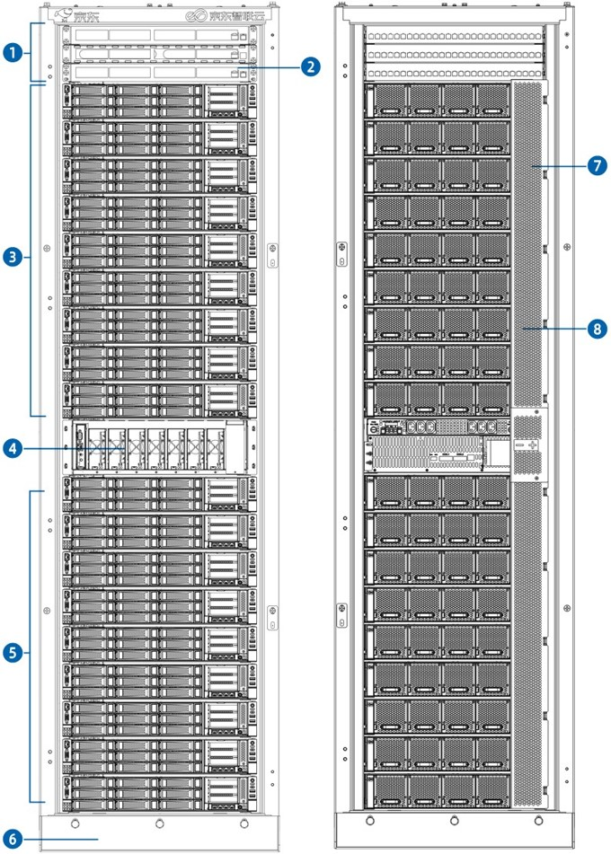
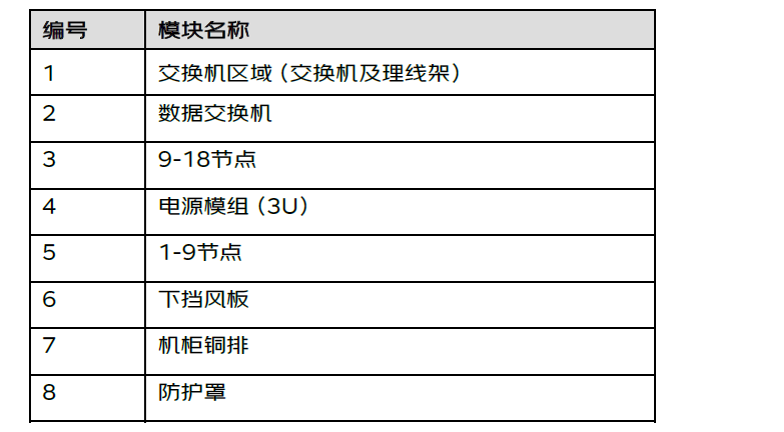
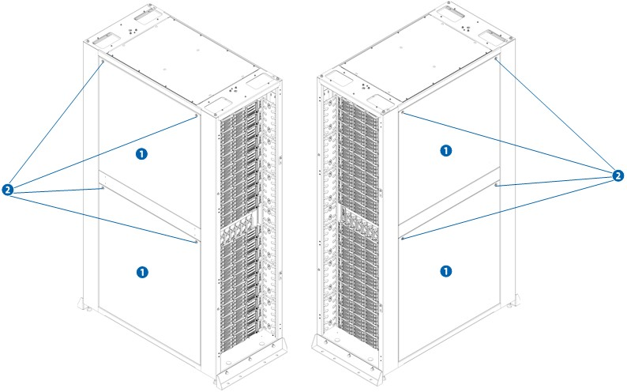
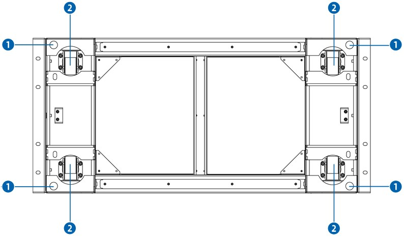

# 1. 整机柜介绍
### 1.1 简介
- 京东云整机柜是京东云首款全自主研发、低成本、高可靠 42U 机架式整机柜服务器，采用了标准的 19 英寸设计，完全融合标准服务器的尺寸，对数据中心环境适配要求更低，极大降低了用户使用门槛。京东云结合用户的需求及痛点，采用自主创新弹性模块化架构设计，用户可以以搭积木的方式，实现按需定制，快速安装，轻松维护。   
- 以高密度、高效能、低功耗、低成本、易管理、灵活部署等特性，为数据中心提供了新一代开放技术管理方案。

## 1.2 机柜前视图及后视图	

## 1.3 机柜左视图及右视图	

## 1.4 机柜俯视图	

## 1.5 机柜下视图	

