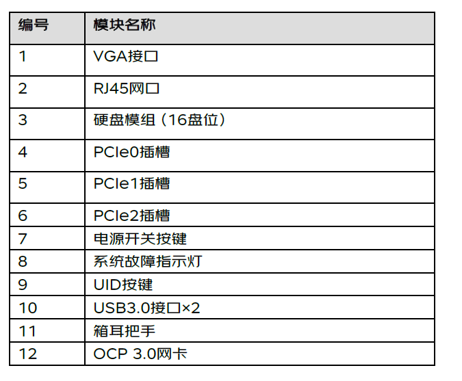
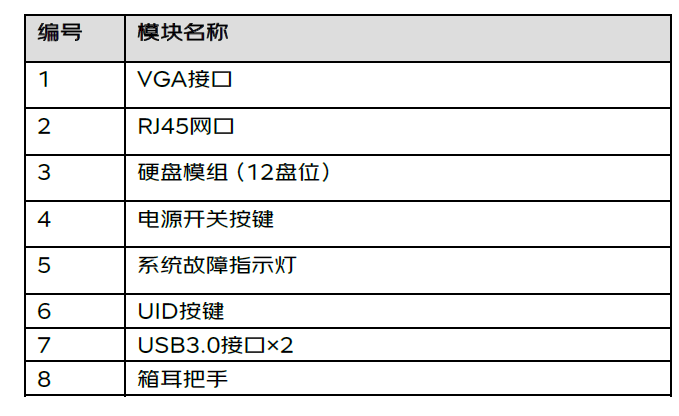
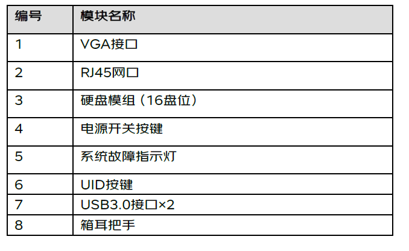
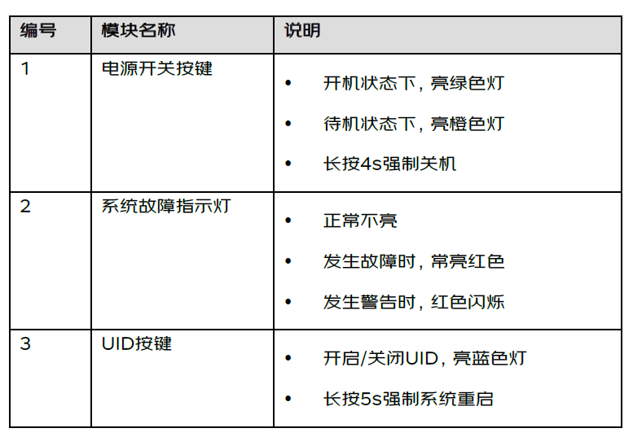
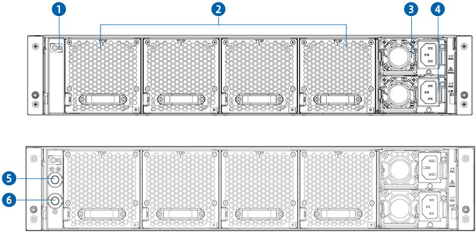
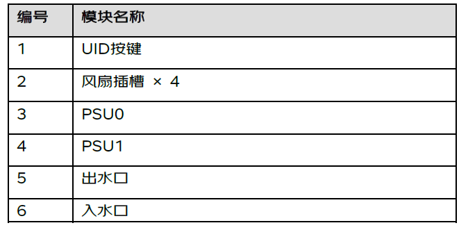
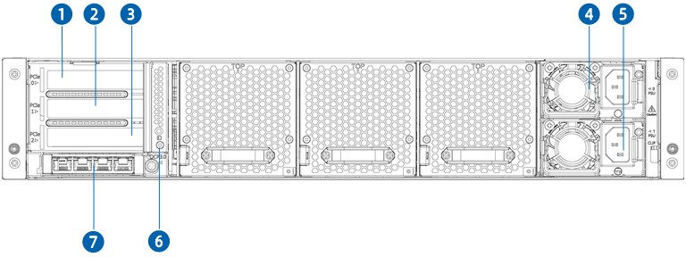
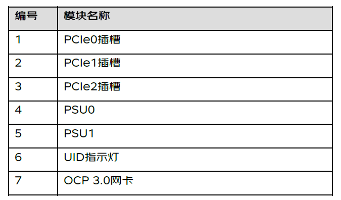
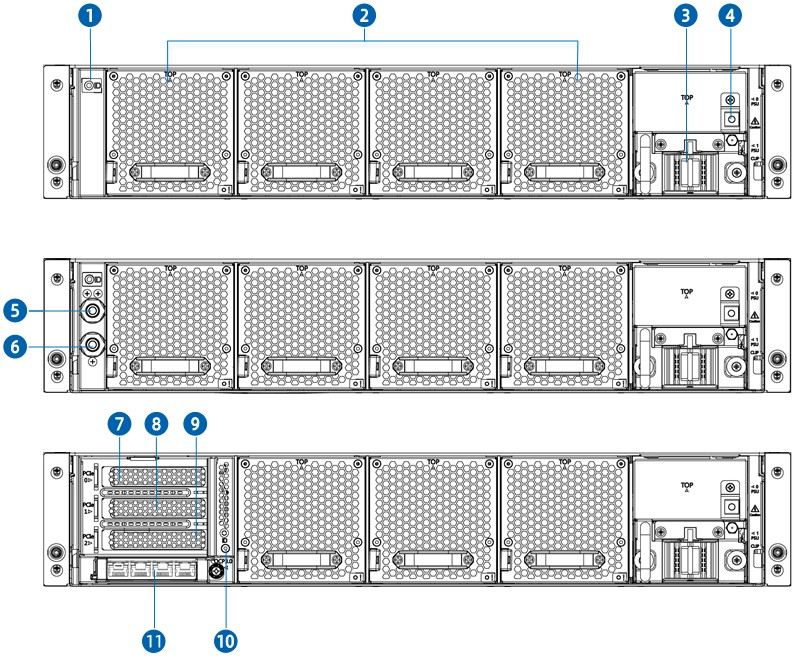
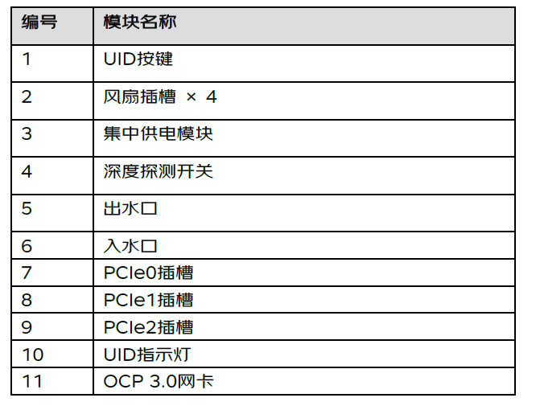

# 3. 组件识别	
### 3.1 前面板	
- **9LFF 硬盘机型（前 I/O）**
	 
   

   
- **16SFF 硬盘机型（前 I/O）**	
  

- **12LFF 硬盘机型（后 I/O）**
  

- **16SFF 硬盘机型（后 I/O）**	
  

### 3.2 前控板按键与指示灯	

### 3.3 后面板	
- **标准电源服务器（前 I/O）**
   

- **标准电源服务器（后 I/O）**	
 

- **整机柜节点服务器（前 I/O）**	
  

### 3.4 主板布局	
- **前 I/O 机型主板**  
   
- **后 I/O 机型主板**    
  
### 3.5 硬盘编号	
- **9LFF 硬盘机型**
    硬盘盘位顺序见下图（编号 0—8）。 
   
- **12LFF 硬盘机型**
    硬盘盘位顺序见下图（编号0—11）。
  

- **16SFF 硬盘机型**	
    硬盘盘位顺序见下图（编号0—15）。
   
### 3.6 硬盘指示灯	
