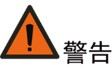

# 4. 服务器操作

### 4.1 启动服务器	

在连接到输入电源时，服务器进行短暂自检（电源状态 LED 快速闪烁）后，进入待机状态（电源状态 LED 每秒闪烁一次）。
您可以通过以下任何一种方式开启服务器（电源 LED 点亮）：
   - 按下并释放服务器前控制板上的电源按钮，启动服务器。
   - 启动BMC网路界面：登录BMC网路界面，从电源控制操作列表框选择启动。
   - 登录BMC CLI，发出IPMI命令，以启动系统。

 如果引导屏幕上持续显示“系统安全 - 系统受损”消息，则意味着未正确安装服务器外盖。请将其卸下并重新装回，然后重新启动服务器。
   
----

### 4.2 关闭服务器	

 
为减少人身伤害、电击或设备损坏的危险，请拔出电源线插头以断开服务器电源。前面板的 “电源开关按键”按钮不能彻底切断系统电源。在切断交流电源前，部分电源和一些内部电路仍带电。

-----

要将服务器置于待机状态（打开电源 LED 每秒闪烁一次）：
  - 使用操作系统开始正常关闭（如果操作系统支持）。
  - 按下“打开电源”按钮开始正常关闭（如果操作系统支持）。
  - 登录BMC CLI，发出IPMI命令，以关闭系统。
  - 紧急关闭：按住电源按钮超过 4 秒，进行关机。
  

正常关闭：关闭之前，需要储存所有打开的文件和网络服务，关闭所有应用程序，停止或终止所有必要的系统流程，然后才可以进行关机操作。
紧急关闭：所有应用程序和文件将关闭，不储存更改，文件系统可能损坏。 

### 4.3 将服务器从机架中拉出	

为减少人身伤害或设备损坏的危险，将组件从机架中拉出之前应保证机架足够稳固。

------

  - 拧松服务器左右挂耳内的松不脱螺钉。
  - 将服务器从机架中拉出。
  
    
    
  - 在执行安装或维护步骤后，将服务器向后推入机架，并固定到位。
  
  
### 4.4 取下主机上盖	

为避免设备表面温度过高而造成人身伤害的危险，请在驱动器和内部系统组件散热后再触碰设备。

请小心取放顶盖。在外盖滑锁打开的情况下跌落顶盖可能会损坏外盖滑锁。
为充分散热，请不要在未安装主机上盖、导风罩、风扇的情况下运行服务器。如果服务器支持热插拔组件，请最大限度地减少打开主机上盖的时间。

------

卸下组件：
  - 如果执行非热插拔安装或维护步骤，则关闭服务器电源。
  - 将服务器从机架中拉出。
  - 使用螺丝刀拧松机盖锁定器上的安全保护螺钉。
  - 提起机盖锁定器手柄，如下图箭头所示方向，卸下主机上盖。
  
 

### 4.5 安装主机上盖	
  - 打开机盖锁定器，将主机上盖对准服务器安装槽位并垂直放下。
  - 将主机上盖滑到闭合位置，向下扣合机盖锁定器。
  - 使用螺丝刀拧紧机盖锁定器上的安全保护螺钉。

### 4.6 卸下 PCIe Riser 卡笼

 
为了避免损坏服务器或扩展卡，在拆卸或安装PCIe Riser卡笼之前，应关闭服务器电源并拔出所有交流电源插头。

------

按以下信息卸下 PCIe Riser 卡笼。本过程以前置 PCIe Riser 卡笼为例，其他 PCIe Riser 卡笼拆卸方法与此相似。
  
**步骤**
- 步骤 1. 解锁前 IO 模块与机箱相连的螺丝，向机箱外抽出前IO 模块。

   
    
- 步骤 2. 向上提前取出 PCIe 模块。捏住PCIe 适配器的两端然后取出 PCIe 适配器。

- 步骤 3. 解锁固定转接卡的两颗螺丝，向右滑动转接卡然后取出转接卡，分离转接卡和 PCIe 卡支架。

 

### 4.7 安装 PCIE Riser 卡笼	

#### 4.71 安装前置 PCIe 模组
  
**步骤**
- 步骤 1. 组装PCIe模组。
   - 将转接卡螺钉孔和葫芦孔与 PCIe 支架上的螺钉孔和立柱对齐，向左滑动。
   - 拧紧两颗螺钉，将转接卡固定在 PCIe 支架上。

    
   
   - 将 PCIe 适配器对齐转接卡上的插槽，然后轻轻地按压 PCIe 适配器的两端，直到适配器在插槽上牢固就位。
   - 将装有 PCIe 适配器的支架向下插入到 OCP 支架上，组成 PCIe 模组。
       
    
- 步骤 2. 将线缆连接到转接卡上。
- 步骤 3. 安装 PCIe 模组。
   - 将线材穿过硬盘仓，伸到机箱内部，把 PCIe 模组插入硬盘仓，并向机箱背面推动。
   - 锁紧两颗自带螺钉固定 PCIe 模组。

    

#### 4.72 安装内置 PCIe 模组
 
**步骤**
- 步骤 1. 安装转接卡。
   - 将转接卡螺钉孔和葫芦孔与 PCIe 支架上的螺钉孔和立柱对齐，向左滑动。
   - 拧紧两颗螺钉，将转接卡固定在 PCIe 支架上。
       
      
      
- 步骤 2. 将线缆连接到转接卡上。
- 步骤 3. 安装 PCIe 适配器：解锁 PCIe 支架上的螺丝，旋转打开 latch ,将 PCIe 适配器对齐转接卡上的插槽，然后轻轻地按压 PCIe 适配器的两端，直到适配器在插槽上牢固就位,最后旋回 latch，紧锁螺丝固定。
   
      
   
- 步骤 4. 安装 PCIe 模组。
   - 将装有 PCIe 适配器的支架上的销钉和孔与机箱上的孔和销钉对齐，并向下放置。
   - 锁紧一颗螺钉固定 PCIe 模组。
       
      

#### 4.73 安装后置 PCIe 模组

**步骤**
- 步骤 1. 组装 PCIe 模组。
   - 将转接卡螺钉孔和葫芦孔与 PCIe 支架上的螺钉孔和立柱对齐，向左滑动。
   - 拧紧两颗螺钉，将转接卡固定在 PCIe 支架上后，将线缆连接到转接卡上。
      
       
      
   - 将 PCIe 适配器对齐转接卡上的插槽，然后轻轻地按压 PCIe 适配器的两端，直到适配器在插槽上牢固就位。
      
     
      
- 步骤 2. 安装系统风扇。
   - 将系统风扇插到 OCP 支架的风扇仓内。
   - 按压铆钉固定风扇。
	
     
        
- 步骤 3. 将装有 PCIe 适配器的支架向下插入到 OCP 支架上，组成 PCIe 模组。
      
     

- 步骤 4. 安装后置 PCIe 模组。
   - 把后置 PCIe 模组插入硬盘仓，并向机箱正面推动。
   - 锁紧一颗螺钉固定后置 PCIe 模组。
        
     

### 4.8 卸下导风罩
 
  

  为充分散热，请不要在未安装主机上盖、导风罩、风扇的情况下运行服务器。如果服务器支持热插拔组件，请最大限度地减少打开主机上盖的时间。
  
  -----
  
  - 关闭服务器电源。
  - 将服务器从机架中取出。
  - 卸下主机上盖。
  - 卸下导风罩。
 
   
   
 **（可选）**
 
  如果服务器配置后置 IO,则服务器安装了后置导风罩。向上提起后置导风罩取出即可。
 
   
 
### 4.9 安装导风罩	

  
  
  为避免损坏服务器组件，请勿用力安装导风罩。确保所有DIMM闩锁都已锁定，以免损坏组件。
  
  ---- 
  
  - 关闭服务器电源。
  - 将服务器从机架中取出。
  - 卸下主机上盖。
  - 安装导风罩。
  - 安装主机上盖。
  - 将服务器安装到机架中。
  - 接通服务器电源。
 
   

  **（可选）**
  
  后置IO配置时，需要安装后置导风罩。将导风罩两侧的卡槽与机箱对齐，向下放入服务器并按压导风罩，直至其牢固就位。
  
    

### 4.10 移除风扇模组

  
  
  操作时务必佩戴劳保手套，避免双手被设备上的尖锐部分划伤。
  
  -----
  
  - 确定需要拆卸的风扇模块。
  - 按压风扇模块一侧把手，将风扇模块水平拉出。
    
   

### 4.11 安装风扇模组	

  
 
  操作时务必佩戴劳保手套，避免双手被设备上的尖锐部分划伤。
  
  ---- 
  
  - 确定风扇模块的安装槽位。
  - 确定风扇的安装方向。
  - 沿水平方向将风扇模块插入机箱中，直到机箱扣紧风扇模块为止。
  - 重复2～3步骤安装其余的风扇模块。
  
   
