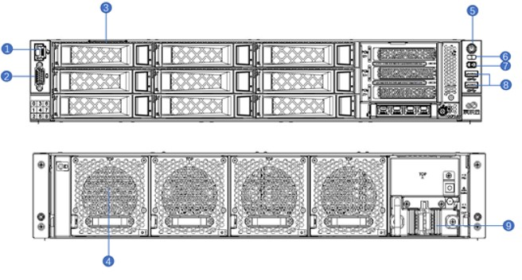
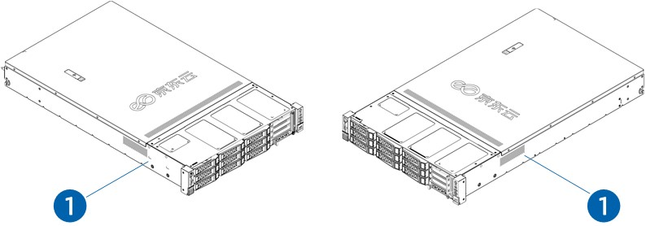
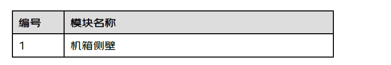

# 2. 服务器介绍

### 2.1 简介
- 第二代京东云服务器的设计理念源于京东自有大规模云数据中心的建设和运营经验，基于全新一代英特尔®至强®可扩展处理器设计的一款高端双路机架式服务器。J360 G2是继第一代服务器“微定制”之后，基于内部多样化海量业务需求，以及京东云各行业客户需求，自主研发与深度创新的新一代云服务器基础架构。
- 通过系统架构设计创新、核心部件创新，实现了高效、灵活、高性价比的目标。
    
### 2.2 服务器前视图及后视图	
    

### 2.3 服务器左视图及右视图	
  

### 2.4 服务器俯视图	
 
