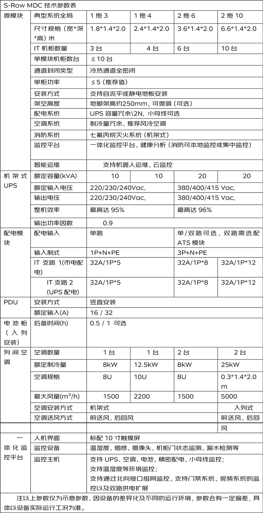

# **产品规格**
模块化数据中心 MDC从结构形态上分为以下三类：D-Row MDC；S-Row MDC；S-Cabinet MDC。

*以下介绍三种规格为典型规格，更多规格请咨询线下销售人员。*
## **D-Row MDC**
D-Row MDC适用机柜总功率35KW~150KW；最大单机柜功率可不大于12KW，为双排柜模组式安装形式，详见图1。

图1 D-Row MDC

## **S-Row MDC**
S-Row MDC 适用机柜总功率6KW~35KW;单机柜平均功率：不大于5KW（推荐），为单排柜安装形式,详见图2。

## **S-Cabinet MDC**
S-Cabinet MDC 适配机柜总功率6KW以内应用场景。详见图3。
 - 架式分体空调：双柜6KW、单柜3KW。
 - 背包式空调：双柜3KW、单柜1.5KW（静音版）。

