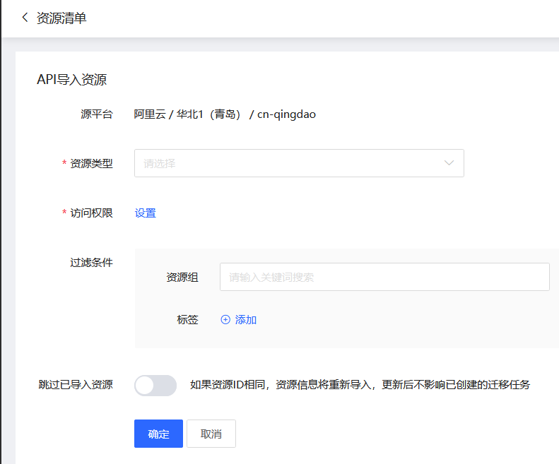

# 资源发现与导入
自动发现并导入其他云平台的常用资源，如主机，数据库等等。

## 前置条件
已经设置了源平台的Access Key 和 Access Key Secret 。

## 操作步骤
1. 点击控制台左边 “资源发现” - **“资源列表”** 的菜单。 在资源列表页中，可以看到当前已经发现的所有资源。
2. 点击 **源平台导入**，在弹窗中输入或选择：
  - 资源类型，目前支持以下资源的自动发现和导入：
    - 服务器：云服务器
    - 数据库：MySQL，PostgreSQL，MongoDB，Redis
    - 对象存储：存储桶（Bucket）
  - 过滤条件，支持按资源组和标签进行过滤。
  - 跳过已导入资源：重新导入时遇到相同资源的处理方式。
    - 关闭：如果资源ID相同，资源信息将重新导入，更新后不影响已创建的迁移任务。
    - 开启：已导入的源资将被跳过，不再重新导入。
3. 设置完成后，点击 ** 确定**，开始自动检测和导入相关资源。

> **备注**
>
> 如果源平台资源不支持资源组或标签，则导入资源时将忽略该筛选条件。

