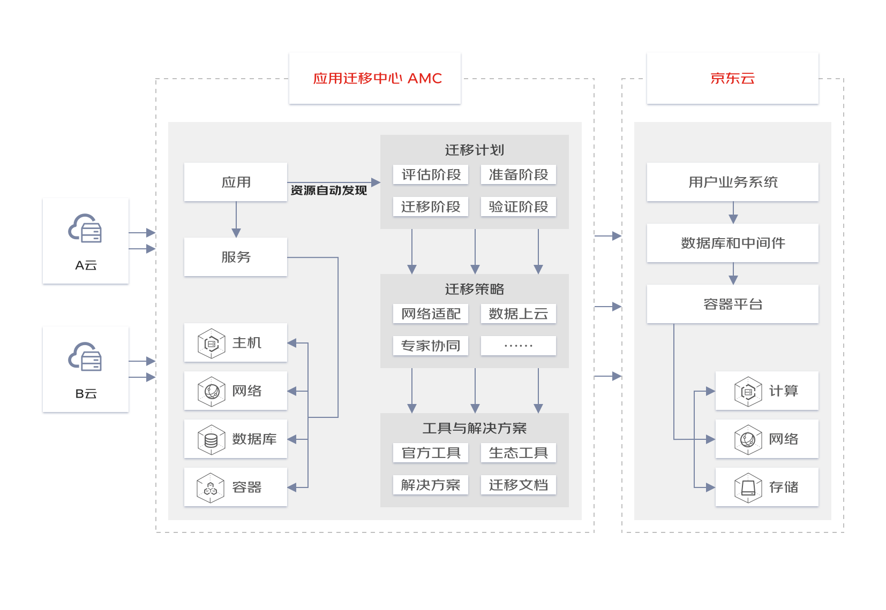
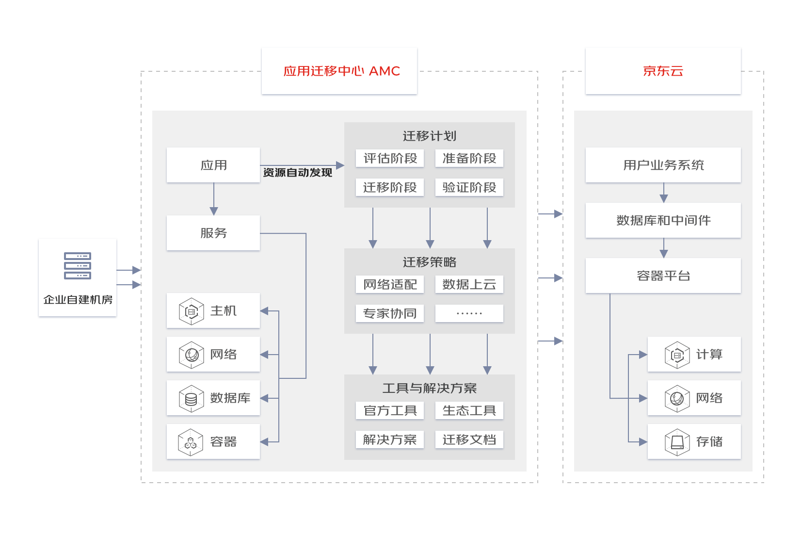

# 应用场景

## 实施多云战略
当用户从成本，服务、风险等整体考虑评估，需要实施多云战略时，可以借助 AMC 将其他云厂商的资源迁移到京东云上。AMC 可以自动检测和发现主流云厂商和常用资源，协助用户管理整个迁移流程，协助用户使用最小的成本和代价高效的完成迁移工作。

## 企业迁移上云
企业在进行数字化建设过程中，需要将位于传统机房的资源和服务迁移到京东云上。AMC 可以支持云主机，数据库、对象存储等常见资源的迁移，可以通过可视化界面，实现迁移的可管控，易观测，帮助用户方便、快捷的完成迁移上云。

