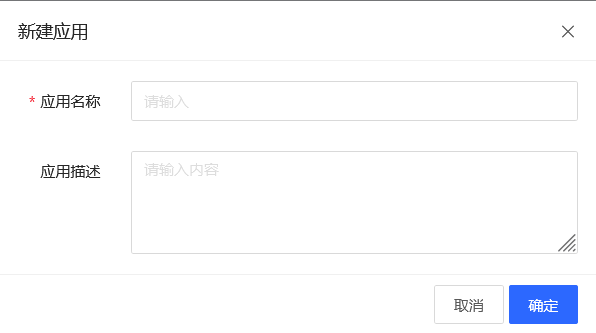
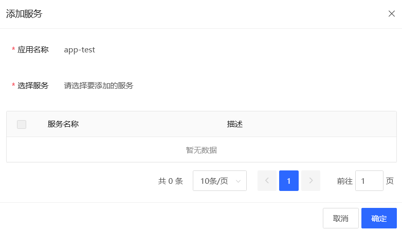

# 应用管理
可以创建，删除或修改应用，并关联相应的服务。

## 操作步骤
### 创建应用
1. 点击控制台左边 “应用管理” - **“应用列表”** 的菜单。 在应用列表页中，可以看到当前已经创建的应用。
2. 点击 **新建** 按钮，在弹窗中输入应用的相关信息。
  - 应用名称
  - 应用描述
3. 点击 **确认**，完成创建。 然后可以在应用列表页中看到创建的应用。

### 给应用添加服务
1. 点击要添加服务的应用右边的 **添加服务** 按钮。
2. 在弹窗中选择当前应用要添加的服务。
3. 点击 **确认**，完成服务的添加。

### 修改应用
1. 点击要修改应用右边的 **修改** 按钮。
2. 在弹窗中可以对 “应用名称” 和 “应用描述” 进行修改。
3. 点击 **确认**，修改完成。

### 删除应用
1. 点击要删除应用右边的 **修改** 按钮。
2. 在弹窗中点击 **确认**，完成删除。
