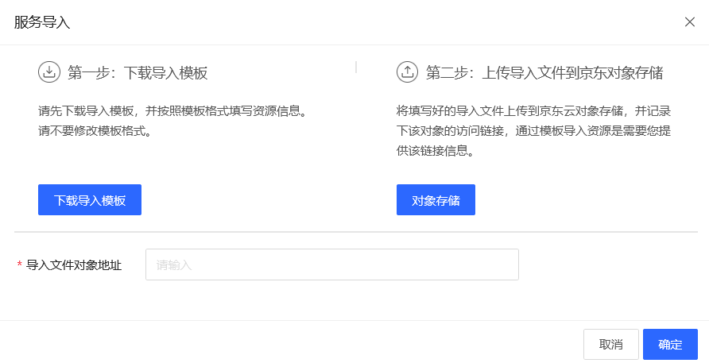

# 服务导入
根据模板批量导入应用相关的各种服务。

## 操作步骤
1. 点击控制台左边 “应用管理” - **“服务列表”** 的菜单。 在服务列表页中，可以看到当前已经导入的所有服务。
2. 点击 **下载导入模板**， 下载模板。
3. 根据模板内容进行填写，注意不要修改模板的格式。
4. 填写完成后，将模板上传到 对象存储 OSS 中。
5. 在导入的界面中输入文件在 OSS 中的地址。
6. 点击 **确认**，开始导入。

> **注意**
>
> 不要修改模板的格式，否则可能会导入失败。

