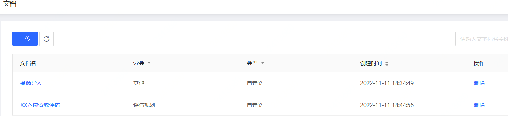

# 文档管理
关联与迁移工作相关的各类文档，包括上传、下载及删除等操作。

## 操作步骤
### 上传文档
1. 点击控制台左边 “文档管理” - **“解决方案文档”** 的菜单。 在文档列表页中，可以看到当前已经上传的所有文档。
  
   

2. 点击 **上传** ，在弹窗中输入以下信息：
  - 解决方案分类
  - 文档名
  - 选择 
    - 上传文件：点击 **点击上传** ，上传本地磁盘中的文档。
    - 指定文档连接：输入文档的地址。
  - 说明：
    - 文件大小：不超过 50 MB
    - 文件类型：支持 .pdf, .docx, .doc, .xlsx, .xls, .pptx, .ppt, .png, .svg, .vsdx, .vsd, .xmind 
    
3. 点击 **确定** ，完成文档上传。
  

### 下载文档
点击文档名称，即可下载该文档。

### 删除文档
1. 点击文档右边的 **删除** 按钮。
2. 在弹窗中点击 **确定** ，完成删除。
  
  
  
