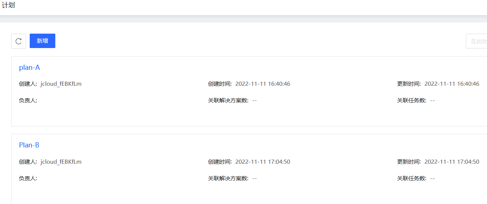

# 迁移计划管理
管理迁移计划，包括创建，修改和删除等常用操作。

## 操作步骤
### 创建计划
1. 点击控制台左边 “计划管理” - **“计划列表”** 的菜单。 在计划列表页中，可以看到当前已经创建的所有迁移计划。
2. 点击 **新增**，在弹窗中输入 **计划名称**。
3. 点击 **确认**，完成计划的创建。

### 修改计划名称
1. 将鼠标移到迁移计划上，然后点击迁移计划名称右边的修改按钮。
2. 在弹窗中输入新计划名称。
3. 点击 **确定**，完成修改。

### 删除迁移计划
1. 将鼠标移到迁移计划上，然后点击迁移计划名称右边的删除按钮。
2. 点击 **确定**，确认删除。
