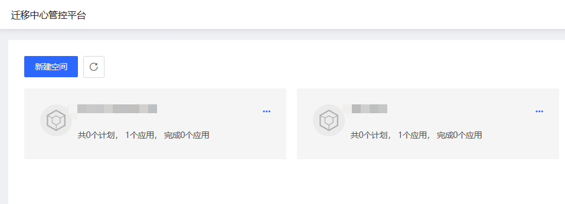
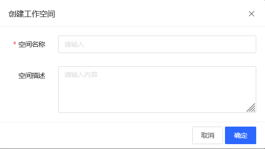
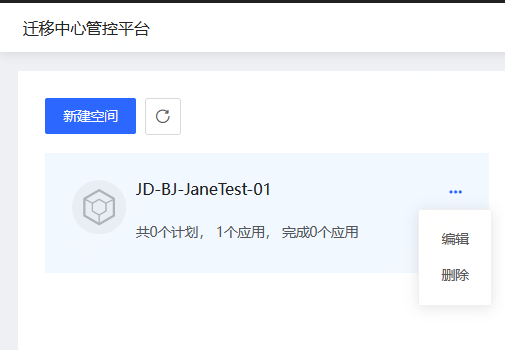

# 空间管理
进行空间相关的常用操作，例如创建，编辑或删除迁移空间。

## 操作步骤
### 新建空间
1. 进入 AMC 控制台，控制台会在当前页面显示已有的空间信息，点击 **新建空间**。

  

2. 在弹窗中输入 “空间名称 和 “空间描述”。

  

### 编辑空间
1. 点击空间右边的按钮，在菜单中选择 **编辑**。

  

2. 在弹窗中可以修改 “空间名称 和 “空间描述”。

### 删除空间
1. 点击空间右边的按钮，在菜单中选择 **删除**。
2. 在弹窗中确认信息无误后，点击 **确定**。
