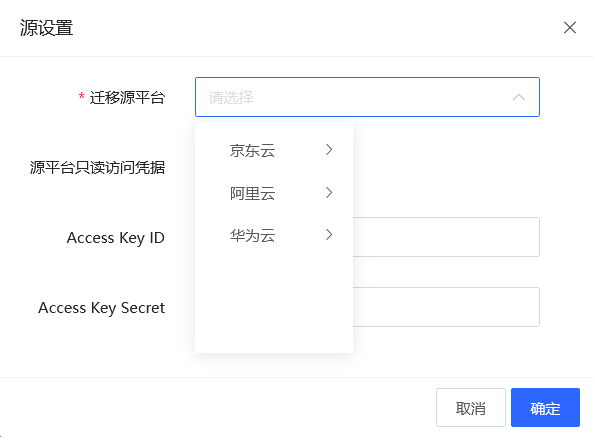
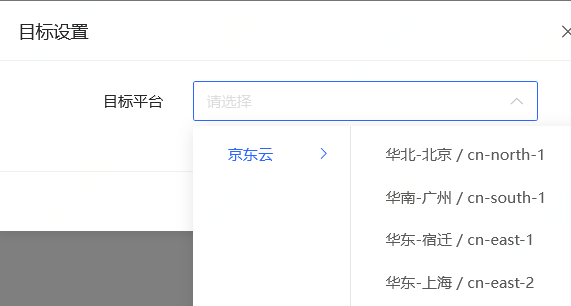
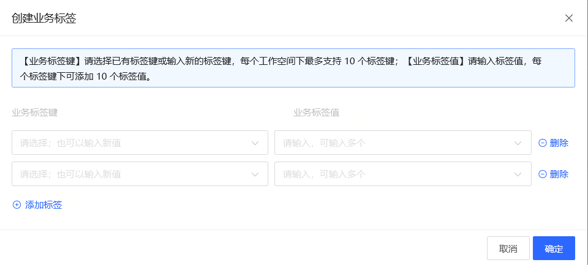

# 空间设置
对该迁移空间的源平台和目标平台进行设置，并可以对空间设置标签。

## 操作步骤
1. 点击左边的菜单 “工作空间” - "空间设置"，进入设置页面。
2. 点击 “源设置”后的修改图标，在弹窗中选择或输入以下信息：
  - 迁移源平台：选择当前要迁移的业务或应用位于云平台，当前支持以下云：
    - 阿里云
    - 华为云
    - 京东云
  - Access Key ID: 访问源平台需要的 Access Key 。
  - Access Key Secret: 访问源平台需要的 Access Key Secret 。
  
  > **备注**
  >  
  > 迁移源平台和目标平台设置后，不能修改。  
  
  

3. 点击 “目标设置”后的修改图标，在弹窗中选择或输入以下信息：
  - 目标平台，仅支持 “京东云”
  
  

4. 可以根据业务需要，对空间设置标签。点击 ”业务标签“ 下的 **创建** 按钮，在弹窗中输入标签信息。
  - 点击 **添加标签** 可以新增一个标签。
  - 点击 **删除** 可以删除一个标签。
  
  

