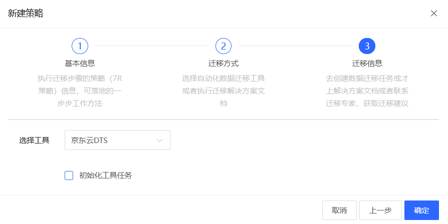
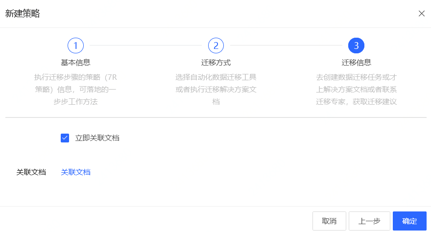
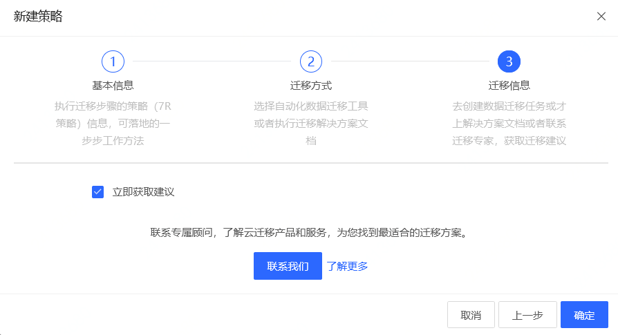

# 策略管理
制定并管理迁移策略。

## 操作步骤
### 新建策略
1. 点击控制台左边 “迁移策略” - **“策略列表”** 的菜单。 在策略列表页中，可以看到当前已经创建的所有策略。
2. 点击 **新建**按钮。

    1） 输入 “策略名称” 和 “策略描述”，点击 **下一步**。
  
    2） 选择迁移方式，目前支持以下三种选择。
      - 工具迁移
      - 文档迁移
      - 咨询
    
   选择完成后，点击 **下一步**。
3. 根据 步骤2 选择的，进行相应的操作。
  - 选择 “工具迁移”：选择要进行迁移的工具，目前支持 “京东云 DTS”。
  
  
  
  - 选择 “文档迁移”：可关联与该迁移有关的文档。
  
  
  
  - 选择 “咨询”，显示咨询相关信息。
  
  
  
4. 点击 **确认**，完成策略的创建。

### 关联任务
如果策略是 “工具迁移”，那么可以关联对于的迁移任务。

1. 点击策略右边的 **关联任务**。
2. 在弹窗的迁移任务列表中，选择要关联的任务。
3. 点击 **确定**，完成关联。

### 关联文档
如果策略是 “文档迁移”，那么可以关联对于的迁移文档。

1. 点击策略右边的 **关联文档**。
2. 在弹窗的文档列表中，选择要关联的文档。
3. 点击 **确定**，完成关联。

### 删除策略
1. 点击策略右边的 **删除**。
2. 在弹窗中点击 **确定**，完成删除。
