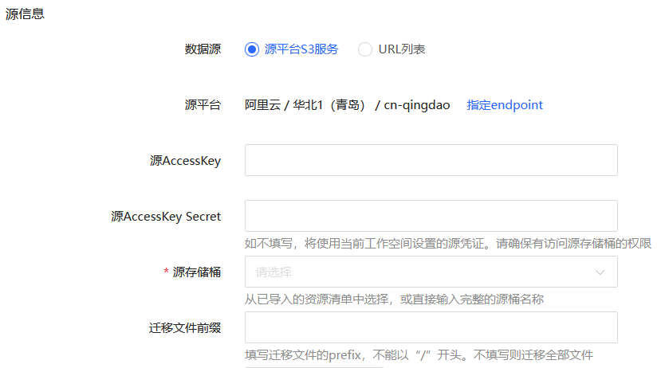
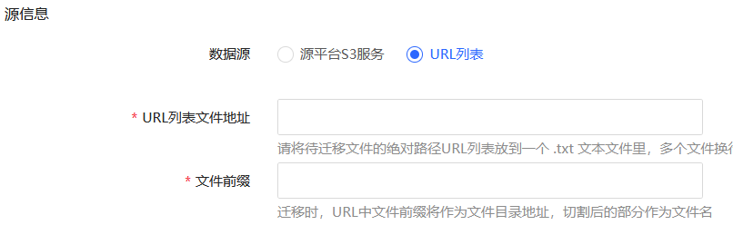
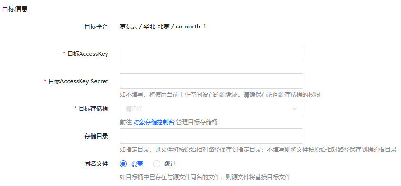

# 对象存储迁移
通过 Web 控制台提供对象存储 OSS 在线迁移和离线迁移的能力，可支持断点续传、流量控制、数据的并行下载、上传，支持的最大单文件大小为 19.5 TB。

> **备注**
>
> - 文件名不能超过 1022 字节，且不得包含回车、换行等不可见字符。
> - 从云厂商迁移对象存储服务（兼容 S3），仅支持源 Bucket 权限为公有读，否则将导致迁移失败。

## 操作步骤
#### 创建迁移任务
1. 点击控制台左边 “任务管理” - **“对象存储”** 的菜单可进入对象存储迁移任务的页面。 在任务列表页中，可以看到当前已经创建的所有对象存储迁移任务。
2. 点击 **创建** 按钮，新建迁移任务。
3. 在新建页面中输入以下信息：
  - 任务名称：长度为1-40字符，支持中文，字母，数字，"-"和"_"，具体以控制台显示为准。
  - 数据源：支持 “源平台 S3 服务” 和 “URL 列表” 两种方式。
    - 如果选择 “源平台 S3 服务”
      - 源平台：默认采用与当前空间的源设置，也可以点击 ** 指定 endpoint** ,定义其他的endpoint。
      - 源 AccessKey 及 源 AccessKey Secret：如不填写，将使用当前工作空间设置的源凭证。请确保有访问源存储桶的权限。
      - 源存储桶：从已导入的资源清单中选择，或直接输入完整的源桶名称 。
      - 迁移文件前缀：填写迁移文件的prefix，不能以“/”开头。不填写则迁移全部文件。
      
      
      
    - 如果选择 “URL 列表”
      - URL列表文件地址: 包含迁移文件 URL 地址的文本下载地址。例如，可将待迁移文件的绝对路径 URL 放到 txt 文本文件里，多个文件的 URL 可以使用换行分隔，每行一个文件地址，如 http://www.example.com/abc/xxx.mp4 。
      - 文件前缀：迁移时，URL 中文件前缀将作为文件目录地址，切割后的部分作为文件名。
      
      
      
  - 最大并行读取文件数：该迁移中同时并行读取的文件数。
  - 请求并发数：该迁移任务最大的 QPS 数。
  - 目标 AccessKey 及 目标 AccessKey Secret：如不填写，将使用当前工作空间设置的目标凭证。请确保有访问目标存储桶的权限。
  - 目标存储桶：迁移的目标存储桶。
  - 存储目录：如指定目录，则文件将按原始相对路径保存到指定目录；不填写则将文件按原始相对路径保存到桶的根目录。
  - 同名文件：如果目标存储桶存在同名文件，则有以下两种处理方式：
    - 覆盖：如目标桶中已存在与源文件同名的文件，则源文件将替换目标文件。
    - 跳过：如目标桶中已存在与源文件同名的文件，则保留目标文件。
          
  - 迁移模式，支持以下两种方式：
    - 在线迁移
    - OSSTransfer（离线迁移
  - 迁移网络，支持 “专线迁移” 和 “公网迁移”。
    - 如果选择 “专线迁移”，则有以下额外配置：
      - 私有网络：选择相应的 VPC 和 Subnet。
      - 安全组：选择相应的安全组。
      - 源存储桶的内网IP：可通过在内网 VPC 内 Ping 源桶域名获得。
      
      
      
  - 迁移限速：当前默认为 200 MB/s 。
4. 配置完上述选项后，可点击 **创建** 或者 **创建并启动** 。

