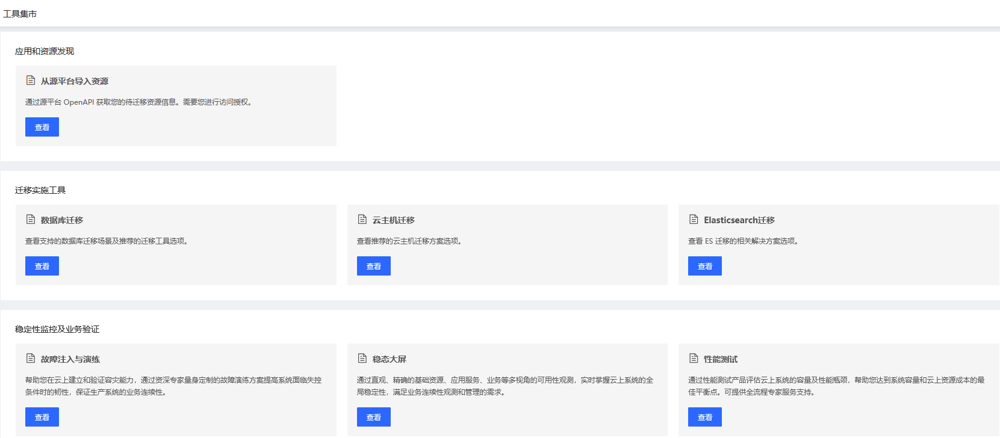

# 工具管理
跟迁移相关的各种工具的入口及迁移方案的文档说明。

## 操作说明
1. 点击迁移中心控制台左边菜单的 “工具管理” - “工具集市”，可以进入到工具集市的页面。
2. 工具集市中汇总了目前迁移中心支持的各种迁移相关的工具及方案，目前支持以下产品：
  - 应用与资源发现
    - 从源平台导入资源
  - 迁移工具
    - 云主机迁移，提供以下两种迁移方式：
      - 私有镜像导入
      - 主机在线迁移
    - 数据库迁移：提供数据迁移、数据订阅和数据同步服务，可满足数据上云、业务异步解耦、数据异地灾备、业务系统数据流转等业务场景。支持以下数据库：
      - MySQL
      - MariaDB
      - Percona
      - PostgreSQL
      - SQL Server
      - MongoDB
      - Redis
    - Elasticsearch：可以通过 OSS 快照方式、Reindex 方式和 Logstash 方式，实现京东云 ES 间的数据迁移、自建/第三方 ES 迁移至京东云等场景。
  - 稳定性监控及业务验证
    - 故障注入与演练：帮助用户在云上建立和验证容灾能力，通过资深专家量身定制的故障演练方案提高系统面临失控条件时的韧性，保证生产系统的业务连续性。
    - 稳态大屏：通过直观、精确的基础资源、应用服务、业务等多视角的可用性观测，实时掌握云上系统的全局稳定性，满足业务连续性观测和管理的需求。
    - 性能测试：通过性能测试产品评估云上系统的容量及性能瓶颈，帮助您达到系统容量和云上资源成本的最佳平衡点。可提供全流程专家服务支持。 

