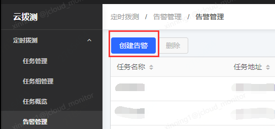
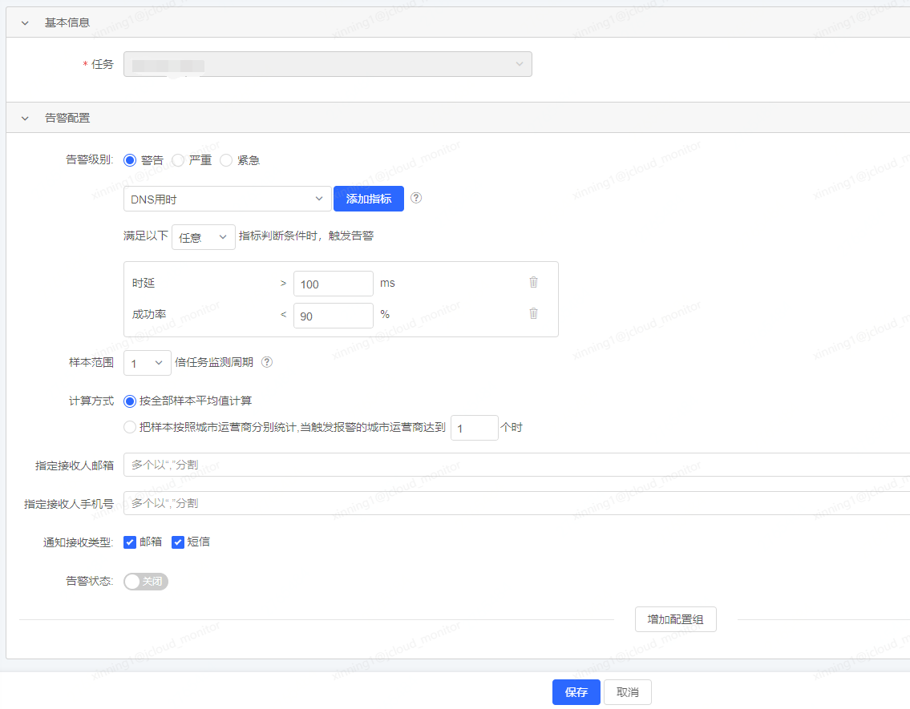
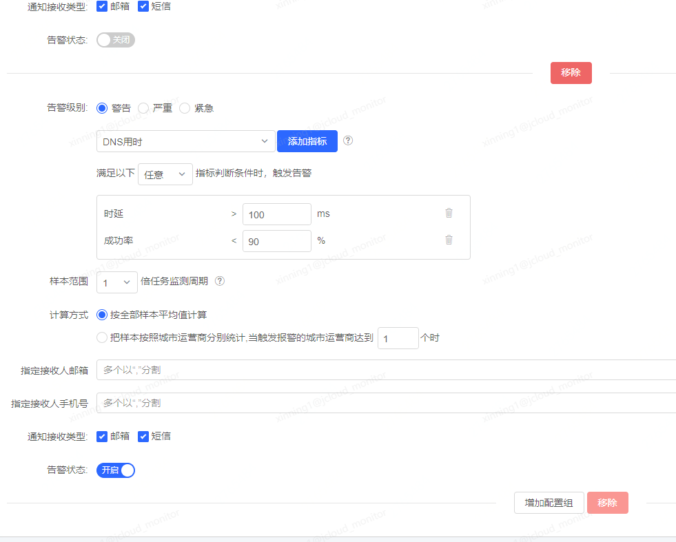
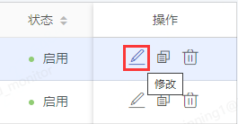
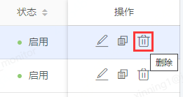
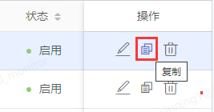

# 告警管理

## 创建告警

在告警管理页面，点击左上角的“创建告警”按钮，进入到配置任务告警的页面。通过此种方式配置告警时，需要手动选择任务。

告警配置中如上图所示。

- 告警级别
配置告警的级别，分为警告、严重、紧急三个等级。

- 告警指标及阈值
配置告警使用的技术指标和对应的阈值。

可从支持的指标下拉框中选择指标，点击“添加指标”按钮，会将所选指标添加到下方的阈值配置框中。

当配置了多个指标时，可以设定触发规则，满足任意一个条件即触发告警，或满足所有条件触发告警。

- 样本范围
获取多少个任务监测周期的数据进行汇总计算告警，默认为1倍。

例如，当前任务的监测周期为5分钟，选择1倍时，每5分钟的数据（一个探测周期的数据）汇总后判断一次告警，选择2倍时，每10分钟的数据（两个探测周期的数据）汇总后判断一次告警。

- 计算方式
可设定计算告警数据的方式。

默认为按照全部样本的平均值进行计算。

可以切换为按照城市运营商分别统计。

例如监测任务配置了北京联通和上海电信两个监测点，当选择按全部样本平均值计算时，会将这两个监测点的数据进行汇总平均，判断总的平均数是否超过告警阈值。当选择按照城市运营商分别统计时，会分别计算北京联通的平均值和上海电信的平均值，之后判断是否超过告警阈值，哪个超过就告警哪个。

这里还可以设置按照城市运营商分别统计时，最小触发的城市运营商个数，例如设置为2个，则必须有2个及以上的城市运营商的平均值都超过了告警阈值时才会触发告警。

- 指定接收人邮箱
可设置当告警触发时，将通知发送给哪些邮箱，多个以英文逗号分隔。

- 指定接收人手机号
可设置当告警触发时，将通知发送给哪些手机号，多个以英文逗号分隔。

- 通知接收类型
选择告警的通知类型，包括邮件和短信。

- 告警状态
当前告警配置是否开起生效。

- 增加配置组
点击增加配置组，可以再增加一组告警配置，配置的内容与上边一致。任意一个配置组触发，都会触发告警。

点击移除按钮可移除某个配置组。

## 修改告警

在告警管理列表页中，点击操作列的“修改”图标，可进入到修改告警的页面。

修改告警的页面与创建告警页面类似，可修改告警的级别、指标及阈值、样本范围、计算方式、指定接收人邮箱、指定接收人手机号、通知接收类型和告警状态开关，也可以增加和移除配置组。

## 删除告警

点击操作列中的“删除”图标，可删除指定告警。

## 复制告警

如果需要创建的告警，其告警配置与之前某个已创建的告警相同或类似，可以点击告警列表中需要复制的告警右侧的“复制”图标，进入到复制告警页面，其页面与创建告警类似，告警配置中的各项参数已填充为和复制的告警一致的内容，您可以在此页面中选择一个新的任务，直接点击提交，即可为该任务快速创建一个与被复制的告警条件相同的告警，或者可以简单修改其中几个告警配置项，以达到快速创建告警的目的。