# 任务管理

## 新建监测任务

1. 登录京东云云拨测控制台，默认会进入到任务列表页面，或点击“定时拨测”-“任务管理”进入到任务列表页面。

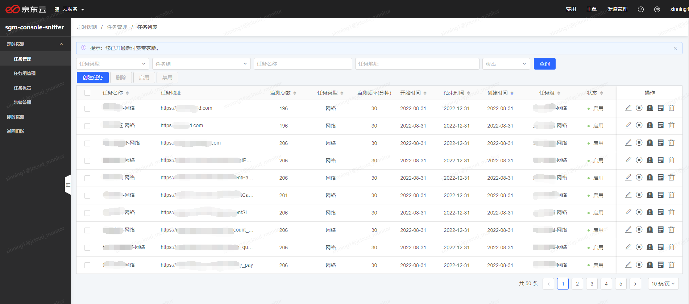

2. 点击表格左上角的“创建任务”按钮，可以进入到创建监测任务的页面。

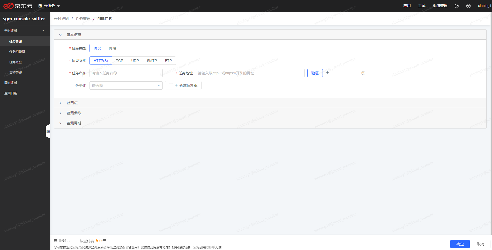

创建任务需要填写四部分信息，分别为基本信息、监测点、监测参数、监测周期。

3. 填写基本信息

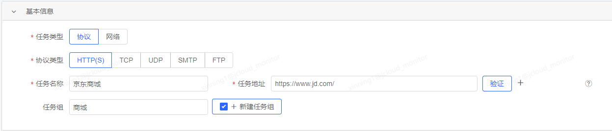

- 任务类型：选择拨测任务的类型，当前支持“协议”测试和“网络”测试两种类型。
- 协议类型：当上边的任务类型选择“协议”测试时，这里的协议类型可以选择HTTP(S)、TCP、UDP、SMTP、FTP。
- 任务名称：填写拨测任务的名称，以便于区分查看。
- 任务地址：填写需要监测的任务地址，当选择的是HTTP(S)协议时，这里的格式为以 http:// 或 https:// 开头的url地址，当选择的是其他协议或网络类型时，这里的任务地址格式为“域名:端口”或“IP:端口”或“IPv6:端口”。
当填写了任务地址后，可以点击后边的“验证”按钮，在本机对所填的任务地址进行访问验证，已排查任务地址是否填写正确。
如果需要同时批量创建任务，可以点击任务地址后边的“+”，即可再添加出一行任务名称和任务地址，似乎相同的监测点、监测参数、监测周期批量创建出多个监测任务，每次最多批量创建10个任务。
- 任务组：可从已创建的任务组中选择一个，将当前创建的任务划入到该组中，也可以勾选后边的“+新建任务组”，填写任务组名称，创建一个新的任务组，并将当前创建的任务划入到该组中。

4. 添加监测点

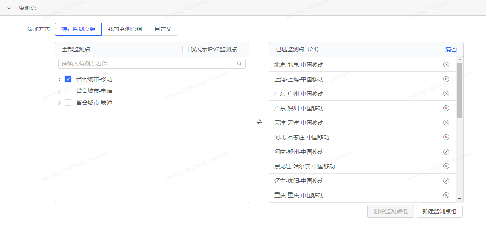

监测点是执行拨测任务的客户端，每次任务下发时，会从符合用户配置的监测点（地区-城市-运营商）中选择空闲的客户端，进行任务的下发，测试，数据上报。

有三种方式可以添加监测点：推荐监测点组、我的监测点组、自定义。

**推荐监测点组**

系统会默认给出一些推荐的监测点组，您可以直接选择系统推荐的监测点组，快速添加监测点，适合初次使用的用户使用，例如选择“省会城市-移动”，可直接添加全国各省会城市的移动运营商监测点。

监测点组可以多选。

右侧会列出当前所有添加的监测点数量和列表，点击每个监测点右边的叉子，可删除该监测点，点击清空可直接清空所有添加的监测点。

**我的监测点组**

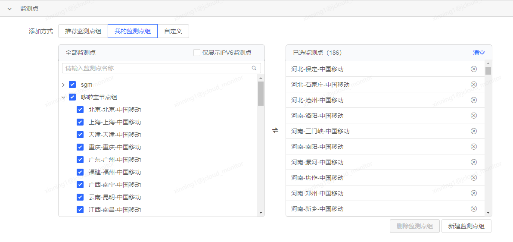

我的监测点组是指用户根据自己需求，事先保存的监测点组，适合高级用户使用，您可以将自己经常会用到的监测点保存为一个监测点组，以方便从“我的监测点组”中直接选择并添加这些监测点。

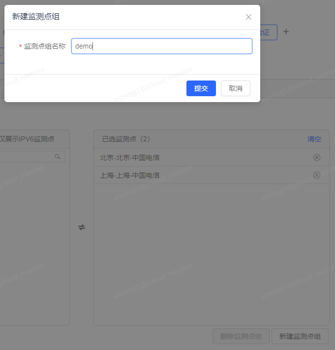

当右侧已添加了监测点时，可点击右下角的“新建监测点组”按钮，快速将这些监测点保存为一个监测点组。

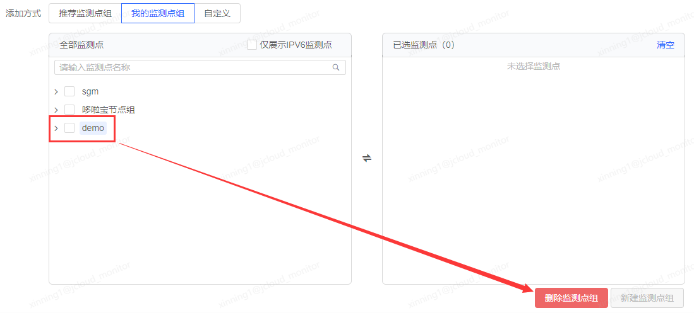

在“我的监测点组”中点击监测点组名称，可以激活右下角的“删除监测点组”按钮，点击该按钮并二次确认后，可删除该用户创建的监测点组。

**自定义**

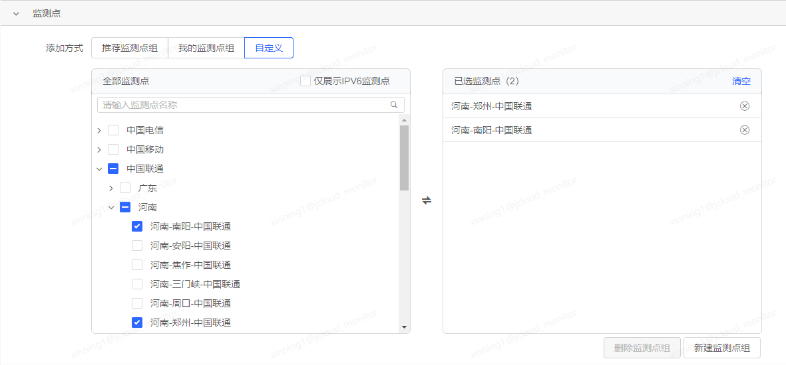

自定义的方式是手动选择需要的运营商-地区-城市的监测点逐个添加，通过左侧备选监测点框中列出的运营商-地区-城市列表，逐级展开选择，也可以一次性选中某个运营商、某个地区的所有监测点，支持输入监测点名称进行搜索。

如之前所述，选择监测点后，可以快速新建一个监测点组，之后便可以在“我的监测点组”中快速选择。

5. 配置监测参数

**HTTP(S)协议**

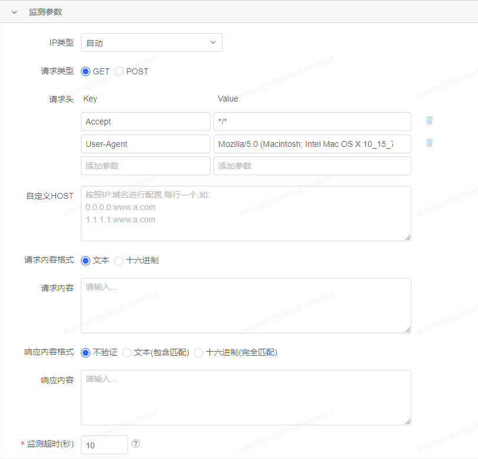

HTTP(S)协议测试的监测参数如上图所示。

- IP类型：默认为自动，如果需要指定使用IPv4或IPv6的监测点进行探测，可以在选项中进行切换。
- 请求类型：默认为GET请求，可切换为POST
- 请求头：可自定义请求头的key-value，以实现一些特定的监测需求，例如有一些监测地址会检测来源信息（Referer）是否是特定的，否则拒绝访问，此时可通过自定义请求头设置来源信息。
- 自定义HOST：可自定义域名HOST，通常情况拨测任务会根据监测点的DNS服务器解析结果进行访问探测，如果希望指定主机进行监测，可以通过自定义HOST配置域名和IP的映射。如果一个域名配置了多个IP地址，每次进行拨测的时候，会随机选择一个IP进行测试。特别注意，如果您配置了自定义HOST，请保证配置的正确性，确保可以访问到。
- 请求内容格式：发送特定请求报文的格式，支持文本或十六进制。
- 请求内容：可以输入特定的请求报文，例如服务器需要接受特定请求报文，或者需要进行特定响应内容验证需要发送特定请求报文的情况，通常情况下可以不用填写。
- 响应内容格式：进行响应内容验证的格式，默认为不验证，可选择文本（包含匹配）或十六进制（完全匹配）。
- 响应内容：进行响应内容的验证时，需要在此填写验证的内容，如果服务端返回的响应内容与此处填写的相符，则此次探测任务成功，如果不相符，则此次探测任务会记为失败，报一个响应内容不正确的错误。通常情况下，如果不需要进行响应内容的验证，则响应内容格式选择不验证，这里不需要填写。
- 监测超时(秒)：整个监测任务的超时时间，如果超过这里设置的时间，任务还没有执行完成，则此次任务会记为任务超时错误，强制终止，释放监测点资源。

**TCP及UDP协议**

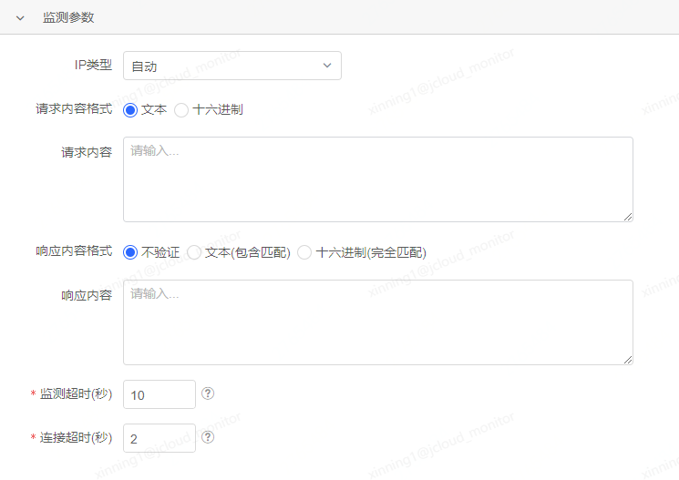

TCP和UDP协议的监测参数配置项相同，包含IP类型，请求内容格式，请求内容，响应内容格式，响应内容，监测超时，连接超时。

大部分配置项与HTTP(S)的一致，这里多了一个连接超时的阈值设置。

- 连接超时(秒)：监测点与服务端建立握手连接时的最大尝试时间，超过此处设置的阈值，则认为连接超时，返回一个对应的错误。

**SMTP及FTP协议**

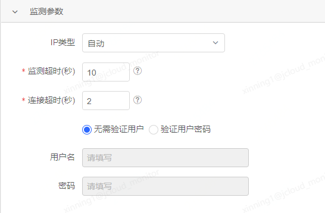

SMTP和FTP协议的监测参数配置项相同，包含IP类型，监测超时，连接超时，用户名密码。

不部分配置项与TCP协议的一致，这里多了一个用户名密码配置项。

如果SMTP或FTP的服务端需要进行用户名和密码校验，则需要选择“验证用户密码”，并在下方填写用户名和密码，以确保监测点在进行探测任务时可以顺利通过用户密码校验并成功执行任务。

**网络类型测试**

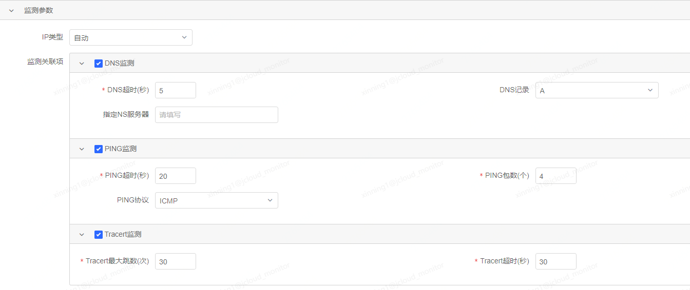

网络类型测试的监测参数包含IP类型，监测关联项配置。

监测关联项是网络类型测试的任务项，支持DNS监测，PING监测，Tracert监测三种，可以根据需要进行选择。

- DNS监测
使用监测点对目标探测地址进行域名解析的测试，并返回解析结果数据。
    - DNS超时(秒)：监测点进行DNS监测时的最大尝试时间，超过此处设置的阈值还未成功解析，则任务域名解析超时失败，会返回一个相应的错误。
    - DNS记录：DNS监测的记录内容，默认为A记录，支持切换为AAAA，MX，NS，CNAME，TXT，ANY等类型。
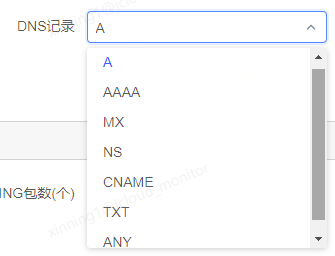

    - 指定NS服务器：默认情况下，监测点在进行DNS监测时，会使用自己的NS服务器进行解析，例如北京联通的监测点会使用北京联通的DNS服务器进行解析，以获得更优的解析结果，如果需要指定使用某个NS服务器进行DNS测试，可以在这里填写。通常情况下为了得到与真实用户同样条件的结果，此项可以不用配置。
- PING监测
使用监测点对目标地址服务器进行PING测试，探测监测点到目标主机之间的网络链路质量情况。
    - PING超时(秒)：监测点进行PING测试的最大尝试时间，超过此处设置的阈值还未成功返回任意一次数据，则PING执行超时失败，会返回一个相应的错误。
    - PING包数(个)：一次PING测试的包数，默认为4。
    - PING协议：执行PING测试使用的协议，默认为ICMP协议，如果服务端禁PING，可尝试切换此项为TCP协议。
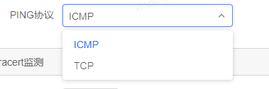

- Tracert监测
使用监测点对目标主机进行Tracert探测，以获得Trace跃点次数和每次的耗时数据。
    - Tracert最大跳数(次)：最大跃点数，达到此处设置的阈值则停止测试，返回之前的数据。
    - Tracert超时(秒)：执行Tracert测试的最大尝试时间，超过此处设置的阈值还未成功开始，则Tracert执行超时失败，会返回一个相应的错误。

6. 设置监测周期和频率

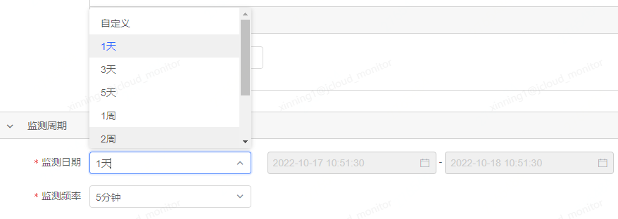

- 监测日期：设置监测任务的开始时间和结束时间，任务只在检测日期的范围内会自动执行探测，未达到和已过期的任务不会执行。这里可以从选项中选择一个预设的时间快速设置，如1天，3天是以创建任务时的时间为开始，向后推移1天，3天，以此类推，选择后，后方的日期时间框会同步显示出对应的时间范围以方便确认，也可以选择自定义选项，之后在后边的日期时间框中手动设置任务开始和结束的具体时间。
- 监测频率：任务间隔多长时间探测一次，这里设置的频率越高，数据越多，相应的花费也越多。

7. 确认费用，保存提交

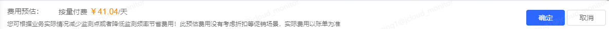

以上信息设置完毕后，系统会根据所选的监测点个数和监测频率，预估出每天的费用，此处预估费用没有考虑折扣等促销场景，实际费用以账单为准。确认无误后，点击确定按钮保存提交。

## 修改监测任务

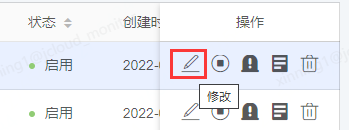

在任务列表中，点击操作列中的“修改”图标，会进入到修改任务界面，该界面与创建任务时一致，区别在于修改任务时，无法修改任务类型，协议类型，任务名称和任务地址，可以修改任务组，监测点，监测参数，监测时间和监测频率。

## 查找监测任务

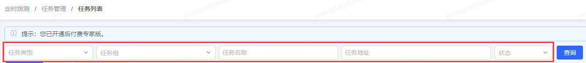

任务列表顶部设有任务检索工具栏，您可以通过指定任务类型、任务组、任务名称、任务地址、任务状态对任务列表中的任务进行检索筛选。

其中任务名称和任务地址均支持模糊搜索。

## 删除监测任务

有两种方式可以删除监控任务。

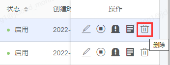

第一种是在任务列表页面，点击操作列中的“删除”图标，可单独删除当前行的监测任务。

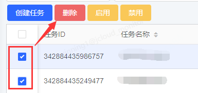

第二种是通过列表前的复选框，选择多个监测任务，之后点击表格顶部的“删除”按钮，可以一次性批量删除多个监测任务。

需要注意，删除的任务无法恢复，无法查看历史数据，也不会再有监测数据，删除前已产生的监测次数和费用会计算。

## 启用/禁用监测任务

有两种方式可以启用/禁用监测任务。

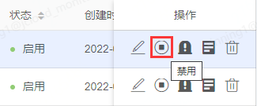

第一种是在任务列表页面，点击操作列中的“启用”或“禁用”图标，可单独启用/禁用当前行的监测任务。

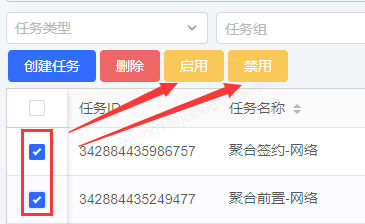

第二种是通过列表前的复选框，选择多个监测任务，之后点击表格顶部的“启用”或“禁用”按钮，可以一次性批量启用/禁用多个监测任务。

需要注意，禁用后的任务直到再次被启用前，不会再进行监测。禁用的任务可以随时进行启用，也可以查看历史数据。

## 配置任务告警

有两种方式配置任务告警。

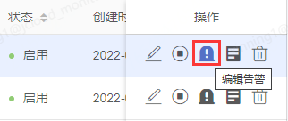

第一种是在任务列表页面，点击操作列中的“编辑告警”图标，进入到配置任务告警的页面。通过此种方式配置告警时，无需再选择任务，已自动选中。

第二种是在告警管理页面，点击左上角的“创建告警”按钮，进入到配置任务告警的页面。通过此种方式配置告警时，需要手动选择任务。

## 查看任务数据

有两种方式查看任务数据。

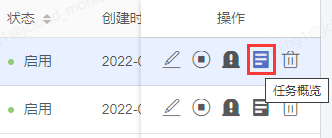

第一种是在任务列表页，点击操作列中的“任务概览”图标，即可进入到任务概览页面，并已自动选中当前任务，展示监控任务的数据。

第二种是点击定时拨测-任务概览，手动选择任务并查询数据。

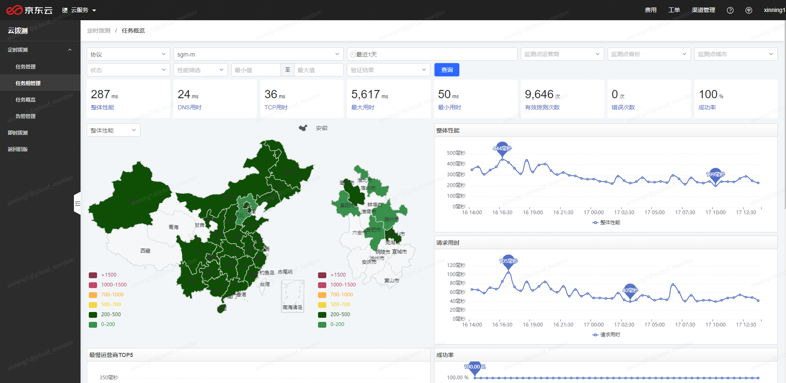
