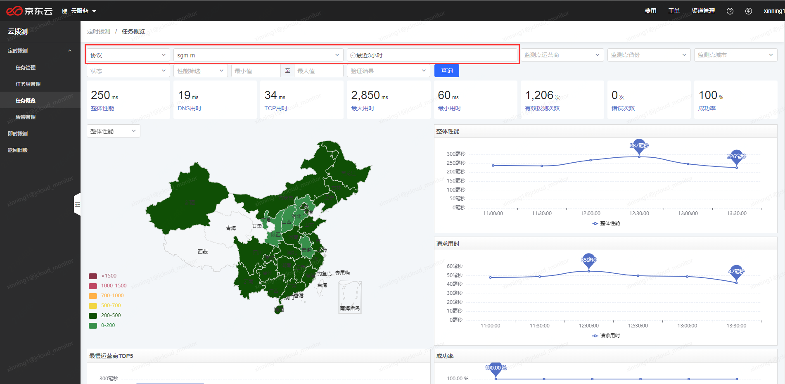
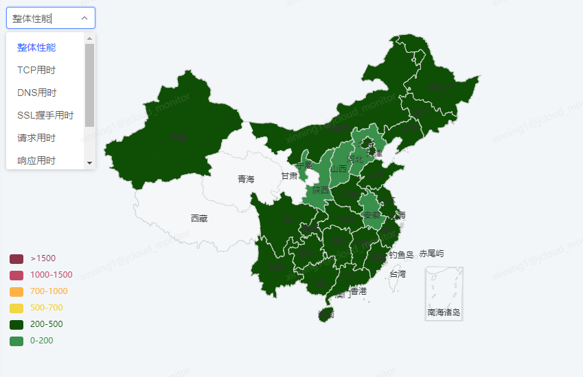
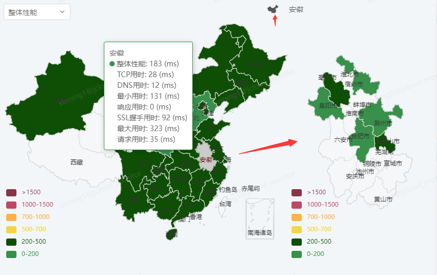
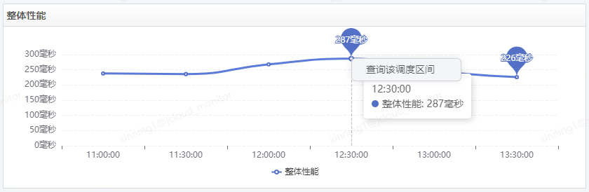
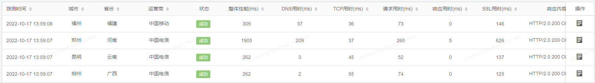
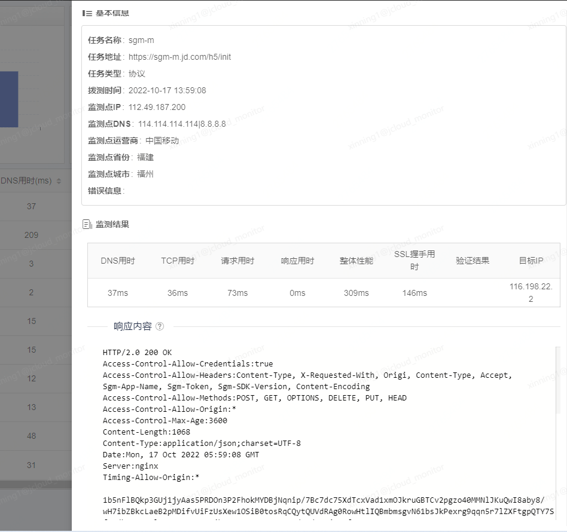
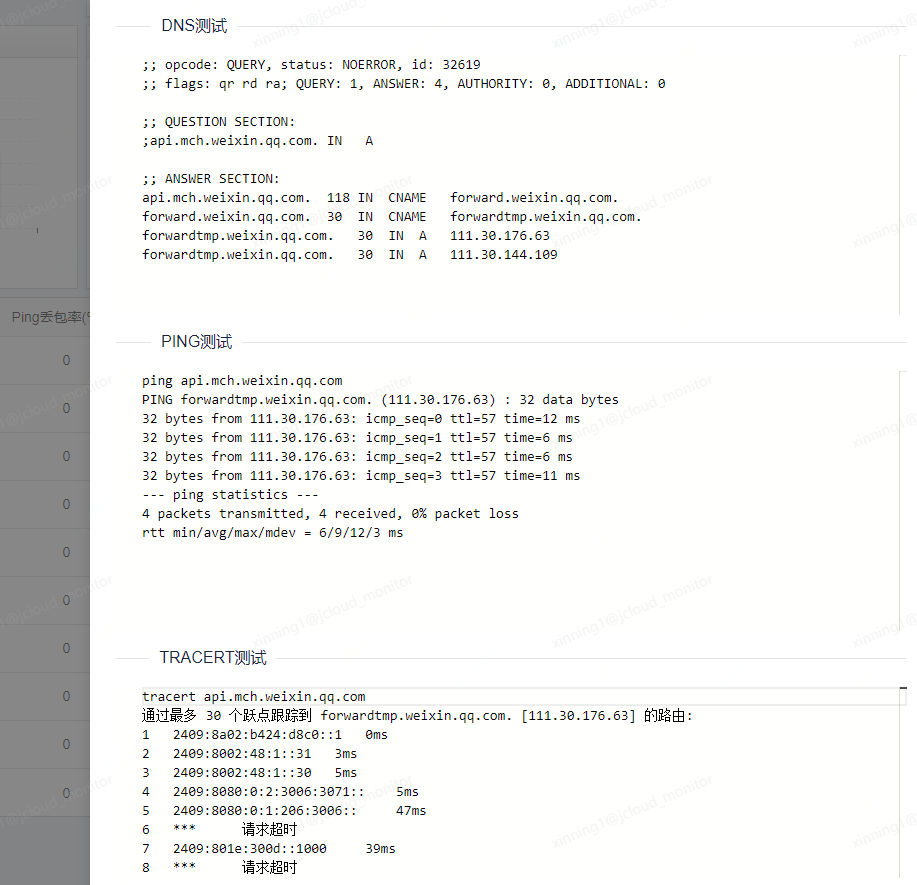

# 任务概览

点击定时拨测-任务概览，可手动选择任务并查询数据。

任务概览页主要选择的上图红框中的任务类型，任务名称和查询时间。

其他为数据筛选项，可筛选监测点的运营商、监测点省份、监测点城市、任务状态、性能指标、验证结果，可根据数据查看和分析的需要进行筛选。

中国地图的左上角为指标切换框，可以切换不同的指标，每一种指标都有各自的健康度阈值，左下角展示对应健康度阈值的颜色，从绿色到红色为优秀到差的过渡。

如果一个省份下配置了多个城市的监测点，可点击省份，右侧会弹出该省的地图，支持查看到城市的数据。点击上方的中国地图小图标，可隐藏省地图，返回到中国地图界面。

趋势图支持点击下钻。

对于性能的趋势图，可点击图中的任意一个数据点，查询该时间区间内的监测数据。

对于成功率的趋势图，除了可下钻时间区间内的所有监测数据外，还可下钻该区间内的所有错误数据。

底部的表格是所有测试记录，表头上有小箭头的列支持点击排序。

点击操作列的查看详情图标，可从右侧划出浮层，显示详情数据。

