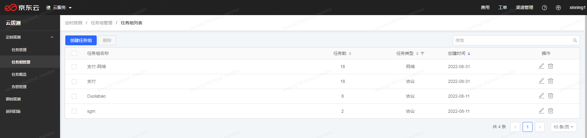
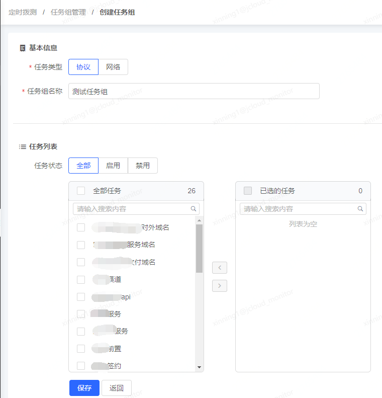
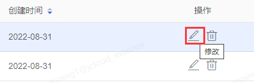
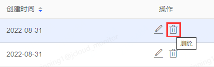
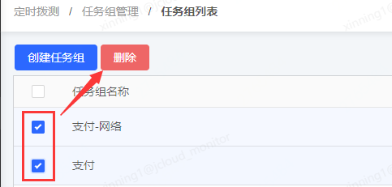

# 任务组管理

任务组顾名思义即是任务的分组，将任务划分到一个分组下，可以方便对任务进行搜索管理。

## 创建任务组

点击定时拨测-任务组管理，可以进入到任务组列表页面，会列出所有已创建的任务组。

创建任务组有两种方式：

第一种是在创建任务界面中快速添加任务组并将创建的任务划分入新建的任务组中，关于这部分操作，可以参考任务管理-新建监控任务-填写基本信息-任务组部分的说明。

第二种是在任务组管理列表页中，点击左上角的“创建任务组”按钮，进入到创建任务组页面。

选择任务类型，填写任务组的名称，从任务列表中选择任务到右侧，点击保存按钮，即可将选定的任务划分到新建的任务组中。

需要注意的是，一个任务只能属于一个任务组，如果将之前在某个任务组A下的任务划分到新的任务组，则该任务会从任务组A中移除。

## 修改任务组

如果需要对任务组进行修改，可以在任务组管理列表中，点击操作列的“修改”图标，进入到修改任务组的页面。

可以对任务类型、任务组名称、任务列表进行修改。

## 删除任务组
删除任务组有两种方式。

第一种是在任务组管理列表中，点击操作列的“删除”图标，即可删除当前行的任务组。

第二种是通过任务组列表前方的复选框，同时选择多个任务组后，点击列表顶部的“删除”按钮，即可快速批量删除多个任务组。

任务组删除不会影响其下的任务，各个任务依然会正常进行监测。