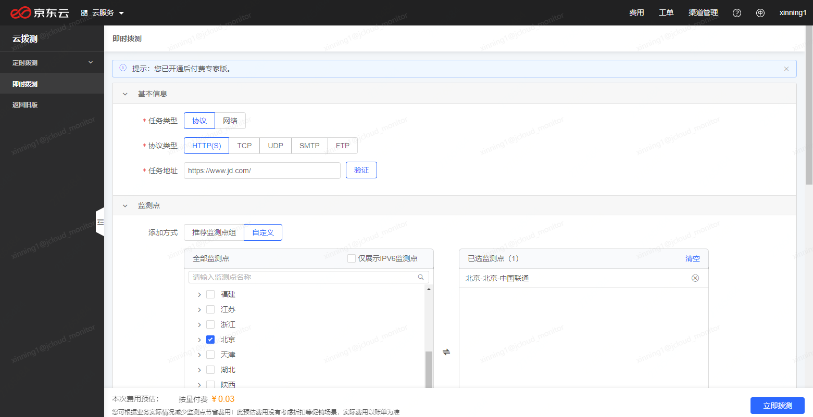
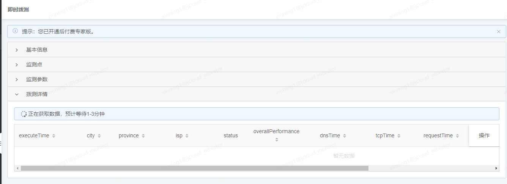
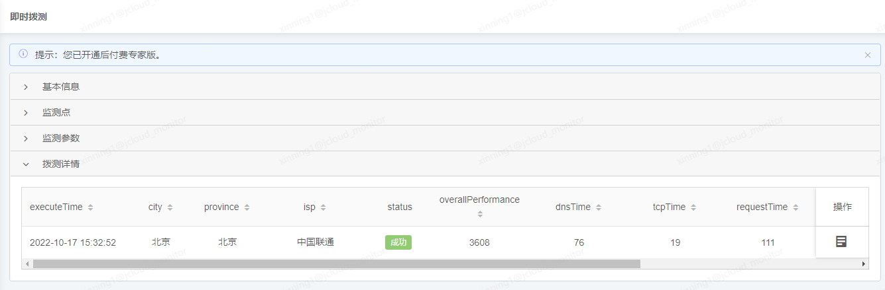

# 即时拨测
即时拨测无需创建定时任务，配置好测试内容，点击提交后，会立即调用对应的监测点发起测试，数据通常会在之后的1-3分钟内返回，即时拨测功能通常对应于非常态测试，而是需要立即进行问题的验证、排查的场景使用。

1. 点击左侧导航菜单中的即时拨测，即可进入到即时拨测页面。
2. 填写测试信息
与创建定时拨测任务类似，这里需要填写一些必要的测试信息，包括：

- 基本信息
    - 任务类型
    - 协议类型
    - 任务地址
- 监测点
- 监测参数

这些信息与创建任务时一致，详细的配置说明可查看操作指南-定时拨测-任务管理-新建监测任务中的说明。

3. 提交并查看数据

确认填写信息无误后，点击页面右下角的“立即拨测”按钮，即可快速发起拨测，数据会在之后的1-3分钟内返回。

数据返回后，即可在拨测详情中查看本次即时拨测的数据，同样支持对列表的表头进行排序，以及操作中查看详情数据。