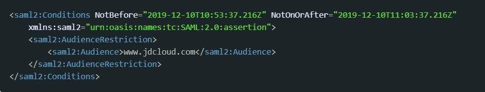

# 身份提供商

## 身份提供商概览

- 身份提供商的定义
- SAML2.0联合身份认证
- 使用SAML2.0身份提供商的联合身份认证访问京东云OpenAPI

### 什么是IAM身份提供商

身份提供商（Identity Provider，简称 IdP）是指受为您提供身份标识服务（ID，一般情况下即账号服务，包括ID创建、ID认证、ID生命周期管理等）的服务商。
在使用京东云服务时，企业人员可以使用受信任的外部身份提供商提供的账号体系（如企业内部的ERP账号体系），通过SAML2.0联合身份认证的方式访问京东云。为了使用外部身份提供商访问京东云，企业需要预先在IAM里建立与指定身份提供商的信任关系，并为该身份提供商分配访问权限。

### 什么是SAML2.0联合身份认证

京东云IAM使用SAML 2.0（安全断言标记语言2.0）支持联合身份验证。SAML 2.0 是一种身份提供商广泛使用的开放标准，可以实现单点登录 (SSO)。用户可以使用支持SAML2.0的账号体系登录京东云控制台或调用OpenAPI，而不必为组织中的每个人都创建一个IAM子用户。

### 使用SAML2.0身份提供商的联合身份认证访问京东云OpenAPI

假设企业员工需要将数据从他们的本地计算机复制到京东云对象存储中。您可以构建一个可在员工的计算机上运行的应用程序。在后端，该应用程序可在对象存储桶中读写对象。
上述示例中，应用程序以员工身份访问京东云对象存储的过程如下：
- ①	用户在企业客户端里向企业的身份提供商请求身份认证（请求登录）
- ②	身份提供商根据企业的用户身份库对用户进行身份认证
- ③	身份提供商根据用户身份信息创建一个SAML断言，并将该断言返回客户端
- ④	客户端调用京东云的sts:AssumeRoleWithSAML服务代入角色，获取该角色的临时访问秘钥
- ⑤	STS服务返回临时安全访问秘钥
- ⑥	客户端使用临时访问秘钥调用对象存储桶操作

## 操作指引

- 创建SAML2.0身份提供商
- 创建联合身份角色
- 向身份提供商提供京东云的信任信息
- 从身份提供商单点登录（SSO）控制台

### 创建SAML2.0身份提供商

1、点击创建身份提供商

2、补全身份提供商信息，请向您的身份提供商获取SAML元数据并上传。
SAML元数据是一个XML格式的文档，以<md:EntityDescriptor xmlns:md="urn:oasis:names:tc:SAML:2.0:metadata" ID="…" entityID="您的IdP标识">开头。
京东云目前支持HTTP-POST的SingleSignOnService Binding方式。

3、创建完成后，在身份提供商的详情页中，可以查看和复制该身份提供商的登录地址。从该地址访问时，京东云会跳转到您指定的身份提供商页面进行登录。

### 创建联合身份角色

1、	创建联合身份角色
请参考：https://docs.jdcloud.com/cn/iam/createfederatedrole
2、	为联合身份角色授权
请参考：https://docs.jdcloud.com/cn/iam/attach-policy

### 向身份提供商提供京东云的信任信息

为了向京东云颁发用户信息断言，您的身份提供商可能要求您提供以下信任信息：
- Subject和NameID

- AudienceRestriction和Audience

要设置为：jdcloud.com（图中应去掉www.）

- SAML Role Attribute

【注意：Attribute 属性区分大小写。必须将其一字不差地设置Attribute Name和Value】
必须包含以下两个Attribute

| 属性     | 属性值格式                                                         |
| -------- | ------------------------------------------------------------ |
| https://jdcloud.com/SAML/Attributes/Role             | oleJrn,IdPJrn若需要传递多个角色jrn，则使用";"分隔，当使用控制台登录时，将会在界面上列出所有角色供用户选择 |
| https://jdcloud.com/SAML/Attributes/RoleSessionName  | 该属性值将被用来作为登录用户信息的一部分显示在控制台上和操作审计日志中。如果您有多个用户使用同一个角色，请确保使用可以唯一标识用户的RoleSessionName值，以区分不同的用户，如员工ID、email地址等。其AttributeValue元素取值要求：长度不少于2个字符且不超过32个字符，只能是英文字母、数字和以下特殊字符：-_.@=  |

以下是一个示例：

### 从身份提供商单点登录（SSO）控制台

