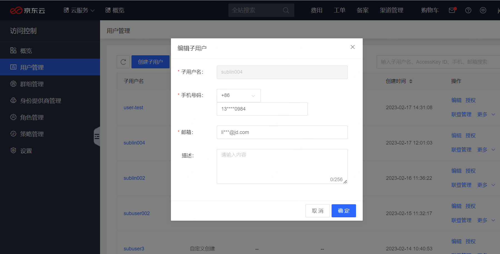
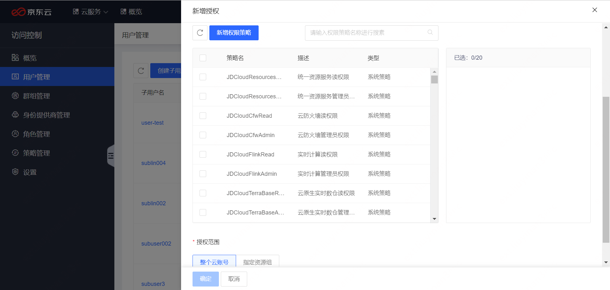
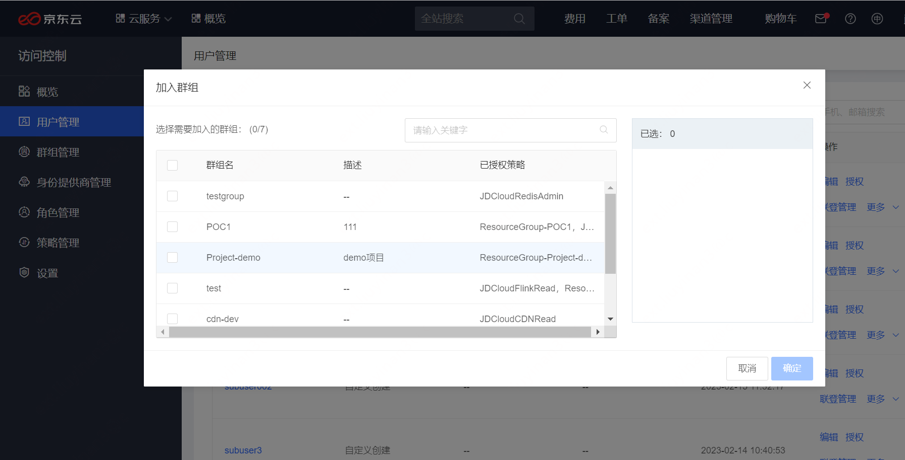
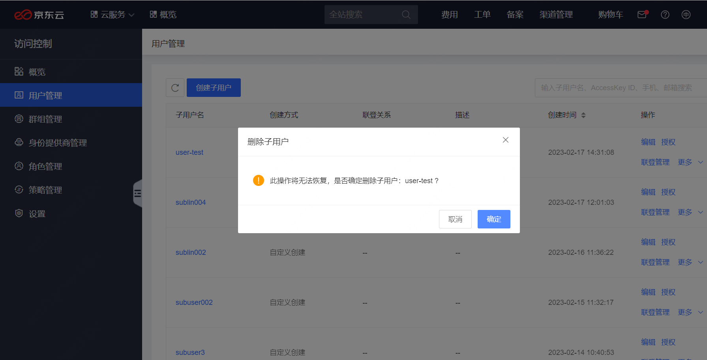

# 管理子用户

本文介绍针对子用户的管理操作。

在 “管理 > 访问控制 > 用户管理” 页面，可以查看子用户列表；列表中提供的快捷操作包括：

- 编辑子用户
- 为子用户授权
- 将子用户加入群组
- 删除子用户

同时，点击子用户名，可以进入子用户的详情页。

## 列表快捷操作

点击【编辑】按钮，可快捷编辑子用户的联系电话、邮箱和描述信息；这些信息在子用户详情页也可以查看和修改。

点击【授权】，可以勾选需要授权的策略对子用户授权。创建和选择符合权限需求的策略，请参考[策略管理](../../../../../documentation/Management/IAM/Operation-manual/Policy-management/policy-overview.md)。

点击【加入群组】，可以将子用户加入指定的群组，此操作支持群组的多选。

点击【删除】，子用户删除操作是不可逆的，删除后子用户信息及其授权信息将被清除。

## 管理用户详情

点击子用户名进入子用户详情页，可以查看和管理子用户的授权详情、所属群组和安全凭证。

子用户安全凭证的管理，详见[设置子用户的安全凭证](../../../../../documentation/Management/IAM/Operation-manual/User-management/setting-up-credential-policies.md)。

