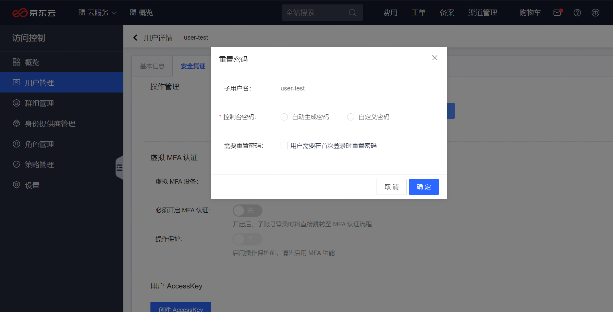
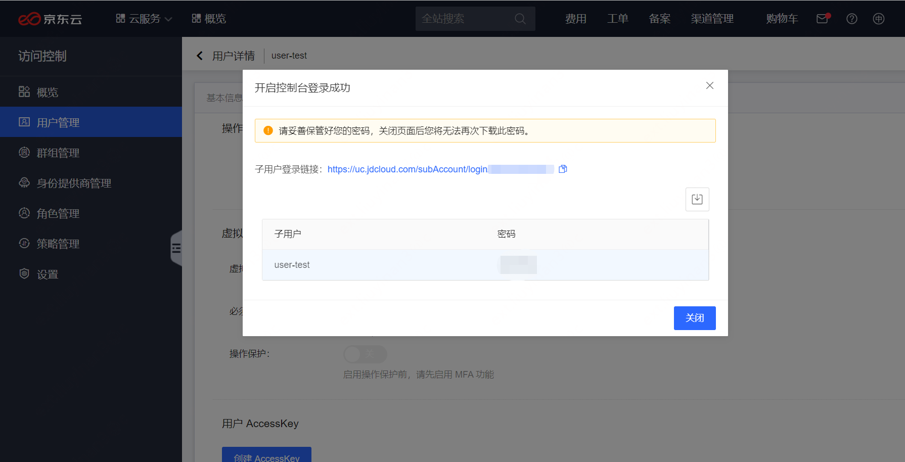
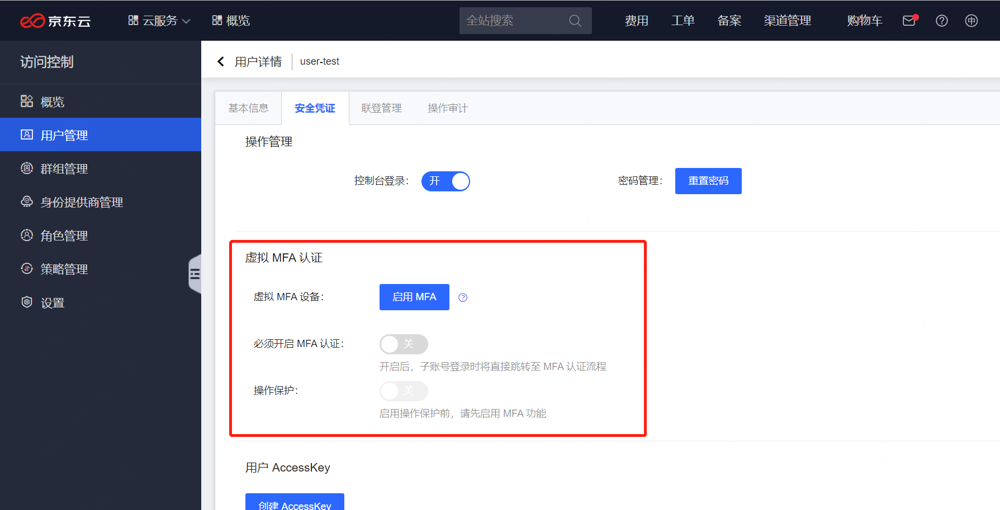

# 设置子用户的安全凭证

安全凭证，指子用户证明自己身份的凭据，可以在子用户的详情页进行管理。

子用户的安全凭证包括：

- 控制台的登录密码
- 虚拟多因子认证（MFA）设备
- API 访问 Access Key

## 密码管理

启用【控制台登录】后，子用户可以登录控制台（注意，登录后是否有资源访问权限，需要额外的授权操作）；而禁用【控制台登录】的子用户，不能登录控制台。

为子用户【开启控制台登录】或【重置密码】时，需要设置登录密码和首次登录是否需要重置密码的规则。如果选择自定义密码，则密码规则必须符合[子用户的密码策略设置](../../../../../documentation/Management/IAM/Operation-manual/User-management/setting-up-credential-policies.md)。

设置完成后，请下载子用户的密码，以方便将登录信息提供给子用户使用。

## 虚拟MFA认证管理

通过虚拟 MFA 认证，您可以提升子用户的访问安全等级。

“虚拟 MFA 设备” 是一个能生成 6 位 TOTP 随机验证码的软件程序，即安装在指定手机上的特定版本的 “[京东云 APP](https://console.jdcloud.com/download)” 。启用 MFA 需要您使用京东云 APP 扫码，将该 APP 绑定为虚拟 MFA 设备，后续即可通过该 APP 上生产的验证码进行身份确认。

**请注意，如果绑定后，更换手机重装 APP 或是将 APP 卸载重装，则新的 APP 不再是您绑定的虚拟 MFA 设备，不能再用作身份认证。此时请联系管理员，协助重新绑定虚拟 MFA 设备（即先停用 MFA，再重新绑定启用）。**

京东云支持三种 MFA 认证场景：

1. 由管理员【启用 MFA】：由管理员绑定该子用户的虚拟 MFA 设备，后续子用户每一次登录控制台，都必须使用管理员绑定的京东云 APP 进行验证；
2. 管理员不启用 MFA，而是要求子用户【必须开启 MFA 认证】（推荐）：子用户首次登录时，自行绑定虚拟 MFA 设备；后续每一次登录控制台，都使用自己的京东云 APP 进行验证；
3. 在 MFA 已经启用的情况下，可以【启用操作保护】：子用户执行所有的[敏感操作](../../../../../documentation/User-Service/Security-Operation-Protection/Introduction/Support-Services.md)，无论通过控制台访问还是通过 OpenAPI 访问，都需要使用 MFA 验证码进行身份确认。

## AccessKey 管理

为子用户创建 AccessKey，可以使子用户在授权范围内访问 OpenAPI 而无需共享主账号的 AccessKey。

每个子用户最多可以创建 2 个 AccessKeys 以支持秘钥的定期轮换。

