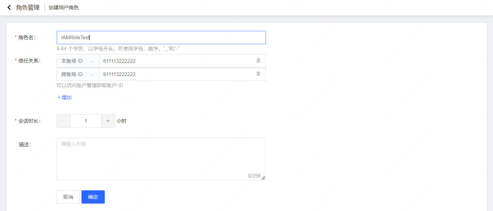
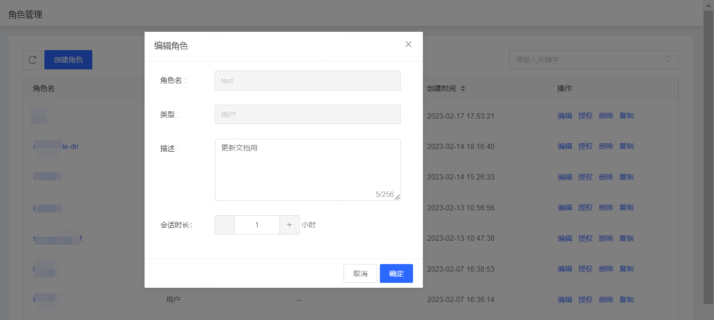
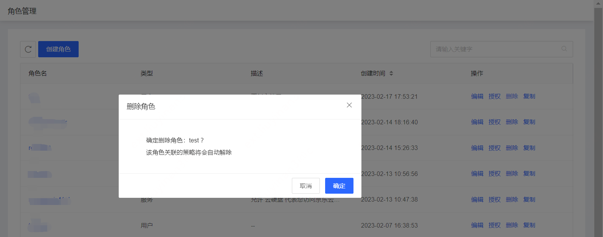
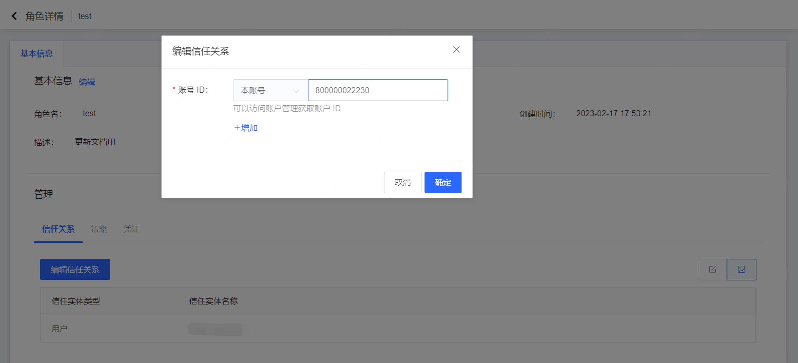
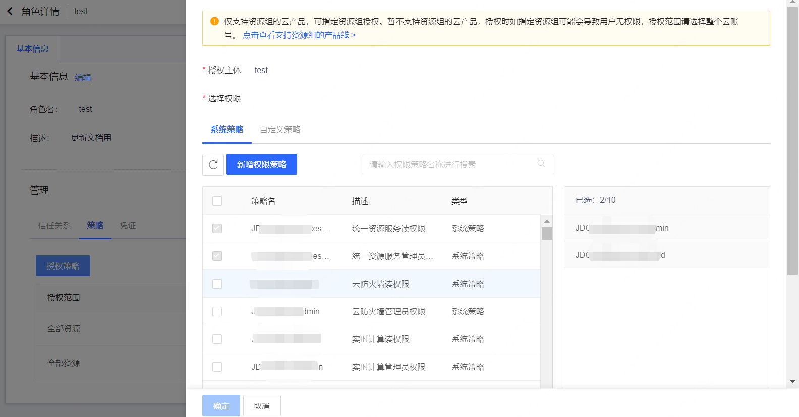
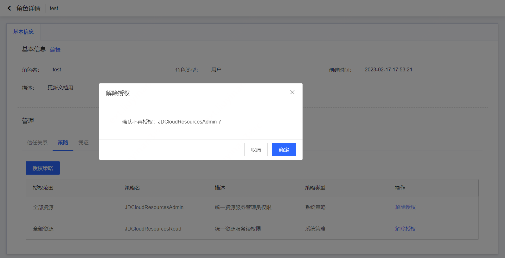
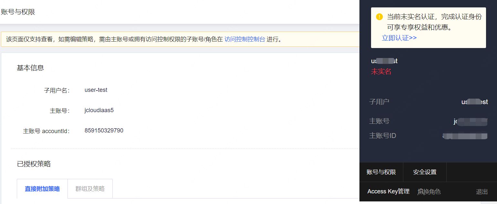

# 角色
## 什么是角色
角色分为用户角色和服务角色，他是一种虚拟身份类型，它没有确定的身份凭证，它必须关联到某个实体身份上才能使用。与子用户的差别主要在使用方法上，角色需要被一个授信的实体用户扮演，扮演成功后实体用户将获得角色的临时安全凭证，使用这个临时安全令牌就能以角色身份访问被授权的资源。

根据角色信任类型的不同，主要有下面两种类型：

- 用户角色必须被当前主账号下的子用户扮演，或者跨账号下的子用户扮演后才能生效。此类角色主要用来解决跨主账号访问和临时授权的场景。
- 服务角色需要授予某个云服务（如云主机，数据库）来扮演，通过服务角色,授权云服务您对您的京东云资源进行管理和操作。

## 如何使用用户角色
- 创建角色A，选择角色的信任关系主账号B或子用户C1，控制哪些用户来扮演扮演该角色。
- 给角色A添加策略，控制角色A所能拥有的权限。
- 授予信任关系中主账号B的子用户B1或子用户C1安全令牌服务（sts：assumeRole）的权限
- 子用户B1，C1进行用户角色扮演和切换

## 如何使用服务角色
- 创建角色A，选择角色的信任关系为云服务B，控制允许哪些云服务来代表您访问京东云资源。
- 给角色A添加策略，控制角色A所能拥有的权限。
- 云服务B当需要代表用户访问其他京东云资源时，扮演服务角色，获取临时AKSK+Token访问其他京东云资源。

## 信任关系，也叫角色扮演者（Principal）
京东云中可以扮演角色的实体用户或者服务，在IAM角色中，在角色中的信任策略中使用“Principal”元素来指定角色的信任关系，“principal”中可以指定京东云账户，子用户、京东云服务。

- 京东云账户:
  - "Principal": { "JDCLOUD": "jrn:iam::*accountID*:root" }
  - "Principal": { "JDCLOUD": "*accountID*" }
- 子用户：
  - "Principal": { "JDCLOUD": "jrn:iam::*accountID*:user/user-name" }
- 京东云服务：具体支持服务角色的产品线，请参考[支持IAM的云服务](https://docs.jdcloud.com/cn/iam/support-services)
  - "Principal": { "Service": "*ServiceName*.jdcloud.com" }

## 用户角色扮演和切换
- 从登录身份切换到用户角色身份（SwitchRole）：
  子用户登录到控制台后，可以选择切换角色，前提是这个子用户已经被授予了扮演该用户角色的权限。子用户每次只能扮演一个用户角色，当子用户从登录身份进入用户角色身份时，用户只能使用用户角色身份上所授予的权限，子用户登录身份上绑定的权限会被屏蔽。如果需要使用登录身份的权限，那么需要从角色身份返回登录身份。
- 从实体身份通过程序调用方式扮演角色（AssumeRole）：
  如果一个子用户被授予了扮演某个用户角色的权限，那么该子用户可以使用访问密钥（AccessKey）来调用 STS 服务的 AssumeRole 接口来获得这个用户角色的临时访问密钥。子用户可以自行设置临时凭证的过期时间，临时凭证访问时的权限也将受限于用户角色被授予的访问权限，通常用于解决临时授权问题和跨账号访问的授权问题。

## 角色基本管理
### 创建用户角色

登录京东云控制台，进入访问控制 > 角色管理，点击【创建】按钮，在创建角色创建窗口填写相关信息：
 
  - 信任关系：指您允许（信任）哪些主账号来扮演该角色，并执行该角色所拥有的权限，例如您是账号A，您创建用户角色RoleA允许账号B来扮演角色访问您的资源。

### 编辑角色

访问角色列表，点击【编辑】按钮，可快捷的编辑角色的描述信息。

### 删除角色

访问角色列表，点击【删除】按钮，删除角色的信息及其策略的关联关系。

### 给角色添加和移除信任关系

点击角色名称，进入相应的角色详情页面 - 信任关系页签，点击【编辑信任关系】按钮，可快捷的为角色添加和移除信任关系。

### 给角色授予策略

访问角色列表，点击【授权】按钮，可快捷的授予角色相应的策略。

### 给角色解绑策略

点击角色名称，进入相应的角色详情页面 - 策略页签，选定对应策略后，点击【解除】即可为角色解绑策略。

## 子用户切换角色身份

### 给子用户授予扮演角色的权限

登录京东云控制台，进入访问控制 > 用户管理，点击【授权】按钮，授予子用户安全令牌系统策略（JDCloudStsAdmin），例如给账号B下的子用户SubUserB绑定JDCloudStsAdmin的权限。
 
  - 在角色信任关系中的主账号里，授予子用户扮演角色的权限。

### 登录子用户控制台，切换角色

登录京东云控制台，在访问控制概览页中获取子用户登录链接，登录子用户，例如进行账号B下的子用户SubUserB的登录。
 
登录后，进入子用户控制台，点击右上角菜单中的 “切换角色”，进行角色身份的登录，例如输入账号A的accountID和RoleA的角色名称，登录后，SubUserB将以RoleA的身份和权限对主账号A的资源进行访问和管理。

