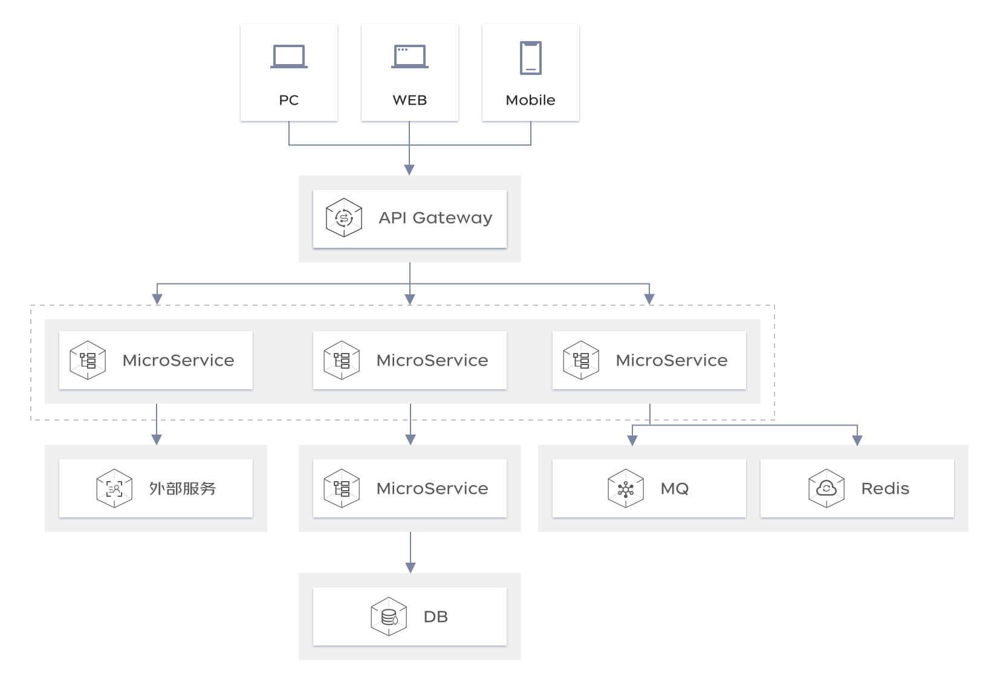

# 应用场景

## 全链路监控

在云原生的大背景下微服务架构的业务应用错综复杂，当生产环境中业务发生错误或者性能遇到瓶颈如何确定故障节点？前端应用监控 SGM-WEB 可以帮助企业快速梳理业务链路根因定位发生故障的节点提升排障速度。

- 用户轨迹：根据用户标识还原真实用户行为轨迹追踪，快速了解页面加载、API调用、JS错误、资源加载等节点的状态、耗时等详细情况。
- 全链路追踪：可与服务端监控产品“应用性能监控 SGM”同时使用，自动发现从前端到后端的全链路调用，快速发现节点性能瓶颈。

## **用户体验感知**

如何及时感知用户访问报错情况？如何简单快速定位性能瓶颈困？前端应用监控SGM-WEB 可以快速了解用户访问系统时的具体情况，定位线上用户偶现的前端问题。

- 应用总览展示：前端应用监控 SGM-WEB 支持应用总览信息，快速查看应用的满意度、JS错误率、访问速度、API请求成功率及PV等情况，帮助您掌握系统的用户体验，全面账务业务情况。

- 详细数据展示：详细记录每次请求的API请求情况、JS错误情况、资源加载情况、访问明细等详细业务数据展示，帮助您快速排查系统情况，精准定位问题。

