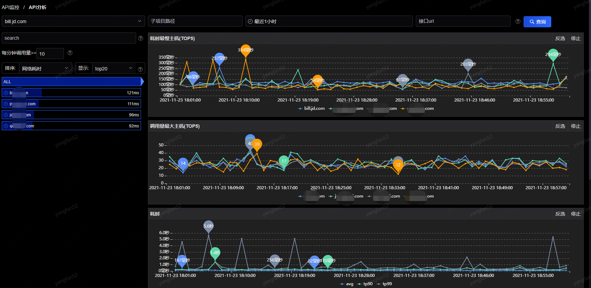
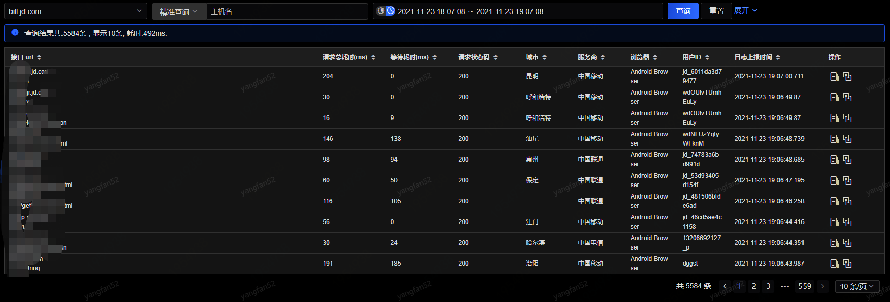
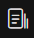
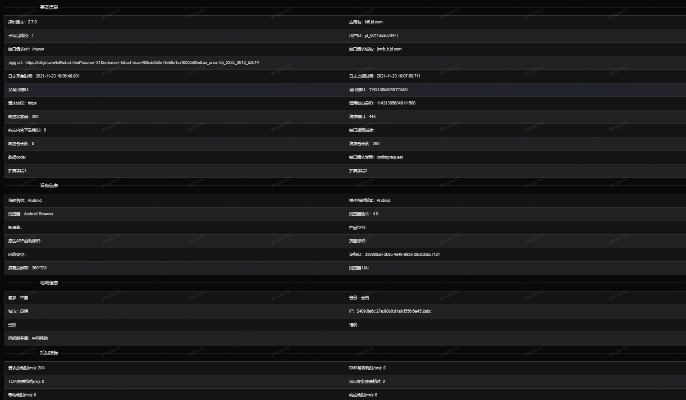

# API监控

## API分析

在此页面，您可以看到对于API监控的各维度各项指标分析，如下图：

页面左方为树状列表，您可以通过筛选条件，筛选出您所想看到的API数据。

如果选择ALL时，页面右方为耗时最慢主机（TOP5）、调用量最大主机（TOP5）、耗时、调用量、失败率/失败数。如果选择某个API则只展示耗时、调用量、失败率/失败数。

您可以通过时间筛选，来查看不同时间段，不同粒度的数据展示。图表中的线可点击，可以查看您所点击的指标项在此时间点的详细日志情况；点击top5的图表时，您还可以下钻到具体的API所对应的指标数据。

树状列表与右方图表指标存在联动关系，您可以通过点击树状列表来查看对应的图表指标趋势图。

## 日志查询

在此页面，您可以看到应用的详细的API监控日志，可通过主机或时间的筛选条件，筛选出您所需要查看的日志信息：

点击操作中，可以看到该行所对应的详细信息，如下：

