# 告警管理
系统支持用户性能监控、网页监控、API监控、JsError监控、资源监控、自定义监控模块的告警，您可以根据自己的需求进行相关配置。

## 用户性能告警配置

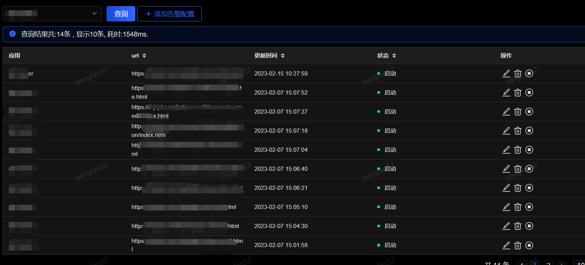

您所配置的所有用户性能告警配置，都在这个菜单里可以查询到，您可以通过应用名来搜索您的告警配置，并可添加、修改、删除此应用的用户性能告警配置。

**告警状态**：分为启动和停用两种，启动的时候系统会按照您所配置的告警接收人发出告警（邮件、微信、咚咚等），如果您将状态改为停用，这些告警都将不再发送。

点击“添加告警配置”按钮，您可以对您的应用进行告警配置

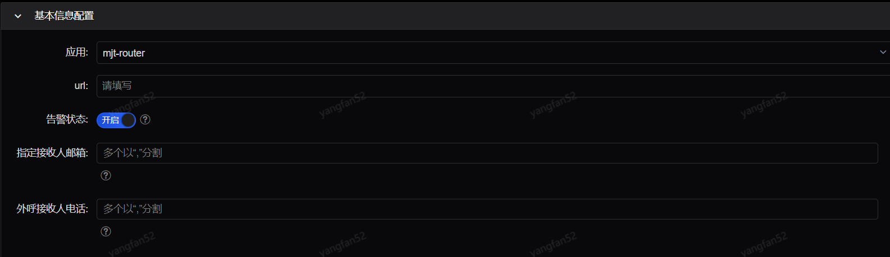

- **基本信息配置**：这一部分是对于您的应用是一个全局性的设置，应用、url中，应用为必选项，也就是说您可以只针对应用进行告警配置，如果没有指定url，那么，url告警使用应用的告警配置进行告警，反之使用url的告警配置进行告警。

这里的报警状态的开启和关闭会影响您整个网页告警模块的告警状态，也就是说，如果您选择了关闭，那么接下来您所配置的LCP、FCP、CLS、FID、TTFB也都是关闭的。如果您只想单独对LCP进行告警，那么您可以将基本告警配置中的报警状态设置为开启，而将其他除了LCP配置中的报警状态都置为关闭即可。

指定通知人手机/邮箱是当您需要指定某个人或者某些人收到此告警时，那么您需要在这里填写他/她的手机/邮箱，并且在需要进行告警的模块的通知人类型中勾选指定人可见，即可。

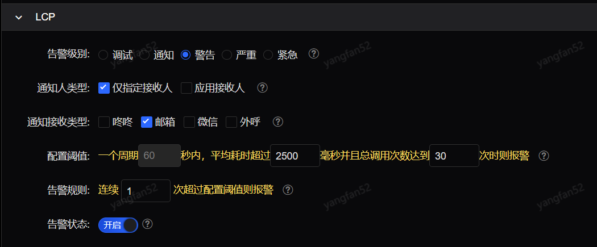

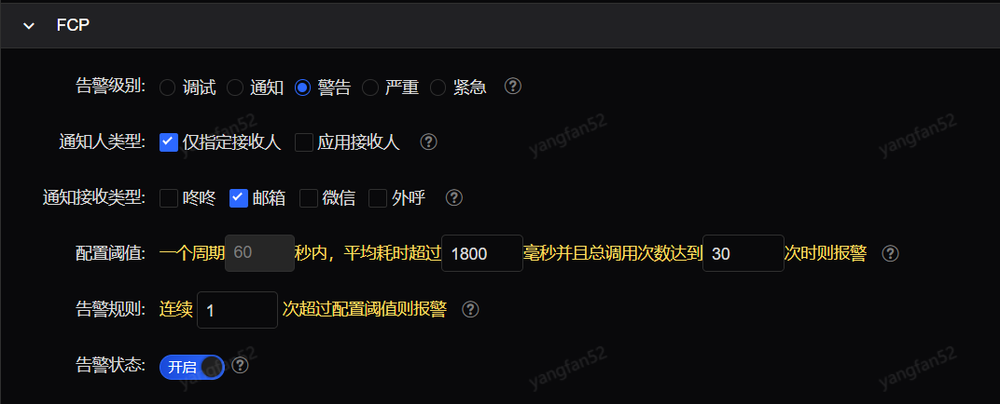

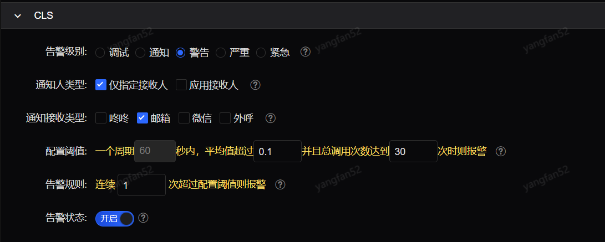


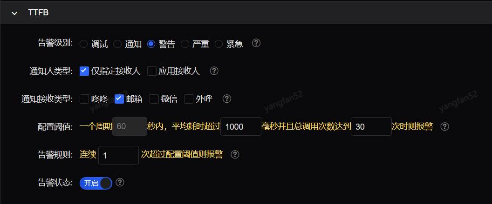

**“LCP”**、**“FCP”**、“CLS”、“FID”、“TTFB”为用户性能告警**配置的五个子模块五者**类似。

- **告警级别：**告警发送级别，单选；
- **通知人类型：**选择通知人，可多选

 仅指定接收人：接口发送时指定的接收人；

 应用接收人：根据应用的相关成员作为接收人；

- **通知接收类型：**报警以咚咚、微信或者邮件方式发送，可多选；
- **配置阈值：**每个周期60s内，平均耗时超出指定毫秒数，并且总的调用次数达到某一个设定值时报警；
- **告警规则：**假如您选择连续2次，则需要连续的两分钟都达到告警条件才会报警，这个参数主要解决毛刺问题；
- **告警状态：**报警开关，关闭后这个规则将不再报警；

## 网页告警配置

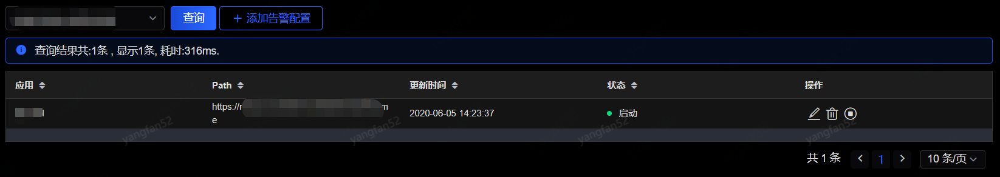

您所配置的所有网页告警配置，都在这个菜单里可以查询到，您可以通过应用名来搜索您的告警配置，并可添加、修改、删除此应用的网页告警配置。

**告警状态**：分为启动和停用两种，启动的时候系统会按照您所配置的告警接收人发出告警（邮件、微信、咚咚等），如果您将状态改为停用，这些告警都将不再发送。

点击“添加告警配置”按钮，您可以对您的应用进行告警配置

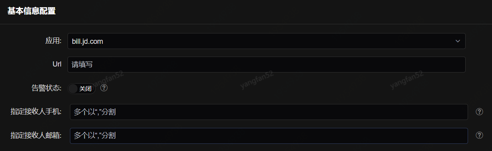

- **基本信息配置**：这一部分是对于您的应用是一个全局性的设置，应用、url中，应用为必选项，也就是说您可以只针对应用进行告警配置，如果没有指定url，那么，url告警使用应用的告警配置进行告警，反之使用url的告警配置进行告警。

这里的报警状态的开启和关闭会影响您整个网页告警模块的告警状态，也就是说，如果您选择了关闭，那么接下来您所配置的白屏时间监控配置、首包时间监控配置等的告警状态也都是关闭的。如果您只想单独对白屏时间监控进行告警，那么您可以将基本告警配置中的报警状态设置为开启，而将其他除了白屏时间监控配置中的报警状态都置为关闭即可。

指定通知人手机/邮箱是当您需要指定某个人或者某些人收到此告警时，那么您需要在这里填写他/她的手机/邮箱，并且在需要进行告警的模块的通知人类型中勾选指定人可见，即可。

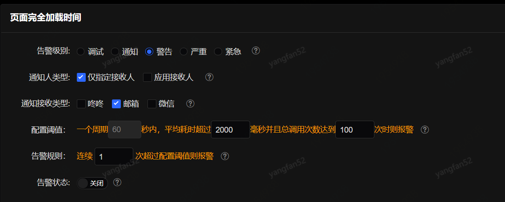

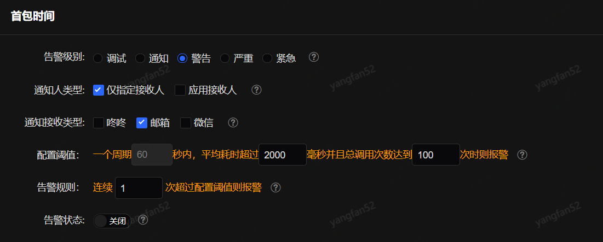

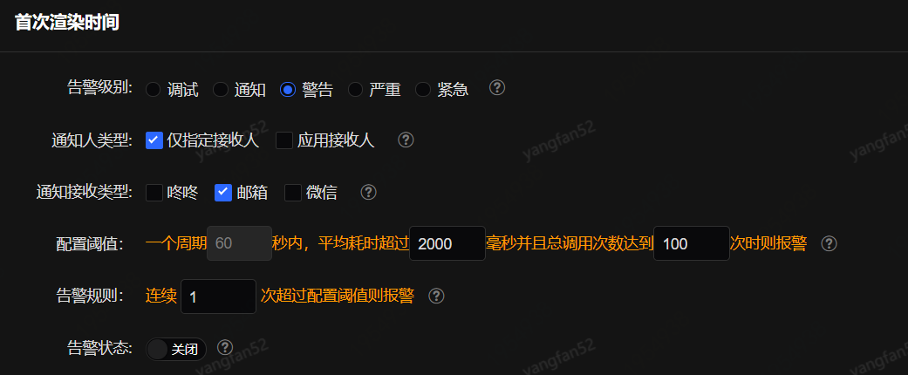                       

“页面完全加载时间”、“首包时间”、“白屏时间”为网页告警配置的三个子模块三者类似。

- **告警级别：**告警发送级别，单选；
-  **通知人类型：**选择通知人，可多选

 仅指定接收人：接口发送时指定的接收人；

 应用接收人：根据应用的相关成员作为接收人；

- **通知接收类型：**报警以咚咚、微信或者邮件方式发送，可多选；
- **配置阈值：**每个周期60s内，平均耗时超出指定毫秒数，并且总的调用次数达到某一个设定值时报警；
- **告警规则：**假如您选择连续2个周期，则需要连续的两分钟都达到告警条件才会报警，这个参数主要解决毛刺问题；
- **告警状态：**报警开关，关闭后这个规则将不再报警；


## API请求告警配置

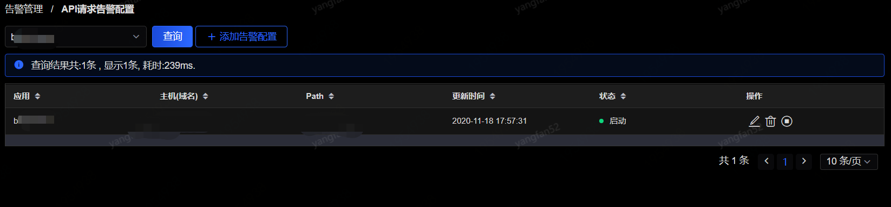

您所配置的所有API请求告警配置，都在这个菜单里可以查询到，您可以通过应用名来搜索您的告警配置，并在这个页面对其添加、修改或者删除。

告警状态：分为启动和停用两种，启动的时候系统会按照您所配置的告警接收人发出告警（邮件、微信、咚咚等），如果您将状态改为停用，这些告警都将不再发送。

点击“添加告警配置”按钮，您可以对您的应用进行告警配置

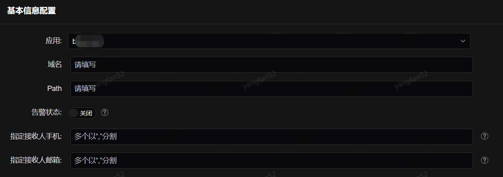

- **基本信息配置**：这一部分是对于您的应用是一个全局性的设置，应用、域名、path中，应用为必选项，也就是说您可以只针对应用进行告警配置，如果没有指定path，那么，访问路径告警使用应用的告警配置进行告警，反之使用path的告警配置进行告警。

这里的报警状态的开启和关闭会影响您整个API请求告警模块的告警状态，也就是说，如果您选择了关闭，那么接下来您所配置的失败监控配置、平均响应时间监控配置等的告警状态也都是关闭的。如果您只想单独对失败监控配置进行告警，那么您可以将基本告警配置中的报警状态设置为开启，而将其他除了失败监控配置中的报警状态都置为关闭即可。

指定通知人手机/邮箱是当您需要指定某个人或者某些人收到此告警时，那么您需要在这里填写他/她的手机/邮箱，并且在需要进行告警的模块的通知人类型中勾选指定人可见，即可。

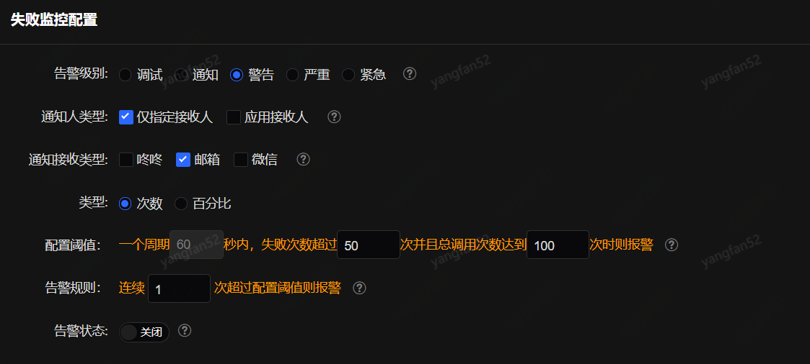

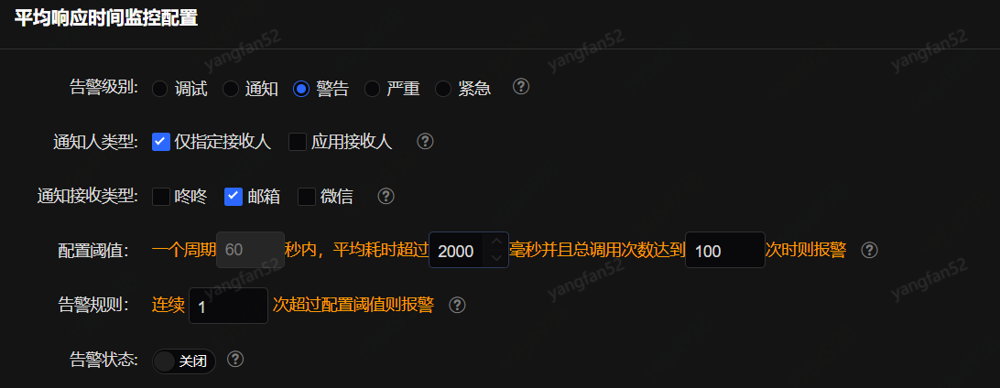

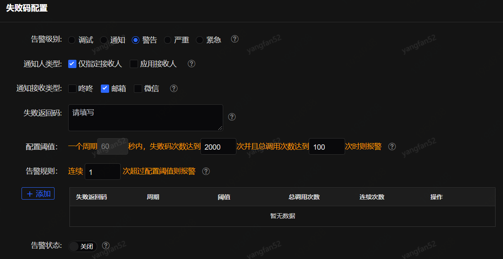 

“失败监控配置”、“平均响应时间监控配置”、“失败码监控配置”为API请求告警配置的三个子模块三者类似。

“失败监控配置”根据失败次数配置规则告警；“平均响应时间监控配置”根据平均响应时间配置规则告警；“失败码监控配置”这个模块您可以对不同的失败返回码配置不同的告警规则，每次配置完一个失败返回码或者一些失败返回码时，需点击“添加”按钮，即可继续进行其他失败返回码的配置。

- **告警级别：**告警发送级别，单选；
- **通知人类型：**选择通知人，可多选；

 仅指定接收人：接口发送时指定的接收人；

 应用接收人：根据应用的相关成员作为接收人；

- **通知接收类型：**报警以咚咚、微信或者邮件方式发送，可多选；
- **配置阈值：**每个周期60s内，平均耗时超出指定毫秒数，并且总的调用次数达到某一个设定值时报警；
- **告警规则：**假如您选择连续2个周期，则需要连续的两分钟都达到告警条件才会报警，这个参数主要解决毛刺问题；
- **告警状态：**报警开关，关闭后这个规则将不再报警；
- **失败返回码（失败码特性配置）：**可配置一个或者多个失败返回码，且支持正则；

```
正则示例：
".\*BA.\*":包含BA的任意字符串
"\^((?!BA).)\*\$":不包含BA的任意字符串
"\^BA.\*":以BA开头的任意字符串
".\*BA\$":以BA结尾的任意字符串
多个示例：AB0001;.\*SUCCESS.\*;\*BA\$。
```


## jsError告警配置

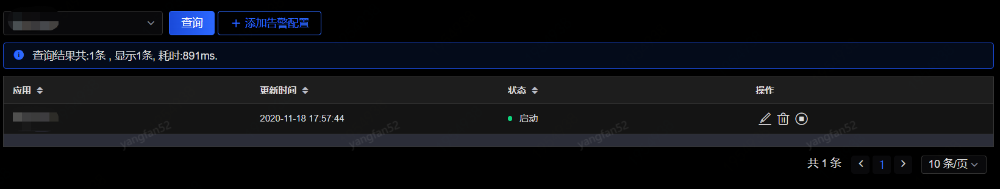

您所配置的所有jsError告警配置，都在这个菜单里可以查询到，您可以通过应用名来搜索您的告警配置，并在这个页面对其修改或者删除。

告警状态：分为启动和停用两种，启动的时候系统会按照您所配置的告警接收人发出告警（邮件、微信、咚咚等），如果您将状态改为停用，这些告警都将不再发送。

点击“添加告警配置”按钮，您可以对您的应用进行告警配置

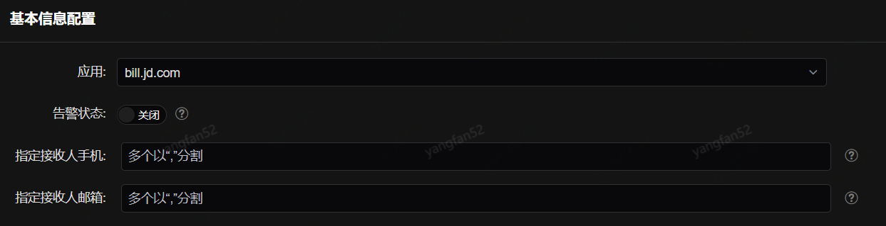

- **基本信息配置**：这一部分是对于您的应用是一个全局性的设置，应用为必选项。

这里的报警状态的开启和关闭会影响您整个jsError告警模块的告警状态，也就是说，如果您选择了关闭，那么接下来您所配置的js错误告警配置等的告警状态也都是关闭的。如果您只想单独对js错误告警配置监控进行告警，那么您可以将基本告警配置中的报警状态设置为开启，而将其他除了js错误告警监控配置中的报警状态都置为关闭即可。

指定通知人手机/邮箱是当您需要指定某个人或者某些人收到此告警时，那么您需要在这里填写他/她的手机/邮箱，并且在需要进行告警的模块的通知人类型中勾选指定人可见，即可。

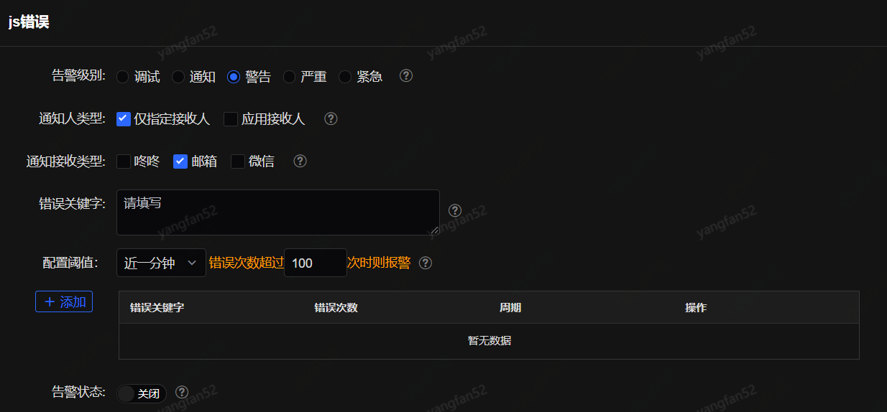

在“js错误”配置页面中：

- **告警级别：**告警发送级别，单选；
- **通知人类型：**选择通知人，可多选

 仅指定接收人：接口发送时指定的接收人；

 应用接收人：根据应用的相关成员作为接收人；

- **通知接收类型：**报警以咚咚、微信或者邮件方式发送，可多选；
- **错误关键字：**可配置一个或者多个js错误类型，且支持正则；

```
正则示例：
 
".\*BA.\*":包含BA的任意字符串
 
"\^((?!BA).)\*\$":不包含BA的任意字符串
 
"\^BA.\*":以BA开头的任意字符串
 
".\*BA\$":以BA结尾的任意字符串
 
多个示例：AB0001;.\*SUCCESS.\*;\*BA\$。
```

- **配置阈值：**每个周期60s内，平均耗时超出指定毫秒数，并且总的调用次数达到某一个设定值时报警；
- **告警规则：**假如您选择连续2个周期，则需要连续的两分钟都达到告警条件才会报警，这个参数主要解决毛刺问题；
- **告警状态：**报警开关，关闭后这个规则将不再报警；

### 资源监控告警配置

您所配置的所有资源监控告警配置，都在这个菜单里可以查询到，您可以通过应用名来搜索您的告警配置，并在这个页面对其修改或者删除。

告警状态：分为启动和停用两种，启动的时候系统会按照您所配置的告警接收人发出告警（邮件、微信、咚咚等），如果您将状态改为停用，这些告警都将不再发送。

点击“添加告警配置”按钮，您可以对您的应用进行告警配置

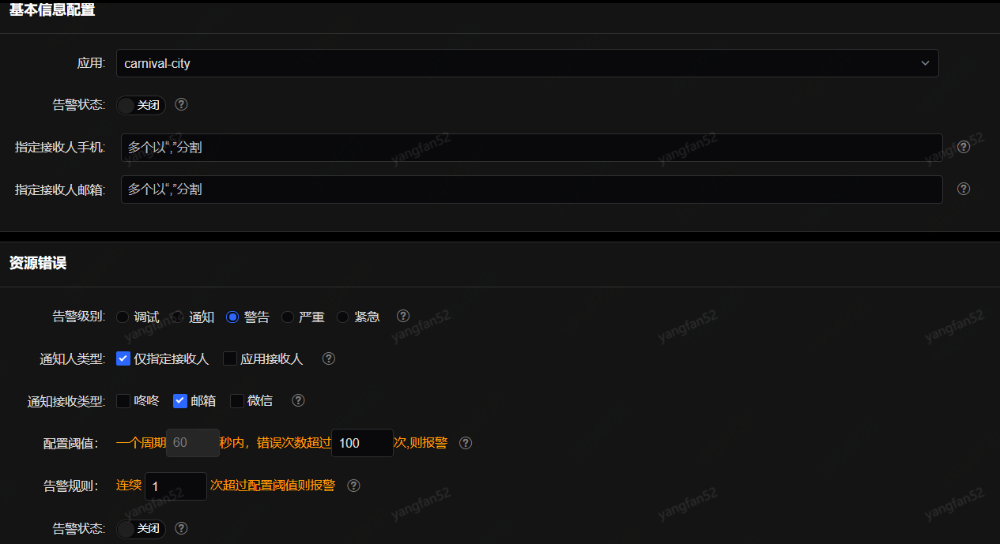

- **基本信息配置**：这一部分是对于您的应用是一个全局性的设置。

这里的报警状态的开启和关闭会影响您整个资源监控告警模块的告警状态，也就是说，如果您选择了关闭，那么接下来您所配置的资源配置的告警状态也都是关闭的。

指定通知人手机/邮箱是当您需要指定某个人或者某些人收到此告警时，那么您需要在这里填写他/她的手机/邮箱，并且在需要进行告警的模块的通知人类型中勾选指定人可见，即可。

- **告警级别：**告警发送级别，单选；
- **通知人类型：**选择通知人，可多选

 仅指定接收人：接口发送时指定的接收人；

 应用接收人：根据应用的相关成员作为接收人；

- **通知接收类型：**报警以咚咚、微信或者邮件方式发送，可多选；
- **配置阈值：**每个周期60s内，平均耗时超出指定毫秒数，并且总的调用次数达到某一个设定值时报警；
- **告警规则：**假如您选择连续2个周期，则需要连续的两分钟都达到告警条件才会报警，这个参数主要解决毛刺问题；
- **告警状态：**报警开关，关闭后这个规则将不再报警；

## 自定义监控告警配置

您所配置的所有自定义监控告警配置，都在这个菜单里可以查询到，您可以通过应用名来搜索您的告警配置，并在这个页面对其修改或者删除。

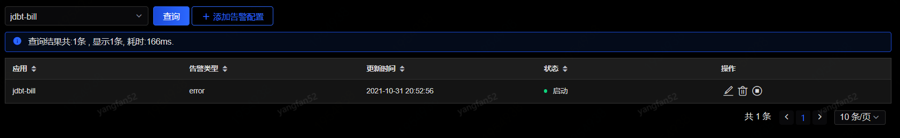

告警状态：分为启动和停用两种，启动的时候系统会按照您所配置的告警接收人发出告警（邮件、微信、咚咚等），如果您将状态改为停用，这些告警都将不再发送。

点击“添加告警配置”按钮，您可以对您的应用进行告警配置

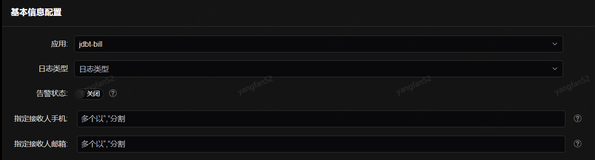

- **基本信息配置**：这一部分是对于您的应用是一个全局性的设置，应用、日志类型为必选项。

这里的报警状态的开启和关闭会影响您整个资源监控告警模块的告警状态，也就是说，如果您选择了关闭，那么接下来您所配置的资源配置的告警状态也都是关闭的。

指定通知人手机/邮箱是当您需要指定某个人或者某些人收到此告警时，那么您需要在这里填写他/她的手机/邮箱，并且在需要进行告警的模块的通知人类型中勾选指定人可见，即可。

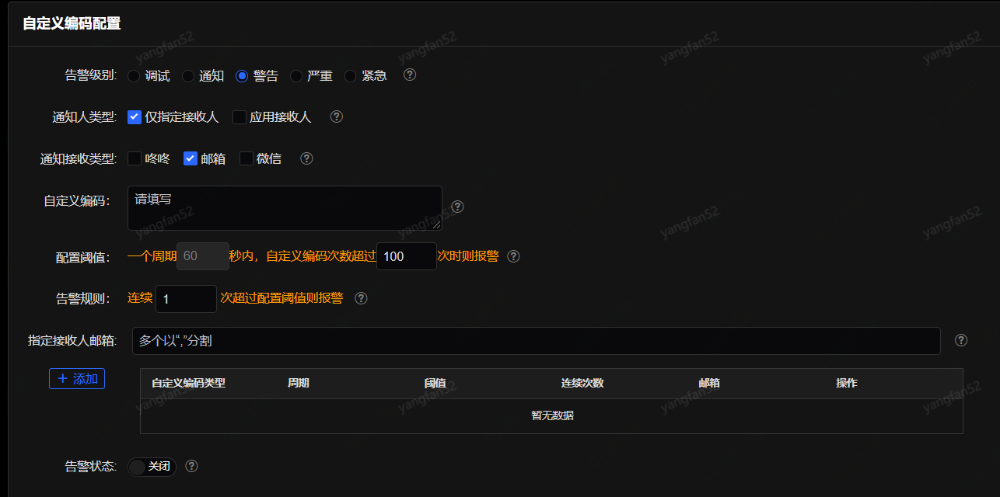

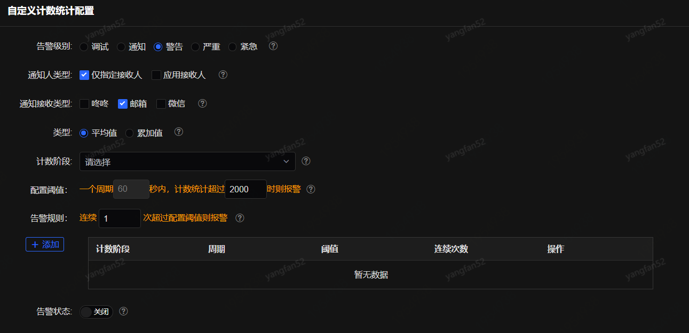

- **告警级别：**告警发送级别，单选；
- **通知人类型：**选择通知人，可多选

 仅指定接收人：接口发送时指定的接收人；

 应用接收人：根据应用的相关成员作为接收人；

- **通知接收类型：**报警以咚咚、微信或者邮件方式发送，可多选；
- **配置阈值：**每个周期60s内，平均耗时超出指定毫秒数，并且总的调用次数达到某一个设定值时报警；
- **告警规则：**假如您选择连续2个周期，则需要连续的两分钟都达到告警条件才会报警，这个参数主要解决毛刺问题；
- **告警状态：**报警开关，关闭后这个规则将不再报警；
- **自定义编码（自定义编码配置）：**根据编码作为关键词配置告警规则。提供正则表达式的方式自定义编码。
- **指定接收人邮箱（自定义编码配置）：**可根据自定义编码给不同用户发送告警。
- **计数阶段（自定义计数统计配置）：**可配置不同阶段计数的告警组合，对所选阶段的数值加和进行告警。

## 告警统计

在告警统计页面您可以根据应用或组织架构统计告警情况。如下图：展示应用或组织架构在查询时间段中完成加载时间告警、首包时间告警、白屏时间告警、JS错误告警、API耗时告警、API调用量告警、API失败告警、自定义编码告警、自定义计数统计告警的数量。

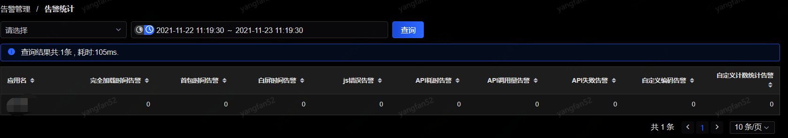

