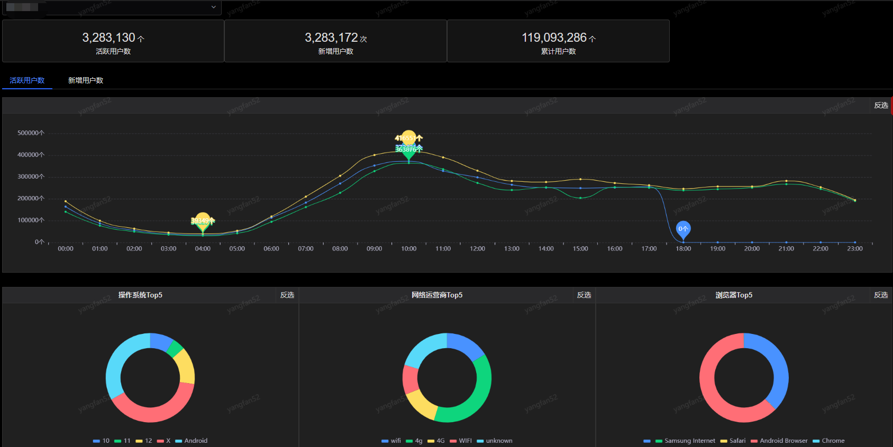
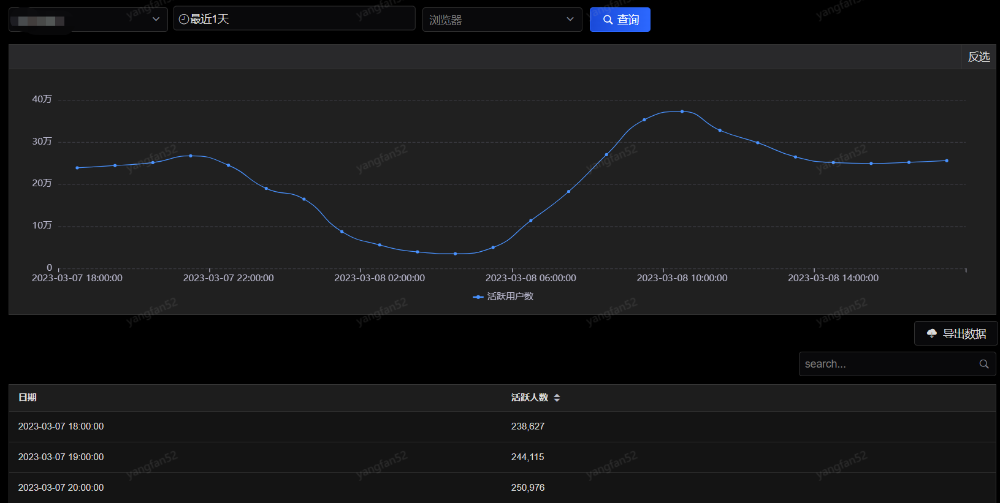
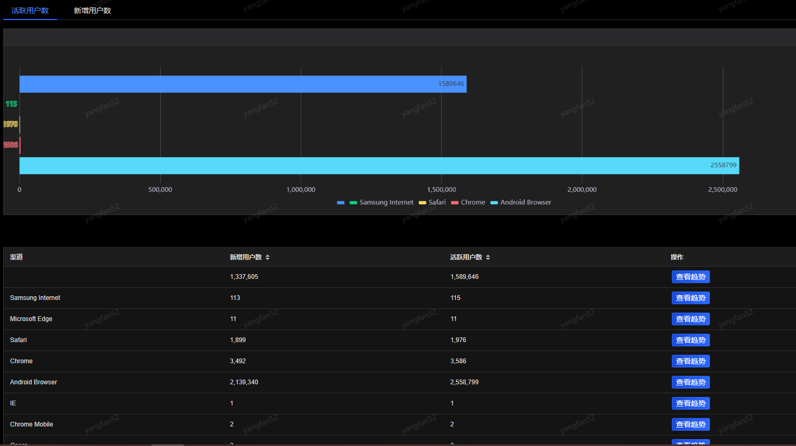
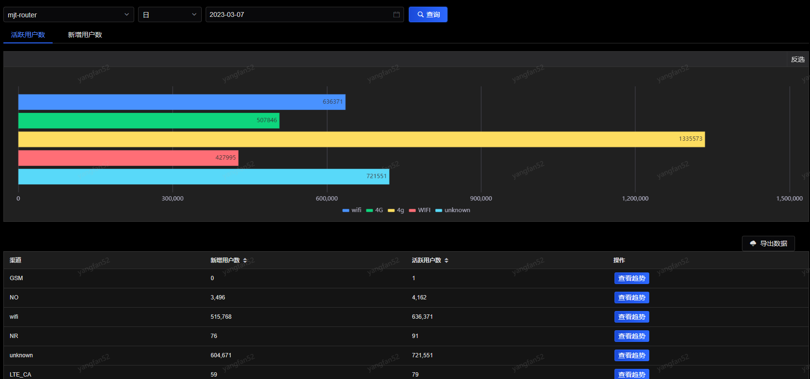
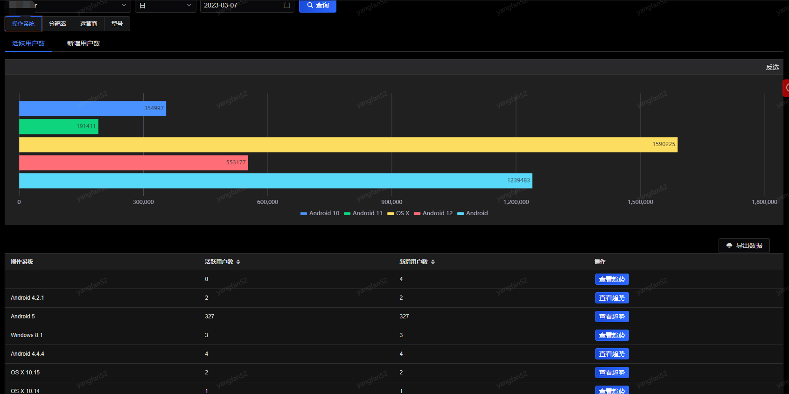
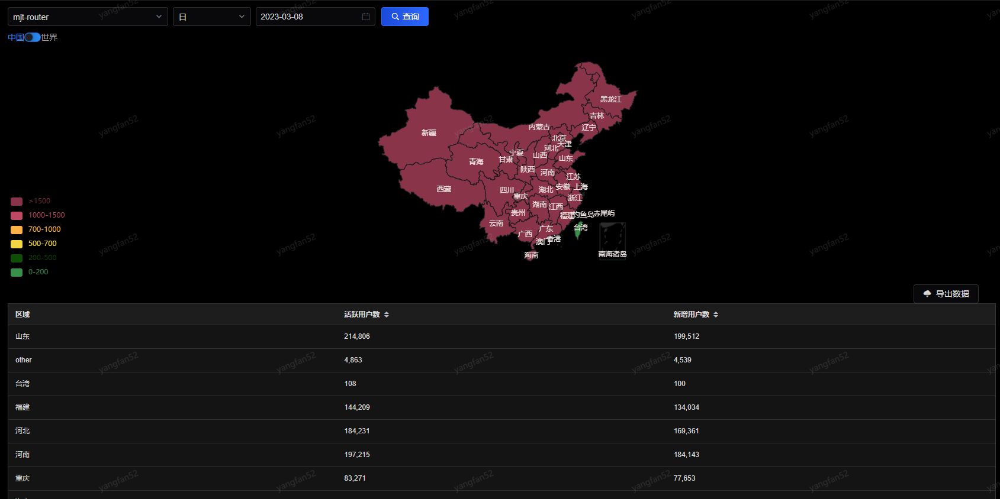

# 行为分析
## 分析概览

展示活跃用户数、新增用户数、累计用户数、活跃/新增用户数的曲线趋势图、操作系统/网络运营商/浏览器TOP5的环状图。

### 活跃分析

展示应用某个时间段的活跃用户趋势及每小时的活跃人数。可以切换应用、时间及浏览器。

### 浏览器

展示应用某日/周/月的浏览器的分布情况及每个类型的活跃/新增用户数，并可查看某个浏览器的趋势图。

### 网络运营商

展示应用某日/周/月的网络运营商的分布情况及每个类型的活跃/新增用户数，并可查看某个网络运营商的趋势图。

### 设备终端

展示应用某日/周/月的操作系统/分辨率/运营商/型号的分布情况及每个类型的活跃/新增用户数，并可查看某个类型的趋势图。

### 地域

展示应用某日/周/月的地域分布情况及每个地域的活跃/新增用户数，并可查看某个类型的趋势图。

