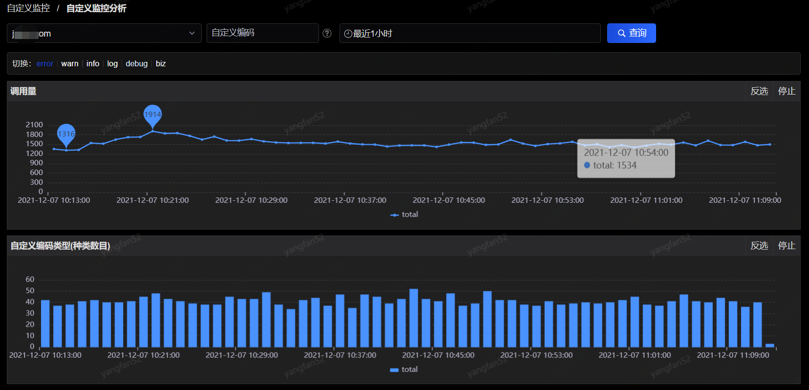
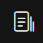
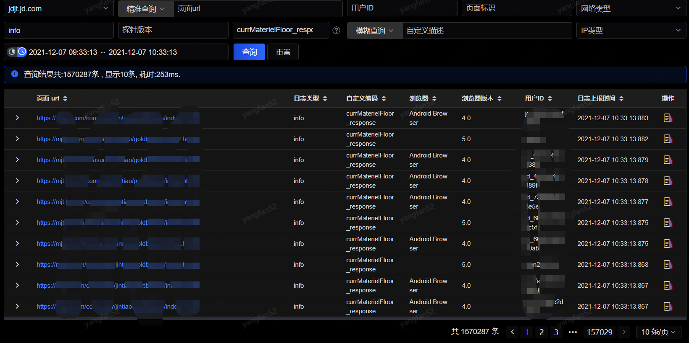
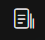
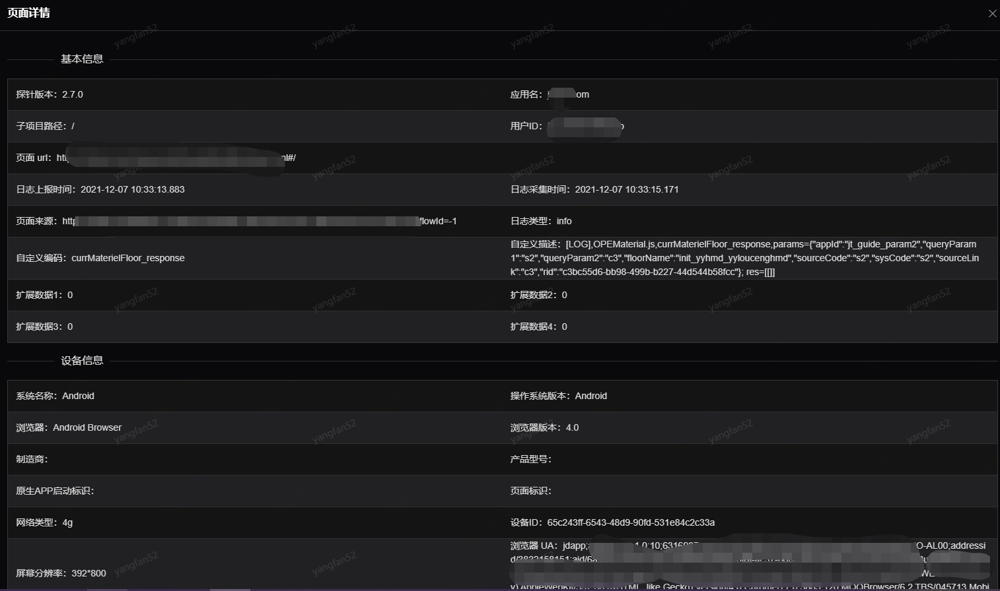

# 自定义监控
## 自定义监控分析

在此页面，您可以看到对于自定义监控的各维度各项指标分析，如下图：

自定义监控中根据自定义埋点展示自定义监控的分析情况。在切换里可根据不同类型的自定义监控展示调用量、自定义编码类型和自定编码的调用量信息。

在自定义编码的调用量信息中点击跳转到日志查询。

## 日志查询

在此页面，您可以看到应用详细的自定义监控日志，可通过其他筛选条件筛选出您所需要查看的日志信息：

点击操作中，可以看到该行所对应的详细信息，如下：

