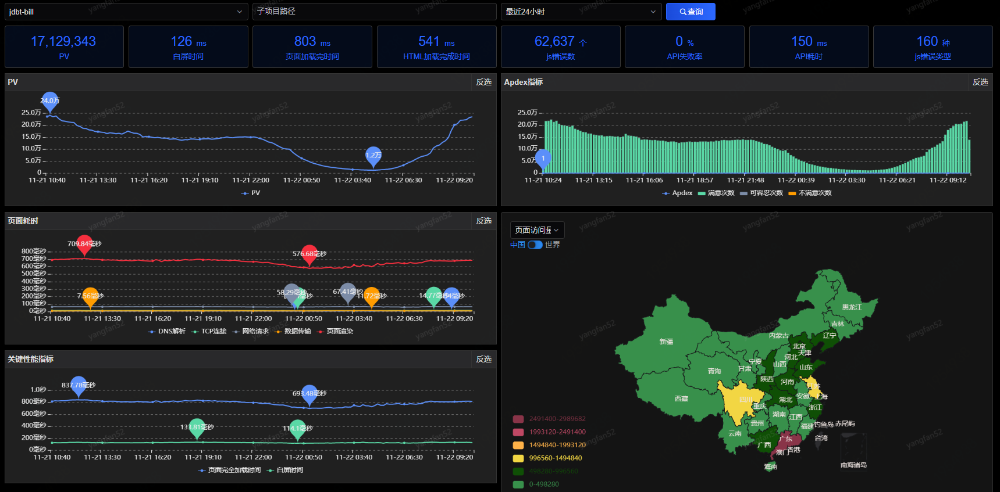

# 应用主页

应用主页中将应用所有重要的性能指标以卡片和图表的形式进行展示，您可以根据不同的筛选条件（应用、路径、时间）来查看应用的前端数据。

页面中最上一行展示根据筛选时间的PV（访问总量）、白屏时间、页面加载完时间HTML加载完成时间、JS错误数、API失败数、API耗时、JS错误类型。

页面中下面图表中展示PV、页面耗时、完全加载/白屏时间、JS错误数、API失败数的时序曲线图，以及根据地域、浏览器的访问量和耗时分布。同时展示时序Apdex情况，根据满意、可容忍和不满意根据时间的次数及Apdex结果。
