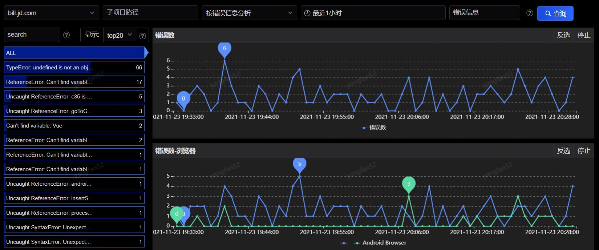
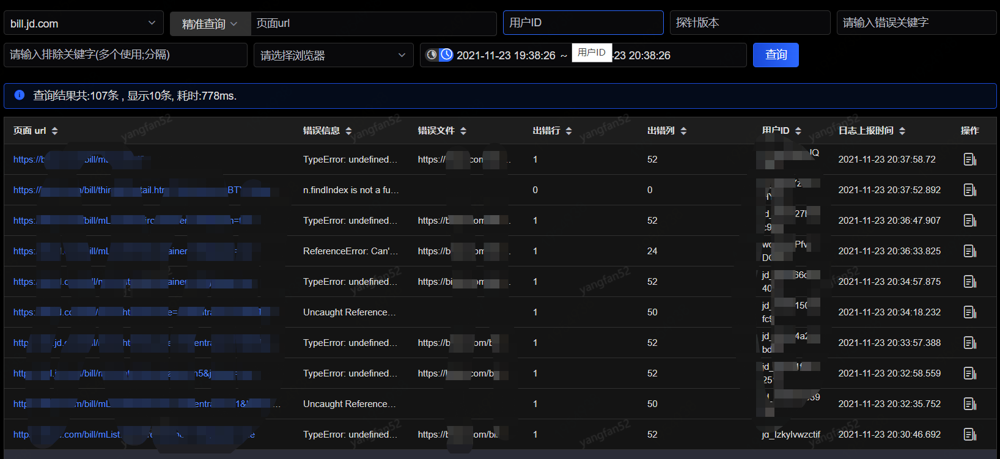
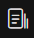
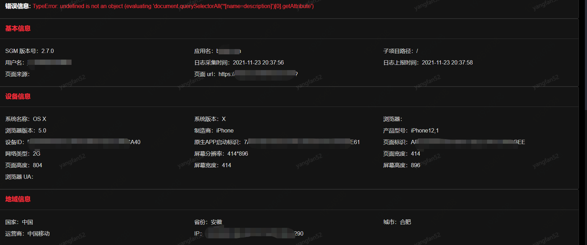
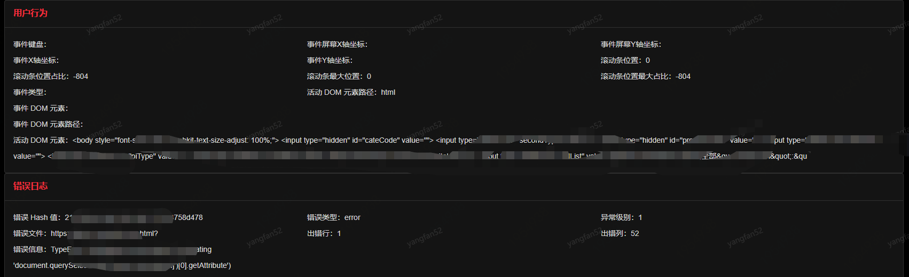
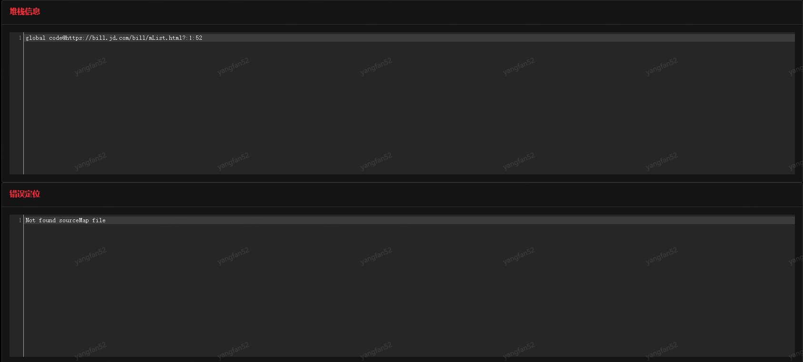

# JS错误监控

## JS错误分析

在此页面，您可以看到对于应用下JS错误监控的各维度各项指标分析，可根据url或错误信息进行分析，搜索条件包括子项目路径、时间、错误信息或url，如下图：

页面左方为树状列表，您可以通过筛选条件，筛选出您所想看到的url或错误信息数据。

页面右方为错误数和浏览器。树状列表与右方图表指标存在联动关系，您可以通过点击树状列表来查看对应的图表指标趋势图。

## 日志查询

在此页面，您可以看到应用的详细的JS错误监控日志，可通过url、用户id、（排除）错误关键字、浏览器或时间作为筛选条件，筛选出您所需要查看的日志信息：

点击操作中，可以看到该行所对应的详细信息，如下：

 

提供本次错误的基本信息、设备信息、地域信息、用户行为、错误日志、堆栈信息和错误定位。