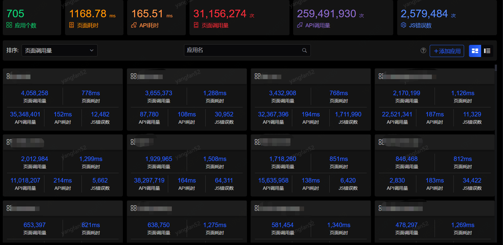
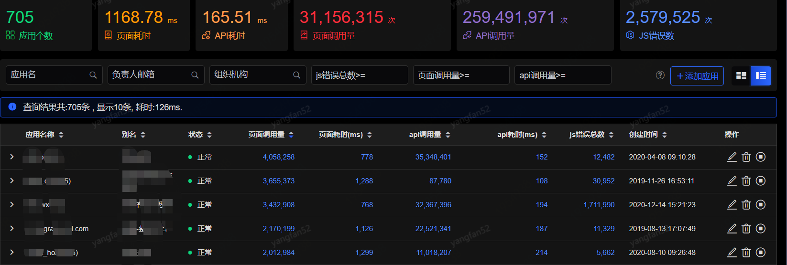
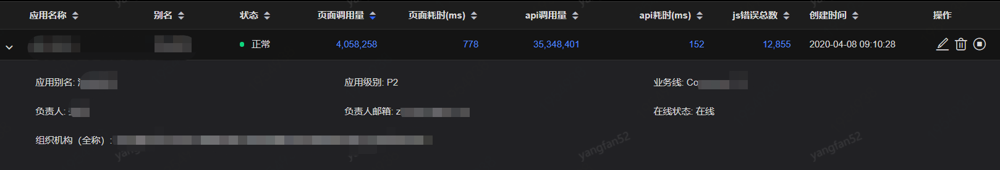

# 应用概览

接入完成后，您可以在应用概览中看到您自己的应用，如下图：

该页面最上方卡片显示的是应用接入总览：

- 应用个数：所有接入SGM前端的应用个数
- 页面耗时：当日所有接入SGM前端的应用页面平均耗时
- API耗时：当日所有接入SGM前端的应用API接口调用的平均耗时
- 页面调用量：当日所有接入SGM前端的应用页面访问总次数
- API调用量： 当日所有接入SGM前端的应用API接口调用的总次数
- JS错误数：当日所有接入SGM前端的应用发生JS错误的总次数

页面默认按照页面调用量对您的应用进行排序，您可以选择不同维度进行排序。页面数据每一分钟刷新一次。当您的应用比较多时，可以在搜索栏中输入关键字进行查找。点击应用名，可跳转至该应用主页，可以看到该应用的一个详细情况。

如果您习惯用列表的方式来查看应用，可通过点击注册应用右方的图标切换到列表模式：

 

您可以通过点击列表中的每一项性能数值，可分别跳转至其对应的详细监控页面，操作列可分别对应用进行编辑，删除，状态的开启与关闭。

如果您想查看应用的一些扩展信息，您可以点击表格每一行应用名称前的“>”,即可看到应用负责人、应用别名、应用级别等信息：

 