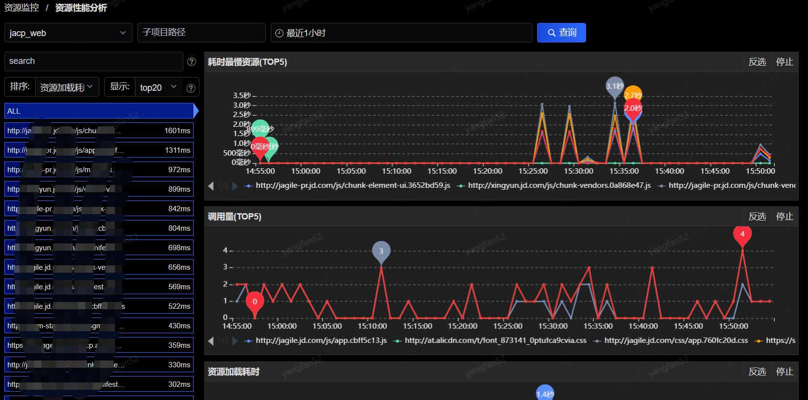

# 资源监控

## 资源性能分析

在此页面，您可以看到对于应用下资源性能监控的各维度各项指标分析，搜索条件包括子项目路径和时间，如下图：

页面左方为树状列表，您可以通过筛选条件，筛选出您所想看到的资源数据。

如果选择ALL时，页面右方为最慢资源（top5）、调用量（top5）、资源加载耗时、调用量、网络传输耗时和资源包大小。如果选择某个url则只展示资源加载耗时、调用量、网络传输耗时和资源包大小。树状列表与右方图表指标存在联动关系，您可以通过点击树状列表来查看对应的图表指标趋势图。

## 资源错误分析

在此页面，您可以看到对于对于资源错误的分析，如下图：

 

展示错误数的时序图、地域运营商的top5信息、以及错误资源地址的数据数列表，列表根据错误数倒序排序。点击进入日志查询。

### 日志查询

在此页面，您可以看到应用的详细的资源监控日志，可通过应用等筛选条件，筛选出您所需要查看的日志信息：

  

点击操作中 ，可以看到该行所对应的详细信息，如下：

  