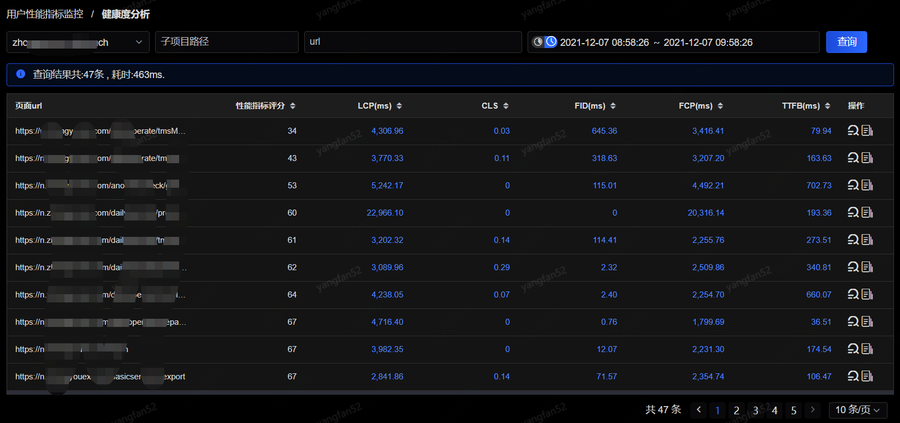
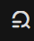
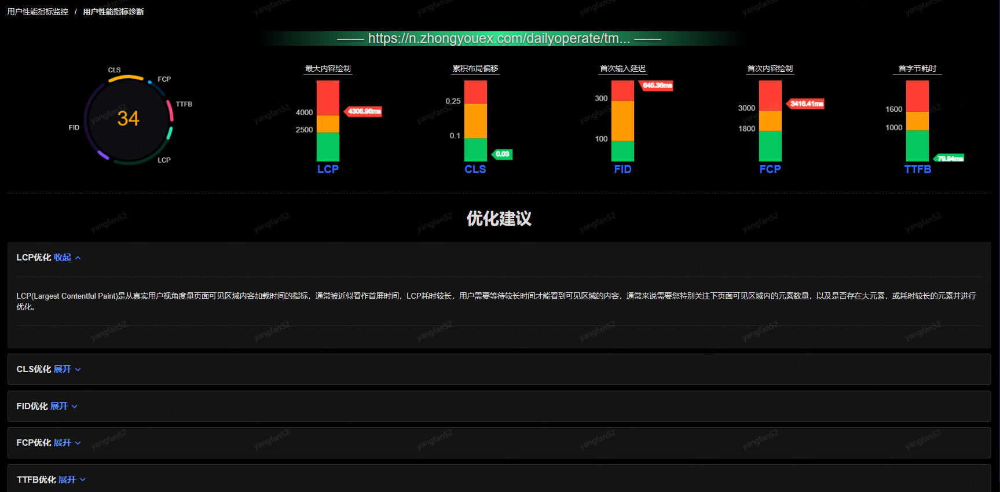
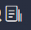
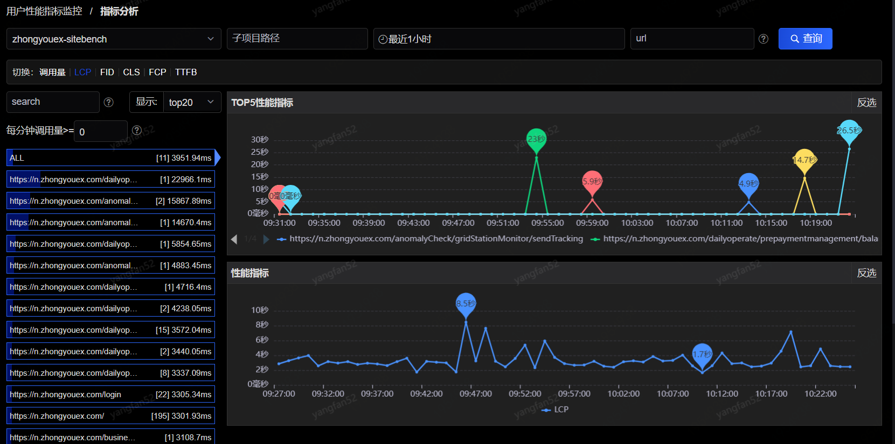
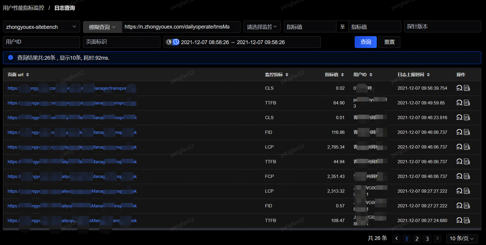
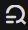
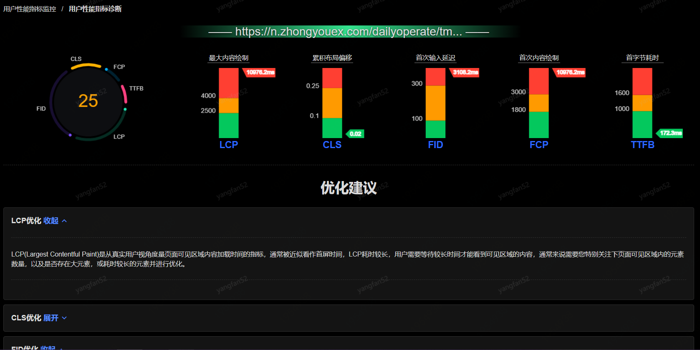
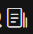
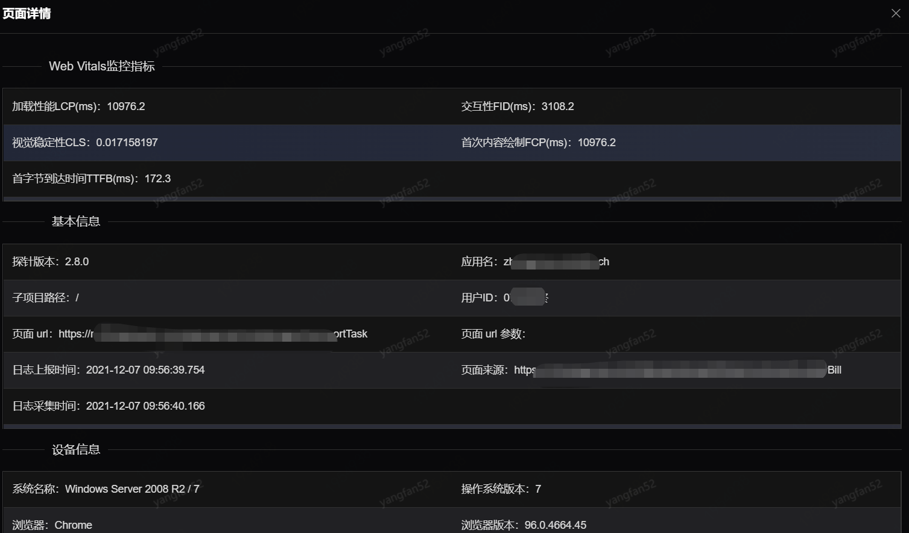

# 用户性能指标监控

## 健康度分析

在此页面，您可以看到对于用户性能指标中健康度的各维度各项指标分析，如下图：

可查看此应用下各页面得性能指标信息，如下

**LCP：** Largest Contentful Paint，即最大内容渲染，指的是视窗（viewport）内所有可见元素中尺寸最大的文本块或图像所需的渲染时间；

**CLS：**Cumulative Layout Shift，即累积布局偏移，指的是首屏页面渲染过程中所有元素结点相对原始位置所发生的位置偏移累积量；

**FID：**First Input Delay，即第一次输入事件延迟，指的是用户第一次交互事件触发到主线程接收事件然后反应之间的时间；

**FCP：**First Contentful Paint，从开始加载网页内容到第一个文本块或者图像渲染完成之间的耗时，该指标主要侧重于网页加载体验；

**TTFB：**Time to First Byte，用户浏览器从开始加载网页内容到接收到第一个字节的网页内容之间的耗时，该指标主要侧重于网页加载体验；

点击操作后的跳转到诊断分析，如下：

展示本url的健康度评分及各指标LCP、CLS、FID、FCP、TTFB的评分。下面展示每个指标对应的优化建议。

点击操作中的查看详情，跳转到日志查看根据url进行搜索展示。

## 指标分析

在此页面，您可以看到对于用户性能指标的各维度各项指标分析，如下图：

点击切换中的tab选项，可以切换调用量、LCP、FID、CLS、FCP、TTFB等不同的指标查看分析情况。左边为树形图展示，点击可查看不同的url的指标分析。右边展示不同时间下的指标时序图，如果选择all则还会展示top5的url指标时序图。

## 日志查询

在此页面，您可以看到对于用户性能指标每次的日志查询，如下图：

展示页面中每次的监控指标、指标值、访问用户和日志上报时间。

点击操作中的查看诊断分析，跳转到诊断分析页面：

点击操作中的查看详情，弹出详情页：

展示本次页面的详情，包括webVitals监控指标、基本信息、设备信息、地域信息、耗时指标、关键性能指标等。