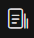

# 页面技术指标监控

## 页面分析

在此页面，您可以看到对于页面监控的各维度各项指标分析，如下图：

页面左方为树状列表，您可以通过筛选条件，筛选出您所想看到的url数据。

页面右方为耗时TOP5页面、调用量、网络传输耗时、页面渲染、性能指标的时间趋势图，您可以通过时间筛选，来查看不同时间段，不同粒度的数据展示。图表中的线可点击，可以查看您所点击的指标项在此时间点的详细日志情况；点击top5的图表时，您还可以下钻到具体的url所对应的指标数据。

树状列表与右方图表指标存在联动关系，您可以通过点击树状列表来查看对应的图表指标趋势图。

## 地域监控

此项监控，您可以看到页面访问在不同地区各项指标的分布情况

您可以通过切换“中国”或者“世界”，来查看世界各地区的页面指标分布；也可以通过切换最上方的不同指标“调用量”、“页面加载总耗时”、“DNS解析耗时”、“TCP连接耗时”、“SSL连接耗时”、“网络请求耗时”、“数据传输耗时”、“DOM解析耗时”、“资源加载耗时”、“首包时间”、“白屏时间”、“首次交互时间”、“HTML加载完时间”、“首屏时间”等按钮查看其对应的top数据以及各地区情况，如果您选择的是耗时指标，则在树状列表，同时为您展现了其对应的调用量数据。

## 浏览器监控

此项监控，您可以看到页面访问在不同浏览器各项指标的分布情况

您可以通过切换最上方的不同指标“调用量”、“页面加载总耗时”、“DNS解析耗时”、“TCP连接耗时”、“SSL连接耗时”、“网络请求耗时”、“数据传输耗时”、“DOM解析耗时”、“资源加载耗时”、“首包时间”、“白屏时间”、“首次交互时间”、“HTML加载完时间”、“首屏时间”等按钮查看其对应的top数据以及各浏览器的情况，如果您选择的是耗时指标，则在树状列表，同时为您展现了其对应的调用量数据。

## 日志查询

在此页面，您可以看到应用的详细的页面监控日志，可通过不同筛选条件，筛选出您所需要查看的日志信息：

点击操作中，可以看到该行所对应的详细信息，如下：

