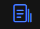

# 周报订阅
## 订阅列表

订阅列表为您所有应用的订阅情况的概览，所有成功订阅的应用都会在这里进行展示。

您可以点击“新建订阅”按钮，来进行周报的订阅。点击后，会出现一个订阅配置弹窗，如下：

如果为“按应用订阅”：

**应用名称：根据此应用配置周报。**

**指定接收人邮箱：配置本周报接收的邮箱，多个邮箱时以“,”分割。**

**指定发件邮箱**：周报建议使用默认的发件邮箱，如果您想使用指定发件邮箱来进行性能周报的发送，请首先联系管理员进行配置。

**原生App应用名：**可配置原生App名称，即可在周报中展示站内统计指标，不配置则默认展示全部统计指标。

**Pv门槛值：**设置周报页面耗时数据top5的url中页面访问量的门槛值，一周内访问量小于此值则不参与排序，默认值为0

**订阅状态**：您可以通过开关来选择不同指标项监控的订阅，关闭则周报中不会为您展示该项指标，如果您关闭订阅状态，则不会为您发送性能周报，直至您打开。

**订阅API监控：**开启/关闭

**订阅页面监控：**开启/关闭

**订阅JS错误监控：**开启/关闭

**订阅类型**：您可以选择定时任务或者手动发送，系统将在每周一8点45生成周报数据。如果您选择定时任务，则每周一8点45将会通过邮件发送给通知人；如果您选择手动发送，系统则不会为您发送，需要您在周报详情页进行手动触发。

**通知人类型**：您可以选择周报通知人的类型，如果您选择了指定接收人，则需配置指定接收人的邮箱；如果您选择了应用接收人，则根据UAS中该应用的关系人作为应用接收人，两者都选则取并集。

## 订阅历史

点击订阅列表操作列的，可查看该应用的周报历史订阅情况：

您可以在这个页面看到历史所有周报的一个概览，如果您想查看某一周报的详细内容，可以点击操作列的的，页面如下：

的

的

在这个详情界面，您会看到您即将收到的邮件在web页面中的展现形式。每个订阅模块的下方都会有“说明”的输入框，您可以在这里输入对于这一模块的一个分析结果，内容将会在邮件中进行展示。指定接收人邮箱会默认加载您配置时输入的指定接收人，如果您想临时去掉或者增添某个接收人，可以在这里进行操作，然后手动触发“发送邮件”。