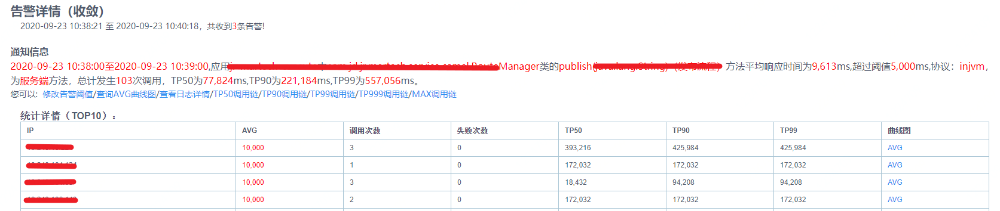
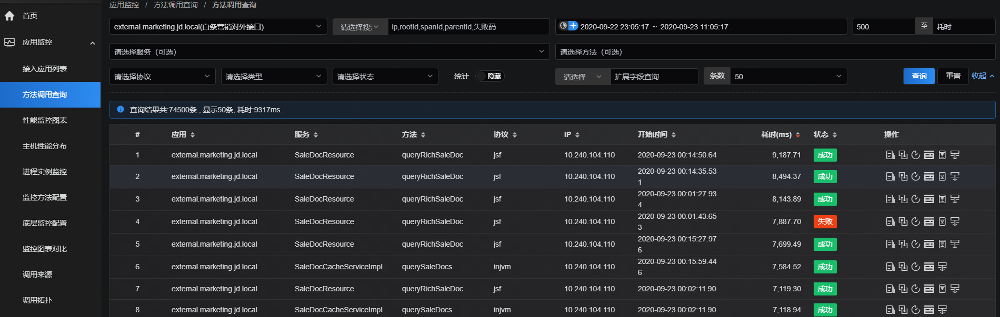
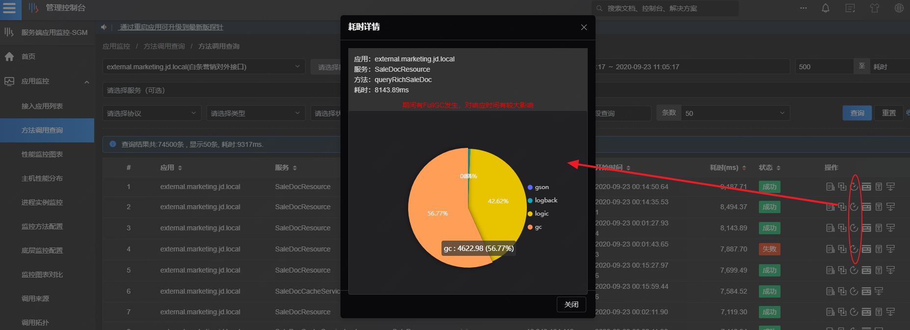
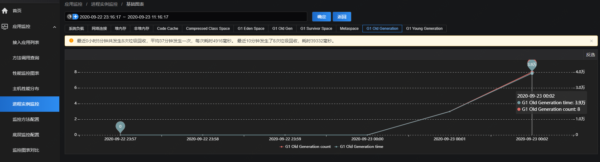
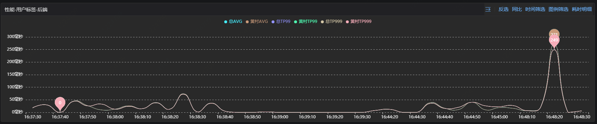

# 场景一：应用性能异常精准定位

例如：在某次全链路压测过程中，发现某条链路上平均响应时间异常超高，期望找到具体是哪个应用节点的哪些方法耗时高及其具体原因。

## 方案一

链路启动压测后，如果某应用节点或多个应用节点的耗时超高，会收到SGM告警，告警将提示某应用的方法耗时高，并告知具体平均响应时间，以及相关的TP90、TP99指标和涉及的机器IP。

 
按照告警提示内容，可在SGM管理端进一步查看耗时明细：

1. 可直接点击告警邮件中的“查询AVG曲线图”下钻至“调用查询”，也可直接登录sgm系统，按照告警中显示的应用服务方法名及发生时间，在调用查询中找到相应的调用记录。
 

2. 点击操作列中的调用链，查看当时的具体调用链情况，然后点击耗时明细，查看耗时分布的饼图，饼图会展示包括底层监控类型在内的各监控类型的耗时、调用次数。从下图可以看出这个方法的耗时为8143.89ms，并提示“期间有FullGC发生，对响应时间有较大影响”，饼图中gc耗时占了56.77%，耗时4600+ms。此时基本可以确定这个方法的耗时极大可能是应用的fgc导致。
 

3. 为了进一步验证gc的存在性，可继续在进程实例监控中按照方法详情页面中提供的时间、进程号查看GC图表。从下图可看出，在0点附近，应用确实发生了8次FGC，且每次耗时4900+ms，是导致本次耗时超高的最终原因。
 

## 方案二

监测应用或方法的性能曲线，如果某应用节点或多个应用节点的耗时超高，会实时体现在性能曲线上。如下图，该应用的avg基本长时间在50ms区间内，但在16:48:20左右，avg突增到250+ms，
 

与方案一类似，此时可通过性能图中提示的时间区间，在调用查询中找到相应的调用记录。或者直接在上图中avg突增的时刻点上点击“调用查询”或者右上角的“耗时明细”来做进一步分析。
